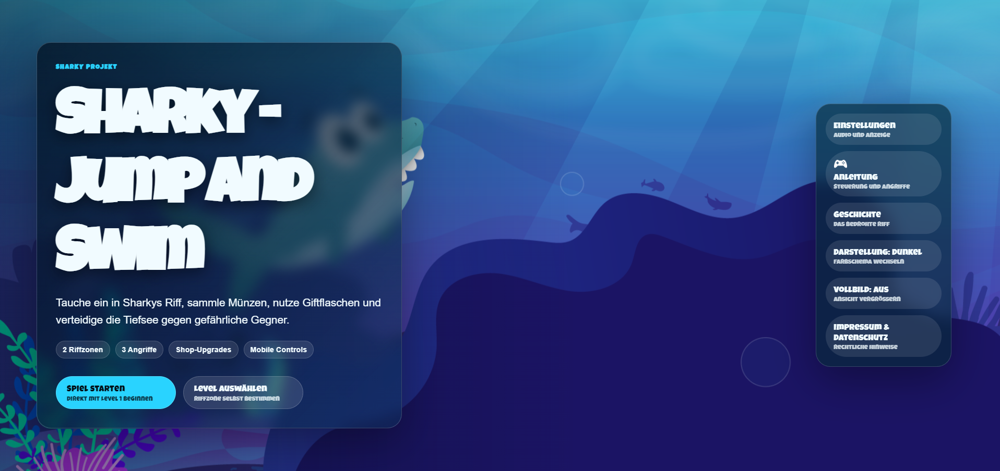
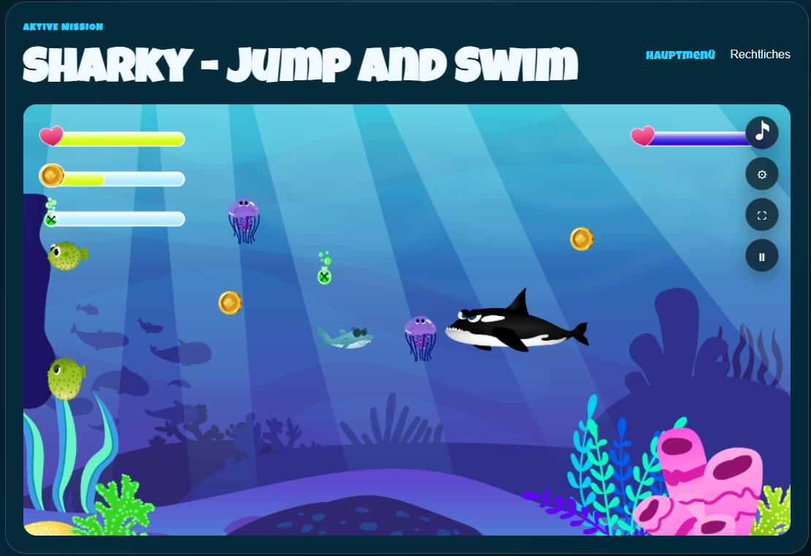
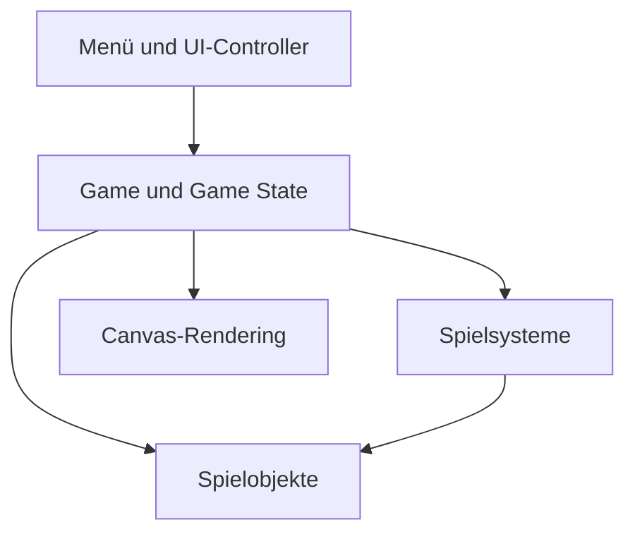

<div align="center">


# Sharky – Jump and Swim

### Responsives 2D-Unterwasserspiel mit Vanilla JavaScript und HTML5 Canvas

Steuere Sharky durch zwei Riffzonen, sammle Münzen und Giftflaschen,
bekämpfe Gegner und besiege die Endbosse.

<br>

[](#tech-stack)
[](#tech-stack)
[](#tech-stack)
[](#architektur)

[](#qualitätssicherung)
[](#qualitätssicherung)
[](#responsive-design)
[](#lokale-einrichtung)

<br>

[Über das Projekt](#über-das-projekt) ·
[Screenshots](#screenshots) ·
[Features](#features) ·
[Steuerung](#steuerung) ·
[Installation](#lokale-einrichtung) ·
[Dokumentation](#projektdokumentation)

</div>

---

## Screenshots

### Hauptmenü



### Gameplay



## Über das Projekt

**Sharky – Jump and Swim** ist ein responsives 2D-Unterwasserspiel auf Basis
von Vanilla JavaScript und HTML5 Canvas.

Der Spieler steuert Sharky durch zwei Riffzonen, bekämpft unterschiedliche
Gegnertypen, sammelt Münzen und Giftflaschen und tritt am Ende eines Levels
gegen einen Endboss an.

Zwischen den Leveln können gesammelte Münzen im Shop für permanente Upgrades
verwendet werden.

Das Projekt wurde objektorientiert aufgebaut. Spiellogik, Rendering,
Kollisionen, Eingaben, Audio, Gegnererzeugung, Levelkonfiguration und
Benutzeroberfläche sind in getrennten Klassen und Fachverzeichnissen
organisiert.

| Projektinformation | Stand |
| --- | --- |
| Projekttyp | 2D-Canvas-Spiel |
| Entwicklungsart | Einzelprojekt |
| Sprache | Vanilla JavaScript |
| Architektur | Objektorientierte Klassen und getrennte Systeme |
| Darstellung | HTML5 Canvas und responsive HTML-Oberfläche |
| Level | 2 spielbare Riffzonen |
| Eingabe | Tastatur und mobile Touch-Steuerung |
| Qualitätssicherung | 42 Tests in 12 Testdateien |
| Build-Schritt | Nicht erforderlich |
| Laufzeit-Backend | Nicht erforderlich |
| Zielgeräte | Desktop, Tablet und Smartphone im Querformat |

## Features

### Spielablauf

- zwei spielbare Riffzonen
- Levelauswahl über das Hauptmenü
- dynamische Gegnererzeugung
- konfigurierbare Gegnerbudgets und Spawnlimits
- steigende Schwierigkeit in Level 2
- Endboss in jedem Level
- Shop zwischen Level 1 und Level 2
- Game-Over- und Gewinnbildschirm
- Restart ohne Neuladen der Seite
- Rückkehr zum Hauptmenü aus mehreren Spielzuständen
- Pause und Fortsetzen mit korrekter Spielzeit

### Spieler

- freie Bewegung in vier Richtungen
- Steuerung über Pfeiltasten oder WASD
- Idle- und Long-Idle-Animation
- Long Idle nach 15 Sekunden ohne Aktivität
- Bewegungs-, Angriffs-, Schadens- und Todesanimationen
- Leben, Münzen und Giftinventar
- begrenzte Giftkapazität
- zurückgesetzte Bewegung nach dem Tod
- konfigurierbare Verbesserungen über den Shop

### Kampfsystem

Sharky besitzt drei Angriffe:

| Angriff | Taste | Funktion |
| --- | --- | --- |
| Flossenschlag | `E` | kurzer Nahkampfangriff |
| Blasenfalle | Leertaste | fängt kleine Gegner |
| Giftangriff | `F` | verbraucht Gift und verursacht Schaden über Zeit |

Das Kampfsystem verhindert, dass derselbe Angriff ein Ziel mehrfach trifft.

Schaden entsteht nur bei einer tatsächlichen Überschneidung der jeweiligen
Trefferflächen.

### Gegner und Endboss

- mehrere normale Gegnertypen
- horizontale und vertikale Bewegungsmuster
- gewichtete Gegnerverteilung pro Level
- zufällige Spawnpositionen
- Spawns außerhalb des sichtbaren Kamerabereichs
- Entfernung abgeschlossener oder entkommener Gegner
- Spawnstopp beim Eintritt in die Bosszone
- eigener Bewegungscontroller für den Endboss
- horizontale Verfolgung und vertikale Patrouille
- eigene Bossmusik
- Bosslebensanzeige nach der Einführung

### Sammelobjekte

- sammelbare Münzen
- sammelbare Giftflaschen
- sofortige Aktualisierung des Inventars
- Sammelsounds
- Giftflaschen bleiben bei vollem Inventar erhalten
- gesammelte Münzen können im Shop ausgegeben werden

### Shop

Verfügbare Upgrades:

| Upgrade | Wirkung |
| --- | --- |
| Flossen-Turbo | erhöht Sharkys Bewegungsgeschwindigkeit |
| Starke Schuppen | erhöht die Startgesundheit |
| Gift-Tasche | erhöht die maximale Giftkapazität |

Ein Upgrade kann nur gekauft werden, wenn genügend Münzen vorhanden sind.

### Benutzeroberfläche

- animiertes Hauptmenü
- Levelauswahl
- Anleitung
- Storybereich
- Audio- und Anzeigeeinstellungen
- Ingame-HUD
- Pausemenü
- Shop
- Game-Over-Screen
- Gewinnbildschirm
- kompakter Ingame-Schnellzugriff
- kombinierte Seite für Impressum und Datenschutz
- optionales Vorlesen der Geschichte
- Debuganzeigen nur im aktivierten Debugmodus

### Audio

- Hauptmenü-Musik
- Levelmusik
- Bossmusik
- Soundeffekte für Angriffe, Treffer und Sammelobjekte
- getrennte Lautstärkeregler für Musik und Soundeffekte
- gemeinsamer Audio-Schalter
- gespeicherte Audioeinstellungen
- Audiofreigabe nach erlaubter Benutzerinteraktion

### Anzeige

- Dunkelmodus
- Hellmodus
- Berücksichtigung der Systempräferenz
- gespeicherte manuelle Theme-Auswahl
- Vollbildmodus
- synchronisierte Buttonzustände
- reduzierte CSS-Animationen bei entsprechender Systemeinstellung

## Steuerung

### Desktop

| Aktion | Eingabe |
| --- | --- |
| Nach oben | Pfeil hoch oder `W` |
| Nach unten | Pfeil runter oder `S` |
| Nach links | Pfeil links oder `A` |
| Nach rechts | Pfeil rechts oder `D` |
| Flossenschlag | `E` |
| Blasenfalle | Leertaste |
| Giftangriff | `F` |

Beim Verlust des Browserfokus werden aktive Tastatureingaben zurückgesetzt.
Dadurch bewegt sich Sharky nach einem Fensterwechsel nicht ungewollt weiter.

### Mobile Geräte

Auf geeigneten Touch-Geräten stehen zur Verfügung:

- virtueller Joystick für die Bewegung
- Taste `Flosse`
- Taste `Blase`
- Taste `Gift`

Die Touch-Steuerung wird nur auf geeigneten Geräten innerhalb der unterstützten
Viewportbreite angezeigt.

Das Spiel ist auf mobilen Geräten für das Querformat ausgelegt. Im Hochformat
erscheint ein Hinweis zum Drehen des Geräts.

## Tech Stack

| Bereich | Technologie | Verwendung |
| --- | --- | --- |
| Struktur | HTML5 | semantische Oberfläche und Spielcontainer |
| Styling | CSS3 | Themes, Layout und responsive Darstellung |
| Sprache | Vanilla JavaScript | gesamte Anwendungs- und Spiellogik |
| Grafik | HTML5 Canvas | Spielwelt, Objekte und Animationen |
| Architektur | Objektorientierte Programmierung | Klassen, Zustände und Systeme |
| Audio | `HTMLAudioElement` | Musik und Soundeffekte |
| Speicherung | Local Storage | Audio- und Anzeigeeinstellungen |
| Vollbild | Fullscreen API | bildschirmfüllende Spieldarstellung |
| Eingaben | Keyboard und Pointer Events | Desktop- und Touch-Steuerung |
| Tests | Node.js Test Runner | Unit- und Regressionstests |
| Testumgebung | `node:vm` | isolierte Browser-Skriptkontexte |
| Tooling | npm und eigenes Validierungsskript | Syntax-, Struktur- und Assetprüfung |
| Versionsverwaltung | Git und GitHub | nachvollziehbare Entwicklung |

Das Projekt besitzt keine externen Laufzeitabhängigkeiten und benötigt kein
Frontend-Framework.

## Architektur

Die Anwendung trennt Benutzeroberfläche, Spielsteuerung, Zustand, Systeme,
Objekte und Rendering.



| Bereich | Verantwortung |
| --- | --- |
| `config` | zentrale Spiel-, Level- und Assetkonfiguration |
| `core` | gemeinsame Zeichen-, Bewegungs-, Animations- und Zeitbasis |
| `entities` | Spieler, Gegner, Angriffe und Weltobjekte |
| `game` | Spielablauf, Zustand, Kamera und Rendering |
| `input` | Tastatur- und Touch-Eingaben |
| `levels` | konkreter Aufbau der beiden Level |
| `systems` | Audio, Kollisionen, Angriffe und Gegnererzeugung |
| `ui` | Hauptmenü, Statusanzeigen, Einstellungen und Events |

Die Browser-Skripte werden in einer festgelegten Reihenfolge geladen. Abhängige
Klassen stehen dadurch vor der Initialisierung über `js/main.js` bereit.

Die ausführliche Beschreibung steht unter
[Anwendungsarchitektur](docs/architecture/application.md).

## Game Loop

Der zentrale Spielablauf basiert auf `requestAnimationFrame`.

Vereinfacht übernimmt jeder Frame:

1. vergangene Zeit ermitteln,
2. aktiven Spielzustand prüfen,
3. Spieler und Gegner aktualisieren,
4. Angriffe und Kollisionen verarbeiten,
5. Kamera aktualisieren,
6. Spielwelt zeichnen,
7. Benutzeroberfläche synchronisieren,
8. nächsten Frame anfordern.

Pause, Game Over, Shop, Levelwechsel und Gewinn verändern den Ablauf über den
zentralen Spielzustand.

Weitere Details:
[Game Loop und Zustände](docs/architecture/game-loop-state.md).

## Responsive Design

Die Oberfläche unterstützt Desktop, Tablet und mobile Touch-Geräte.

Wichtige Breakpoints:

| Bedingung | Anpassung |
| --- | --- |
| bis 1180 px | geeignete Touch-Steuerung und Hochformat-Hinweis |
| bis 980 px | einspaltiges Hauptmenü |
| bis 900 px | einspaltige Karten und Anleitungen |
| bis 760 px | kompaktes Seiten-, HUD- und Dialoglayout |
| bis 520 px | kleinere Touch-Steuerung |
| bis 620 px Höhe im Querformat | bildschirmfüllendes Spiellayout |
| bis 430 px Höhe im Querformat | stark reduziertes mobiles Layout |

Zusätzlich berücksichtigt die Anwendung:

- `prefers-color-scheme`
- `prefers-reduced-motion`
- mobile Safe Areas
- Touch- und Pointer-Verhalten
- dynamische Viewporthöhe über `dvh`
- 16:9-Skalierung des Canvas

Details:
[Styling und Barrierefreiheit](docs/engineering/styling-accessibility.md).

## Barrierefreiheit

Vorhandene Maßnahmen:

- deutsche Dokumentensprache
- semantische HTML-Grundstruktur
- native Buttons und Links
- beschriftete Navigationen
- `aria-label` für Icon-Buttons
- `aria-pressed` für Umschaltzustände
- zugeordnete Labels für Lautstärkeregler
- gruppierte Touch-Steuerungen
- ausgeblendete dekorative Elemente
- visuell verborgene Textüberschriften
- sichtbare Fokuszustände im Hauptmenü
- reduzierte CSS-Animationen
- angekündigter Hochformat-Hinweis

Das visuelle Canvas-Spiel besitzt derzeit keine vollständig gleichwertige
textuelle Alternative und ist nicht als vollständig WCAG-konform zertifiziert.

## Lokale Einrichtung

### Voraussetzungen

- Git
- Node.js 18 oder höher
- npm
- aktueller Browser
- lokaler Webserver

### 1. Repository klonen

```bash
git clone https://github.com/CZX93-BW/SharkyProject.git
cd SharkyProject
```

### 2. npm-Metadaten initialisieren

```bash
npm install
```

Das Projekt besitzt derzeit keine externen Pakete. Der Befehl wird hauptsächlich
für einen einheitlichen npm-Arbeitsablauf verwendet.

### 3. Lokalen Webserver starten

Das Projekt benötigt keinen Build.

Mit VS Code kann `index.html` beispielsweise über die Erweiterung Live Server
gestartet werden.

Alternativ kann ein vorhandener statischer Entwicklungsserver verwendet werden.

Die Anwendung sollte nicht ausschließlich über eine direkte `file://`-URL
getestet werden.

## Verfügbare Befehle

| Befehl | Zweck |
| --- | --- |
| `npm run validate` | Projektstruktur, Referenzen, Syntax und Assets prüfen |
| `npm test` | alle automatisierten Tests ausführen |
| `npm run check` | Validierung und Tests gemeinsam ausführen |
| `git diff --check` | problematische Whitespace-Änderungen erkennen |
| `git status --short` | Arbeitsstand kompakt anzeigen |

Vollständige lokale Prüfung:

```bash
npm run check
git diff --check
git status --short
```

## Qualitätssicherung

Der zuletzt bestätigte Projektstand:

| Prüfung | Ergebnis |
| --- | ---: |
| Testdateien | 12 |
| Automatisierte Tests | 42 |
| Erfolgreich | 42 |
| Fehlgeschlagen | 0 |
| HTML-Skriptreferenzen | 46 |
| Stylesheets | 8 |
| Konfigurierte Assets | 202 |
| Projektvalidierung | erfolgreich |

Die automatisierten Tests decken unter anderem ab:

- Audiozustände
- Bossbewegung
- Long Idle
- Kollisionen
- Sammelobjekte
- Gegnererzeugung
- Spielzeit und Pause
- Tod und Restart
- Statusdarstellung
- Interface-Struktur
- Tastatursteuerung
- Levelkonfiguration
- mobile Touch-Steuerung

Tests und Validierung ersetzen keine vollständige manuelle Prüfung in
Desktop- und Mobilbrowsern.

Die vollständige Beschreibung steht unter
[Tests und Projektvalidierung](docs/engineering/testing-validation.md).

## Projektstruktur

```text
SharkyProject/
├── assets/
│   ├── audio/
│   ├── fonts/
│   ├── icons/
│   └── img/
│       └── readme/
├── docs/
│   ├── architecture/
│   ├── engineering/
│   ├── features/
│   ├── operations/
│   └── README.md
├── js/
│   ├── config/
│   ├── core/
│   ├── entities/
│   ├── game/
│   ├── input/
│   ├── levels/
│   ├── systems/
│   └── ui/
├── scripts/
│   └── validate-project.mjs
├── styles/
├── tests/
├── index.html
├── legal.html
├── package.json
├── README.md
└── robots.txt
```

## Projektdokumentation

Die zentrale README bietet den Projekteinstieg. Architektur, Features,
Engineering und Betrieb werden in zwölf Fachdokumenten ausführlich beschrieben.

Eine vollständige Navigation steht unter
[docs/README.md](docs/README.md).

### Architektur

| Dokument | Inhalt |
| --- | --- |
| [Anwendungsarchitektur](docs/architecture/application.md) | Schichten, Klassen und Abhängigkeiten |
| [Game Loop und Zustände](docs/architecture/game-loop-state.md) | Frames, Pause, Levelwechsel, Tod und Restart |
| [Rendering und Assets](docs/architecture/rendering-assets.md) | Canvas, Kamera, Animationen und Assetverwaltung |

### Features

| Dokument | Inhalt |
| --- | --- |
| [Spieler und Kampfsystem](docs/features/player-combat.md) | Bewegung, Angriffe, Schaden und Sammelobjekte |
| [Gegner und Level](docs/features/enemies-levels.md) | Spawning, Gegnertypen, Level und Endboss |
| [Interface und Steuerung](docs/features/interface-controls.md) | Menüs, HUD, Tastatur und Touch |
| [Audio und Anzeigeeinstellungen](docs/features/audio-display-settings.md) | Musik, Effekte, Theme und Vollbild |

### Engineering

| Dokument | Inhalt |
| --- | --- |
| [Entwicklungskonventionen](docs/engineering/conventions.md) | JavaScript-, JSDoc- und Strukturregeln |
| [Tests und Validierung](docs/engineering/testing-validation.md) | Tests, Validator und manuelle Prüfungen |
| [Styling und Barrierefreiheit](docs/engineering/styling-accessibility.md) | CSS-Struktur, Breakpoints und Accessibility |

### Betrieb

| Dokument | Inhalt |
| --- | --- |
| [Entwicklungsworkflow](docs/operations/development-workflow.md) | Git, Commits, Tests und Push |
| [Deployment](docs/operations/deployment.md) | Releasepaket, Upload, Abnahme und Rollback |

## Entwicklungsworkflow

Das Repository wird derzeit als Einzelprojekt über `main` geführt.

Der grundlegende Ablauf:

```bash
git switch main
git pull --ff-only origin main
git status --short

# Änderung umsetzen

npm run check
git diff --check
git diff

git add <dateien>
git diff --cached
git commit -m "type(scope): short description"
git push origin main
```

Das Projekt verwendet überwiegend Conventional-Commit-ähnliche Nachrichten:

```text
feat(player): add long idle animation
fix(boss): restore reset and patrol lifecycle
refactor(ui): split interface responsibilities into controllers
test(game): add lifecycle and collision regression coverage
docs(project): add technical project documentation
```

Details:
[Entwicklungsworkflow](docs/operations/development-workflow.md).

## Deployment

Sharky ist eine statische Anwendung.

Für die Laufzeit werden benötigt:

```text
index.html
legal.html
robots.txt
assets/
js/
styles/
```

Vor einer Veröffentlichung:

```bash
npm run check
git diff --check
git status
```

Es ist derzeit kein automatisches Deployment und keine feste
Produktionsplattform im Repository konfiguriert.

Der vollständige manuelle Ablauf steht unter
[Deployment](docs/operations/deployment.md).

## Bekannte Grenzen

- Die mobile Spielansicht ist für das Querformat ausgelegt.
- Das Canvas-Spiel besitzt keine vollständig gleichwertige Screenreaderansicht.
- Es ist keine automatische CI/CD-Pipeline eingerichtet.
- Deployment und Releaseprüfung erfolgen manuell.
- Es existiert kein Backend und kein globales Online-Ranking.
- Tests ersetzen keine vollständige visuelle Browserprüfung.
- Einige ältere Assetnamen enthalten Leerzeichen oder uneinheitliche
  Schreibweisen.
- Links innerhalb aller `docs`-Dateien werden aktuell nicht automatisch durch
  das Validierungsskript geprüft.

## Mögliche spätere Erweiterungen

- Ranking- und Scoresystem
- persistente Bestenliste
- zusätzliche Level
- weitere Gegnertypen
- zusätzliche Shop-Upgrades
- erweiterte Canvas-Barrierefreiheit
- durchgängiges Cache-Busting
- automatisierte GitHub-Actions-Prüfungen
- automatisiertes Deployment
- automatische Prüfung aller Dokumentationslinks

Diese Punkte sind nicht Bestandteil des aktuell abgeschlossenen Projektstands.

---

<div align="center">

**Sharky – Jump and Swim**

Entwickelt von
[Bastian Wollny](https://github.com/CZX93-BW)

</div>