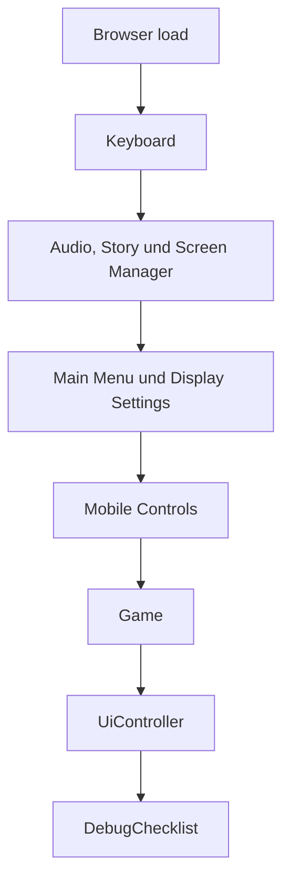
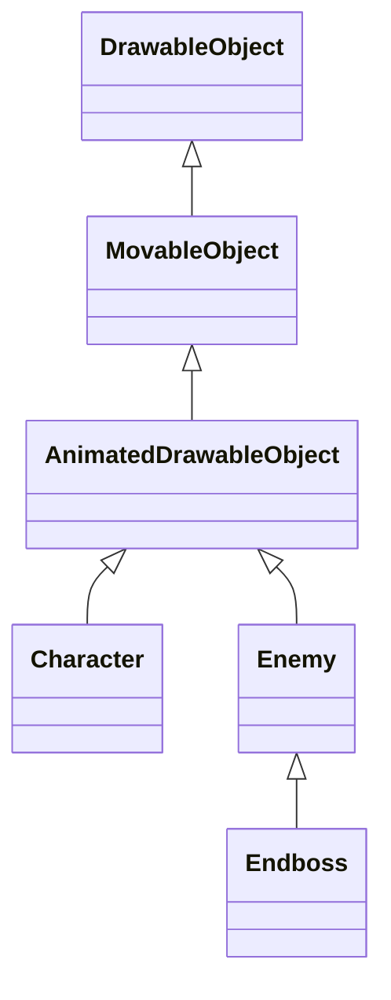
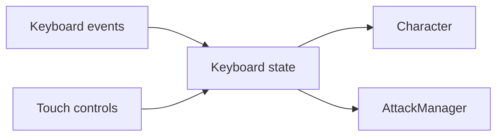
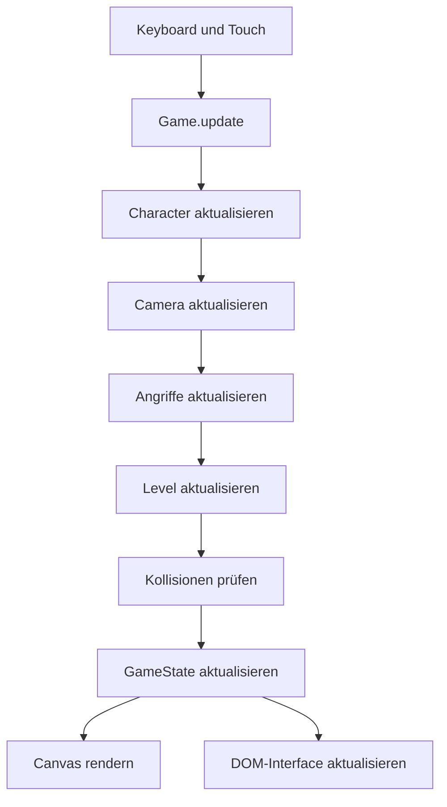

# Anwendungsarchitektur

Dieses Dokument beschreibt den technischen Aufbau von
**Sharky – Jump and Swim**, die Verantwortlichkeiten der wichtigsten
Anwendungsbereiche und den grundlegenden Datenfluss während einer Spielsitzung.

Details zum Game Loop, Rendering, Kampfsystem, Gegnerverhalten, Interface und
Testing werden in den jeweils zuständigen Fachdokumenten beschrieben.

## Technische Grundlage

Sharky ist eine clientseitige Webanwendung auf Basis von:

- HTML5
- modularem CSS
- Vanilla JavaScript
- objektorientierter Programmierung
- HTML5 Canvas
- `requestAnimationFrame`
- DOM- und Browser-APIs
- `HTMLAudioElement`
- Local Storage
- Node.js Test Runner

Das Projekt verwendet kein Frontend-Framework, keinen Bundler und keinen
Produktions-Build. Die JavaScript-Dateien werden in einer festgelegten
Reihenfolge über klassische `<script>`-Elemente in `index.html` eingebunden.

Die Anwendung wird nach dem vollständigen Laden der Seite über
`js/main.js` initialisiert.

## Projektstruktur

```text
SharkyProject/
├── assets/
│   ├── audio/
│   ├── fonts/
│   ├── icons/
│   └── img/
├── docs/
│   ├── architecture/
│   ├── engineering/
│   ├── features/
│   └── operations/
├── js/
│   ├── config/
│   ├── core/
│   ├── entities/
│   │   ├── attacks/
│   │   ├── enemies/
│   │   ├── player/
│   │   └── world/
│   ├── game/
│   ├── input/
│   ├── levels/
│   ├── systems/
│   ├── ui/
│   └── main.js
├── scripts/
├── styles/
├── tests/
├── imprint.html
├── index.html
├── package.json
└── robots.txt
```

## Verantwortungsbereiche

| Bereich | Verantwortung |
| --- | --- |
| `assets` | Bilder, Animationen, Musik, Soundeffekte, Schriftarten und Icons |
| `js/config` | Zentrale Spielwerte, Levelparameter und Assetpfade |
| `js/core` | Technische Basisklassen, Zeitsteuerung und allgemeine Hilfssysteme |
| `js/entities` | Sichtbare und interaktive Objekte der Spielwelt |
| `js/game` | Spielablauf, Spielzustand, Kamera, Level und Rendering |
| `js/input` | Tastatur- und Touch-Eingaben |
| `js/levels` | Konkreter Aufbau der beiden spielbaren Riffzonen |
| `js/systems` | Angriffe, Kollisionen, Audio, Gegnerbewegung und Spawning |
| `js/ui` | Hauptmenü, Dialoge, HUD, Einstellungen und Statusanzeigen |
| `styles` | Layout, Komponenten, Spielansicht und responsive Darstellung |
| `tests` | Automatisierte Unit- und Regressionstests |
| `scripts` | Projektweite Validierung von Dateien, Syntax und Referenzen |
| `docs` | Technische Projekt- und Betriebsdokumentation |

## Anwendungseinstieg

`js/main.js` ist der zentrale Bootstrap der Anwendung. Die Initialisierung
beginnt nach dem `load`-Event des Browsers:

```js
window.addEventListener('load', initializeApplication);
```

`initializeApplication()` erzeugt die Controller und verbindet ihre
Abhängigkeiten in einer festen Reihenfolge.



Die Reihenfolge ist relevant:

1. Der Tastaturzustand wird erzeugt.
2. Das Canvas-Element wird aus dem DOM gelesen.
3. Audio-, Story- und Screen-Manager werden initialisiert.
4. Hauptmenü und Anzeigeeinstellungen werden aktiviert.
5. Die Touch-Steuerung wird mit dem gemeinsamen Eingabestatus verbunden.
6. Die zentrale `Game`-Instanz wird erzeugt.
7. Der `UiController` verbindet Spiel, Audio und Oberfläche.
8. Optionale Debugprüfungen werden gestartet.

## Zentrale Anwendungskomponenten

### `Game`

`Game` koordiniert den vollständigen Lebenszyklus einer Spielsitzung.

Die Klasse ist verantwortlich für:

- Starten eines Levels
- Wechsel in das nächste Level
- Pause und Fortsetzung
- Restart ohne Seiten-Reload
- Rückkehr zum Hauptmenü
- Ausführung der Animationsschleife
- Aktualisierung der Spielsysteme
- Koordination von Kollisionen und Angriffen
- Aktualisierung der Kamera
- Auswahl der passenden Musik
- Rendering des aktuellen Zustands
- Benachrichtigung der Benutzeroberfläche

`Game` speichert fachliche Sitzungsdaten nicht selbst. Diese liegen in
`GameState`. Dadurch bleibt die Ablaufsteuerung vom eigentlichen Zustand
getrennt.

### `GameState`

`GameState` enthält den veränderlichen Zustand der aktuellen Spielsitzung.

Dazu gehören:

- aktueller Spielstatus
- aktives Level
- Spielerinstanz
- Lauf- und Pausenzustand
- Münzen
- Giftflaschen
- gekaufte Upgrades
- aktuelle Bildrate
- Debugmodus

Die Klasse steuert außerdem gültige Statuswechsel:

```text
menu
  ↓
playing
  ├── paused
  ├── gameOver
  ├── shop
  └── levelComplete
```

Ein neuer Spielstart setzt den vollständigen Sitzungsfortschritt zurück.
Beim Wechsel von Level 1 zu Level 2 bleiben Münzen und gekaufte Upgrades
erhalten. Ein Restart setzt das aktuelle Level und den Spieler zurück, ohne die
Seite neu zu laden.

### `Level`

`Level` verwaltet alle Objekte, die zu einer Riffzone gehören.

Eine Levelinstanz enthält:

- Abmessungen und Levelgrenzen
- Hintergrundobjekte
- Barrieren und feste Kollisionsbereiche
- Gegner
- Sammelobjekte
- Endboss
- Zielobjekt
- Levelkonfiguration
- optionalen `EnemySpawner`

Das Level aktualisiert seine dynamischen Objekte pro Frame und stellt der
Spielsteuerung abgegrenzte Abfragen zur Verfügung.

Beispiele:

- `getDangerObjects()`
- `getAttackTargets()`
- `getActiveCollectibles()`
- `getBounds()`
- `isLevelComplete()`
- `getMaxCameraX()`
- `getMaxCameraY()`

Dadurch benötigt `Game` keine Detailkenntnisse über den internen Aufbau eines
Levels.

### `GameRenderer`

`GameRenderer` übernimmt die Zeichenreihenfolge der Spielwelt. Die Klasse
erhält den aktuellen `GameState`, die `Camera` und den `AttackManager`.

Die Spiellogik verändert keine Canvas-Darstellung direkt. Objekte stellen ihre
Zeichendaten bereit und werden vom Renderer in der vorgesehenen Reihenfolge
ausgegeben.

### `GameStatusRenderer`

`GameStatusRenderer` kapselt die Statusdarstellung innerhalb des Canvas.

Dazu gehören insbesondere:

- Spielerleben
- Münzen
- Giftinventar
- Bossleben
- kontextabhängige Statusinformationen

Die Auslagerung verhindert, dass `GameRenderer` neben der Weltzeichnung auch
sämtliche HUD-Details selbst verwalten muss.

### `Camera`

`Camera` übersetzt Weltpositionen in den sichtbaren Canvas-Ausschnitt.

Die Kamera:

- folgt der Spielerposition
- berücksichtigt die Größe des Canvas
- bleibt innerhalb der aktuellen Levelgrenzen
- stellt den sichtbaren Weltbereich für das Gegner-Spawning bereit
- wird bei Levelstart, Restart und Rückkehr zum Menü zurückgesetzt

## Core-Bereich

`js/core` enthält Basisklassen und allgemeine technische Werkzeuge.

| Klasse | Verantwortung |
| --- | --- |
| `DrawableObject` | Bilddaten, Position, Abmessungen und grundlegendes Zeichnen |
| `MovableObject` | Bewegung, Geschwindigkeit und bewegungsbezogene Zustände |
| `AnimatedDrawableObject` | Bildfolgen, Animationszustände und Animationswechsel |
| `GameClock` | Pausierbare Spielzeit unabhängig von der Browserzeit |
| `RandomGenerator` | Kontrollierbare Zufallswerte für dynamische Spielsysteme |

Die Vererbung der sichtbaren Objekte folgt einem gemeinsamen Grundmodell:



Nicht jedes Weltobjekt benötigt dieselbe Vererbungstiefe. Statische
Hintergründe oder Sammelobjekte verwenden nur die Funktionen, die für ihre
Darstellung und ihr Verhalten erforderlich sind.

## Entities

### Spieler

`Character` bildet Sharky als steuerbare Spielfigur ab.

Die Klasse verwaltet unter anderem:

- Position und Bewegung
- Blickrichtung
- Geschwindigkeit
- Lebenspunkte
- Bewegungsanimationen
- Angriffsanimationen
- Hurt- und Dead-Zustände
- Idle- und Long-Idle-Verhalten
- Upgrade-Auswirkungen

### Gegner

`Enemy` stellt die gemeinsame Basis für normale Gegner bereit.
`Endboss` erweitert das Gegnerverhalten um Bosszustände, größere Trefferflächen,
Einführung, Verfolgung und eigene Animationen.

Die eigentliche Bewegungslogik wird teilweise an spezialisierte Controller
delegiert:

- `EnemyMovementController`
- `BossMovementController`

### Angriffe

Alle aktiven Angriffe basieren auf `AttackObject`.

Konkrete Angriffsobjekte sind:

- `FinSlap`
- `BubbleTrap`
- `PoisonShot`

Die Angriffsobjekte enthalten Position, Trefferfläche, Schaden, Lebensdauer und
bereits getroffene Ziele. Auslösung und Verwaltung übernimmt der
`AttackManager`.

### Weltobjekte

| Klasse | Aufgabe |
| --- | --- |
| `BackgroundObject` | Darstellung der scrollbaren Riffhintergründe |
| `CollectibleObject` | Münzen und Giftflaschen |
| `FinishObject` | Levelziel und Freischaltung nach dem Bosskampf |

## Fachsysteme

Die Verzeichnisse unter `js/systems` enthalten Logik, die mehrere Entities oder
Anwendungsbereiche koordiniert.

### `AttackManager`

Der `AttackManager`:

- liest Angriffseingaben
- prüft Abklingzeiten und Voraussetzungen
- erzeugt Angriffsobjekte
- aktualisiert aktive Angriffe
- entfernt abgelaufene Angriffe
- spielt passende Soundeffekte
- verbraucht Giftflaschen für Giftangriffe

### `CollisionManager`

Der `CollisionManager` verarbeitet:

- Spieler-Gegner-Kollisionen
- Angriffs-Treffer
- Sammelobjekte
- feste Levelbereiche
- einmalige Treffer je Angriff und Ziel
- Kontakt- und Angriffsschaden

### Gegnererzeugung

Die dynamische Gegnererzeugung ist auf mehrere Verantwortlichkeiten verteilt:

| Klasse | Verantwortung |
| --- | --- |
| `EnemyFactory` | Erzeugung eines konkreten Gegnertyps |
| `EnemySpawner` | Spawnlimits, Budgets, Respawns und Laufzeitverwaltung |
| `EnemySpawnPositionFinder` | Suche einer gültigen Position außerhalb des sichtbaren Bereichs |
| `RandomGenerator` | Auswahl kontrollierter Zufallswerte |

### `AudioManager`

Der `AudioManager` kapselt:

- Musik
- Soundeffekte
- getrennte Lautstärken
- globales Stummschalten
- Gameplay- und Bossmusik
- gespeicherte Audioeinstellungen
- Stoppen und Fortsetzen der Wiedergabe

## Eingabesystem

`Keyboard` speichert den aktuellen Zustand aller unterstützten Aktionen.

Dazu gehören:

- Bewegung über Pfeiltasten
- Bewegung über W, A, S und D
- Flossenschlag
- Blasenfalle
- Giftangriff

`MobileControls` schreibt Touch-Eingaben in dieselbe `Keyboard`-Instanz.
Dadurch müssen Spieler und Angriffssystem nicht unterscheiden, ob eine Aktion
über Tastatur oder Touch ausgelöst wurde.



Die mobile Steuerung wird nur auf geeigneten Touch-Geräten innerhalb der
unterstützten Bildschirmbreite aktiviert.

## Benutzeroberfläche

Die HTML-Benutzeroberfläche ist von der Canvas-Spielwelt getrennt.

### Zentrale UI-Klassen

| Klasse | Verantwortung |
| --- | --- |
| `UiController` | Koordination der gesamten Benutzeroberfläche |
| `UiEventBinder` | Registrierung und Zuordnung von DOM-Ereignissen |
| `UiStatusController` | Synchronisierung sichtbarer Statuswerte und Screens |
| `UiAudioControls` | Audio-Schaltflächen und Lautstärkeregler |
| `ScreenManager` | Wechsel zwischen Menü, Spiel und Overlays |
| `MainMenuController` | Hauptmenü und visuelle Menüeffekte |
| `DisplaySettingsController` | Farbschema und Vollbildmodus |
| `StoryNarrator` | Vorlesen und Stoppen des Storytexts |
| `DebugChecklist` | optionale Browserprüfungen im Debugmodus |

Der `UiController` erhält Statusmeldungen von `Game`. Die Fachsysteme greifen
nicht direkt auf Menüelemente oder Dialoge zu.

## Konfiguration

Zentrale Werte werden außerhalb der Klassen in `js/config` gepflegt.

| Datei | Inhalt |
| --- | --- |
| `game-config.js` | Allgemeine Spielwerte, Spielerwerte, Upgrades und Grenzwerte |
| `level-config.js` | Gegnerverteilung, Spawnverhalten und Schwierigkeitswerte je Level |
| `asset-config.js` | Pfade zu Animationen, Bildern, Musik und Soundeffekten |

Die konkreten Level werden in folgenden Dateien aufgebaut:

```text
js/levels/level-one.js
js/levels/level-two.js
```

`GameState` greift über die globale `LEVELS`-Sammlung auf das angeforderte Level
zu. Ungültige Levelnummern werden auf Level 1 zurückgeführt.

## Datenfluss pro Frame



Die Aktualisierungsreihenfolge verhindert unter anderem:

- verzögerte Kamerabewegung
- veraltete Angriffspositionen
- verspätete Kollisionserkennung
- verzögerte Statusanzeigen
- Levelabschluss vor der Kollisionsprüfung

## Zustandsaufteilung

Sharky unterscheidet mehrere Zustandsbereiche:

| Zustand | Zuständige Klasse | Beispiele |
| --- | --- | --- |
| Sitzungszustand | `GameState` | Level, Münzen, Gift, Upgrades und Spielstatus |
| Ablaufzustand | `Game` | Animationsframe, Framezeit und beobachteter Bosszustand |
| Levelzustand | `Level` | Gegner, Sammelobjekte, Boss und Ziel |
| Entity-Zustand | jeweilige Entity | Position, Leben, Animation und Blickrichtung |
| Angriffszustand | `AttackManager` | aktive Angriffe und Abklingzeiten |
| Eingabestatus | `Keyboard` | aktive Bewegungs- und Angriffstasten |
| UI-Zustand | UI-Controller | sichtbare Screens, Einstellungen und Dialoge |
| persistierte Einstellungen | Browser Local Storage | Audio- und Anzeigeeinstellungen |

## Script-Abhängigkeiten

Da keine ES-Module oder ein Bundler verwendet werden, ist die Reihenfolge der
Script-Einbindungen in `index.html` Teil der Architektur.

Eine abhängige Klasse muss nach ihren Basisklassen und Konfigurationen geladen
werden.

Vereinfachte Reihenfolge:

```text
Konfiguration
    ↓
Core-Klassen
    ↓
Entities
    ↓
Fachsysteme
    ↓
Level
    ↓
Game-Klassen
    ↓
UI und Bootstrap
```

Das Validierungsskript prüft, ob lokale Scriptreferenzen vorhanden und
JavaScript-Dateien syntaktisch gültig sind. Es ersetzt jedoch keine echte
Modulauflösung.

## Architekturregeln

- `Game` koordiniert den Ablauf, speichert aber keine duplizierten Fachdaten.
- `GameState` ist die zentrale Quelle für Sitzungsfortschritt und Spielstatus.
- Entities verwalten ihren eigenen Zustand und ihr eigenes Verhalten.
- Fachübergreifende Logik wird in spezialisierten Systemklassen gekapselt.
- Eingabequellen schreiben in einen gemeinsamen Eingabestatus.
- Spielsysteme greifen nicht direkt auf Menü- oder Dialogelemente zu.
- Die Oberfläche reagiert auf Statusmeldungen des Spiels.
- Konfigurierbare Werte bleiben außerhalb der Klassenimplementierungen.
- Rendering und Spiellogik bleiben getrennt.
- Assetpfade werden zentral gepflegt.
- Level stellen kontrollierte Abfragen bereit, statt interne Sammlungen unnötig
  außerhalb zu verändern.
- Restart und Levelwechsel verwenden definierte Resetmethoden und keinen
  Seiten-Reload.
- Neue Abhängigkeiten müssen in der richtigen Reihenfolge in `index.html`
  eingebunden werden.

## Erweiterungspunkte

### Neues Level

Ein weiteres Level benötigt:

1. einen Eintrag in der Levelkonfiguration
2. eine Leveldatei unter `js/levels`
3. Hintergrund-, Gegner-, Sammel- und Bossobjekte
4. Registrierung in der globalen `LEVELS`-Sammlung
5. Einbindung der Leveldatei in `index.html`
6. Tests für die neue Konfiguration

### Neuer Gegnertyp

Ein neuer Gegnertyp benötigt:

1. eine passende Assetkonfiguration
2. eine Definition in der Levelkonfiguration
3. Unterstützung in `EnemyFactory`
4. Bewegungs- und Schadensparameter
5. Aufnahme in die gewichtete Gegnerverteilung
6. Tests für Spawnlimit und Konfigurationsvalidierung

### Neuer Angriff

Ein neuer Angriff benötigt:

1. eine Klasse auf Basis von `AttackObject`
2. eine Eingabezuordnung
3. Erzeugungslogik im `AttackManager`
4. Kollisions- und Schadensbehandlung
5. Animationen und optionalen Sound
6. automatisierte Tests

## Bekannte architektonische Grenzen

- Die Anwendung verwendet globale Klassen und Konfigurationsobjekte statt
  ES-Module.
- Die korrekte Script-Reihenfolge wird manuell in `index.html` gepflegt.
- Es existiert kein Backend und kein serverseitiger Spielstand.
- Sitzungsfortschritt wird nicht dauerhaft gespeichert.
- Local Storage wird nur für ausgewählte Einstellungen verwendet.
- Ein Produktions-Build mit Bündelung, Minifizierung oder Code-Splitting ist
  nicht Bestandteil des Projekts.
- Die Leveldefinitionen werden beim Laden der Anwendung im Browser erzeugt.
- Automatisierte Tests simulieren einzelne Systeme, aber keinen vollständigen
  grafischen Browserdurchlauf.

## Weiterführende Dokumentation

- [Game Loop und Spielzustand](game-loop-state.md)
- [Rendering und Assets](rendering-assets.md)
- [Spieler und Kampfsystem](../features/player-combat.md)
- [Gegner und Levelsystem](../features/enemies-levels.md)
- [Interface und Steuerung](../features/interface-controls.md)
- [Code-Konventionen](../engineering/conventions.md)
- [Tests und Projektvalidierung](../engineering/testing-validation.md)