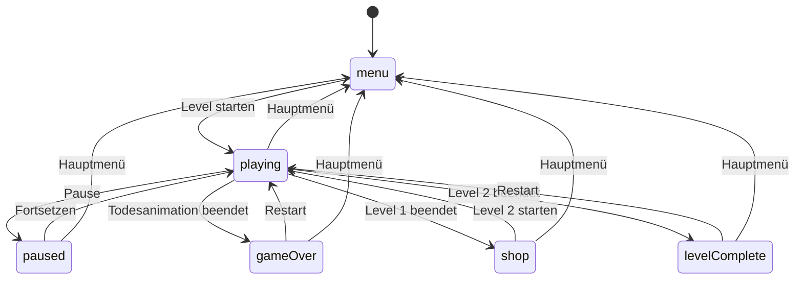
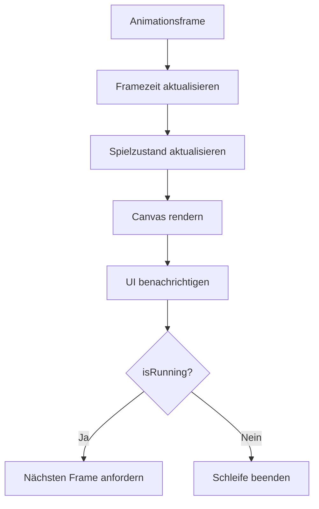
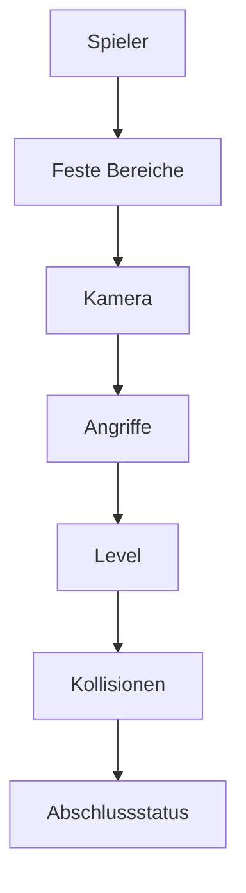
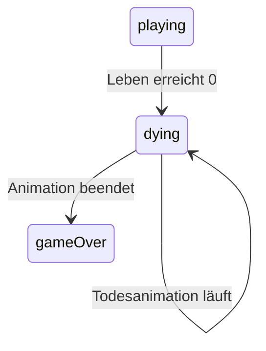

# Game Loop und Spielzustand

Dieses Dokument beschreibt die zentrale Animationsschleife, die pausierbare
Spielzeit, den Lebenszyklus einer Spielsitzung und die Statusübergänge von
**Sharky – Jump and Swim**.

Die wichtigsten beteiligten Klassen sind:

- `Game`
- `GameState`
- `GameClock`
- `Level`
- `UiStatusController`
- `ScreenManager`

## Verantwortungsverteilung

| Klasse | Verantwortung |
| --- | --- |
| `Game` | Ablaufsteuerung, Game Loop, Updates, Rendering und Lebenszyklus |
| `GameState` | Spielstatus, Level, Inventar, Spieler, Upgrades und Sitzungsdaten |
| `GameClock` | Spiel- und Animationszeit ohne Pausendauer |
| `Level` | Aktualisierung der aktiven Levelobjekte |
| `UiStatusController` | Synchronisierung von Zustand, HUD und Statusscreens |
| `ScreenManager` | Sichtbarkeit der Menü-, Spiel- und Overlaybereiche |

`Game` entscheidet, wann etwas ausgeführt wird. `GameState` speichert, in
welchem Zustand sich das Spiel befindet.

## Initialzustand

Beim Erzeugen von `GameState` wird ein sicherer Ausgangszustand hergestellt.

```text
status:       menu
isRunning:    false
isPaused:     false
currentLevel: 1
coins:        0
poison:       0
upgrades:     nicht gekauft
```

Level 1 und eine Spielerinstanz werden bereits vorbereitet. Die aktive
Spielschleife beginnt jedoch erst nach einem ausdrücklichen Spielstart.

Der `Game`-Konstruktor erzeugt anschließend:

- `GameState`
- `GameRenderer`
- `Camera`
- `CollisionManager`
- `AttackManager`

Danach wird der initiale Menüzustand einmal gerendert und an die
Benutzeroberfläche gemeldet.

## Spielstatus

`GameState.status` verwendet folgende Werte:

| Status | Bedeutung | Aktive Updates |
| --- | --- | --- |
| `menu` | Hauptmenü ist aktiv | Nein |
| `playing` | Level wird gespielt | Ja |
| `paused` | Spiel ist pausiert | Nein |
| `shop` | Level 1 wurde abgeschlossen | Nein |
| `gameOver` | Spieler wurde besiegt | Nein |
| `levelComplete` | Level 2 wurde abgeschlossen | Nein |

Neben `status` werden zwei zusätzliche Zustände geführt:

| Eigenschaft | Bedeutung |
| --- | --- |
| `isRunning` | Eine Animationsschleife gehört zur aktuellen Spielsitzung |
| `isPaused` | Fachliche Updates und Spielzeit sind pausiert |

`isRunning` bleibt während einer Pause aktiv. Dadurch kann die bestehende
Animationsschleife weiterlaufen, ohne nach dem Fortsetzen neu gestartet werden
zu müssen. `Game.update()` überspringt währenddessen sämtliche
Spielaktualisierungen.

## Statusübergänge



## Spielstart

Der normale Spielstart erfolgt über:

```js
game.start(levelNumber);
```

Der Ablauf ist:

1. Eine eventuell vorhandene Animationsschleife wird beendet.
2. `GameState.start()` setzt die aktuelle Sitzung zurück.
3. Münzen, Giftflaschen und Upgrades werden zurückgesetzt.
4. Die Levelnummer wird validiert.
5. Der Status wechselt zu `playing`.
6. Spieler und Level werden zurückgesetzt.
7. Spielzeit und Eingaben werden vorbereitet.
8. Kamera und Angriffssystem werden zurückgesetzt.
9. Gameplay-Musik wird gestartet.
10. Die Animationsschleife beginnt.

Ungültige oder unbekannte Levelnummern werden sicher auf Level 1
zurückgeführt.

## Wechsel zu Level 2

Der Wechsel nach dem Shop verwendet:

```js
game.startNextLevel(2);
```

Im Gegensatz zu einem vollständigen neuen Spiel wird die Sitzung dabei nicht
zurückgesetzt.

Folgende Werte bleiben erhalten:

- Münzen
- Giftflaschen
- gekaufte Upgrades

Für das neue Level werden dagegen zurückgesetzt:

- Spielerinstanz
- Spielerposition
- Levelobjekte
- Gegner
- Sammelobjekte
- Endboss
- Kamera
- aktive Angriffe
- Framezeit

Gekaufte Upgrades werden nach dem Erzeugen des neuen Spielers erneut
angewendet.

## Animationsschleife

Die zentrale Schleife basiert auf `requestAnimationFrame`.

```js
requestAnimationFrame(
    (currentTime) => this.runGameLoop(currentTime)
);
```

Ein Frame durchläuft folgende Schritte:



Die Reihenfolge ist bewusst festgelegt. Erst werden Zustände verändert, danach
wird das aktuelle Ergebnis gezeichnet und an das DOM-Interface übertragen.

## Framezeit und FPS

`Game` speichert den Zeitstempel des vorherigen Browserframes in
`lastFrameTime`.

Ab dem zweiten Frame wird die Bildrate berechnet:

```text
frameDuration = currentTime - lastFrameTime
framesPerSecond = round(1000 / frameDuration)
```

Der berechnete Wert wird über `GameState.setFramesPerSecond()` gespeichert.

Bei einem Levelstart oder Restart wird die Framezeit zurückgesetzt. Dadurch
wird die Pause zwischen zwei Spielsitzungen nicht fälschlich als extrem langer
Frame gewertet.

Die FPS-Anzeige ist ein Diagnosewert und steuert nicht die
Bewegungsgeschwindigkeit.

## Update-Bedingungen

Normale Spielsysteme dürfen nur aktualisiert werden, wenn alle folgenden
Bedingungen erfüllt sind:

```js
gameState.isRunning &&
!gameState.isPaused &&
gameState.status === 'playing'
```

Dadurch werden Bewegungen und Kollisionen in folgenden Situationen verhindert:

- Hauptmenü
- Pause
- Shop
- Game-over-Screen
- Win-Screen

Ein besiegter Spieler erhält einen eigenen Updatepfad für die Todesanimation.

## Update-Reihenfolge

Während eines aktiven Frames führt `Game.updateActiveGame()` die Systeme in
dieser Reihenfolge aus:

1. Spieler aktualisieren
2. feste Kollisionen auflösen
3. Kamera aktualisieren
4. Angriffe aktualisieren
5. Level und Gegner aktualisieren
6. Kollisionen prüfen
7. Spielstatus prüfen



## Spielerupdate

Vor der Spielerbewegung wird die bisherige Position gespeichert:

```js
const previousPosition = {
    x: player.x,
    y: player.y
};
```

Danach verarbeitet der Spieler die aktuelle Eingabe. Der `CollisionManager`
verwendet die vorherige Position, um unzulässige Bewegungen in feste
Levelbereiche aufzulösen.

Die Spielerposition wird innerhalb der von `Level.getBounds()` gelieferten
Grenzen gehalten.

## Kameraupdate

Die Kamera wird nach dem Spieler aktualisiert. Dadurch basiert der sichtbare
Ausschnitt auf der aktuellen und nicht auf der vorherigen Spielerposition.

Der sichtbare Kamerabereich wird anschließend an das Level weitergegeben. Der
dynamische Enemy-Spawner kann damit Spawnpositionen außerhalb des sichtbaren
Bereichs bestimmen.

## Angriffsupdate

Der `AttackManager` verarbeitet den gemeinsamen Tastatur- und Touchzustand.

Während dieses Schritts werden:

- neue Angriffe ausgelöst
- aktive Angriffe bewegt
- Lebenszeiten aktualisiert
- abgelaufene Angriffe entfernt
- Abklingzeiten berücksichtigt

Die Kollisionsprüfung erfolgt erst danach. Dadurch besitzen alle Angriffe für
den aktuellen Frame gültige Positionen.

## Levelupdate

Das aktive Level aktualisiert:

1. normale Gegner
2. Sammelobjekte
3. Endboss
4. dynamischen Enemy-Spawner
5. Freischaltung des Levelziels

Der Endboss erhält Spielerposition, feste Kollisionsbereiche und Levelgrenzen.
Der Spawner erhält Spieler und sichtbaren Kamerabereich.

## Kollisionsphase

Die Kollisionen werden nach Typ getrennt geprüft:

1. gefährliche Objekte gegen Spieler
2. Sammelobjekte gegen Spieler
3. Angriffe gegen gültige Ziele

Diese Reihenfolge stellt sicher, dass tödlicher Kontaktschaden und im selben
Frame eingesammelte Objekte eindeutig verarbeitet werden, bevor über
Game-over oder Levelabschluss entschieden wird.

## Game-over-Ablauf

Ein tödlicher Treffer öffnet den Game-over-Screen nicht sofort.

Im Trefferframe:

1. Die Geschwindigkeit des Spielers wird zurückgesetzt.
2. Die Todesanimation wird gestartet.

In den folgenden Frames:

1. Normale Bewegung wird vollständig übersprungen.
2. Die Spielerposition bleibt unverändert.
3. Nur die Todesanimation wird weitergeführt.
4. Nach ihrem Abschluss wird `setGameOver()` ausgeführt.
5. Die Musik wird gestoppt.
6. `isRunning` wird auf `false` gesetzt.
7. Die Animationsschleife endet.
8. Das Interface zeigt den Game-over-Screen.



Damit bleibt der Spieler nach seinem Tod unbeweglich und die Animation wird
vollständig angezeigt.

## Levelabschluss

Ein Level gilt nur als abgeschlossen, wenn:

1. das Zielobjekt existiert
2. das Ziel freigeschaltet wurde
3. der Spieler das Ziel erreicht

Das Ziel wird freigeschaltet, sobald kein aktiver Endboss mehr vorhanden oder
der vorhandene Endboss besiegt ist.

Der anschließende Status hängt vom aktuellen Level ab:

| Level | Folgestatus |
| --- | --- |
| Level 1 | `shop` |
| Level 2 | `levelComplete` |

Bei beiden Übergängen:

- endet die Animationsschleife
- wird die Musik gestoppt
- werden normale Ingame-Steuerungen deaktiviert
- wird der passende Statusscreen angezeigt

Beim Wechsel zu `levelComplete` spielt die Benutzeroberfläche zusätzlich den
Win-Sound.

## Shopzustand

Nach Abschluss von Level 1 wechselt das Spiel in den Status `shop`.

Im Shop können Münzen für folgende Upgrades verwendet werden:

| Upgrade | Auswirkung |
| --- | --- |
| `speedBoost` | erhöht die Bewegungsgeschwindigkeit |
| `extraHealth` | erhöht maximale und aktuelle Lebenspunkte |
| `poisonCapacity` | erhöht die Kapazität für Giftflaschen |

Ein Upgrade kann nur gekauft werden, wenn:

- eine gültige Konfiguration existiert
- es noch nicht gekauft wurde
- genügend Münzen vorhanden sind

Die Kaufaktion zieht die konfigurierten Kosten ab, markiert das Upgrade als
gekauft und aktualisiert den Spielerzustand.

## Pause

Eine Pause verändert den Status wie folgt:

```text
status:    playing → paused
isRunning: true
isPaused:  false → true
```

Zusätzlich werden:

- `GAME_CLOCK` eingefroren
- Musik pausiert
- laufende Soundeffekte gestoppt
- alle aktiven Eingaben zurückgesetzt
- das Interface aktualisiert

Die Animationsschleife bleibt bestehen. `Game.update()` beendet sich jedoch
vor allen Fachupdates.

Dadurch bewegen sich während der Pause weder:

- Spieler
- Gegner
- Endboss
- Angriffe
- Sammelobjekte
- Kamera

## Fortsetzen

Beim Fortsetzen:

1. berechnet `GameClock` die abgeschlossene Pausendauer
2. die Pausenzeit wird von künftigen Zeitabfragen abgezogen
3. `GameState` wechselt zurück zu `playing`
4. Musik wird fortgesetzt
5. die Oberfläche wird aktualisiert

Da die Animationsschleife während der Pause bestehen bleibt, muss kein zweiter
Loop gestartet werden.

## `GameClock`

Browserzeit läuft auch dann weiter, wenn das Spiel pausiert ist. Direkte
Verwendung von `Date.now()` oder `performance.now()` würde daher
Animationszeiten und Abklingzeiten überspringen lassen.

`GameClock` stellt zwei pausierbare Zeitquellen bereit:

| Methode | Grundlage | Einsatz |
| --- | --- | --- |
| `now()` | `Date.now()` | Spielzustände und zeitbasierte Abläufe |
| `animationNow()` | `performance.now()` | Animationen und kurze Zeitintervalle |

Während einer Pause liefern beide Methoden konstant den Zeitpunkt zurück, an
dem die Pause begonnen hat.

Beim Fortsetzen wird die Pausendauer auf getrennte Offsets addiert:

```text
Spielzeit = reale Date-Zeit - vollständige Date-Pausen
Animationszeit = reale Performance-Zeit - vollständige Animationspausen
```

Die Anwendung verwendet eine gemeinsame Instanz:

```js
const GAME_CLOCK = new GameClock();
```

Dadurch beziehen sich alle zeitabhängigen Spielsysteme auf dieselbe
pausierbare Zeitbasis.

## Restart

Ein Restart verwendet keinen Seiten-Reload.

```js
game.restart();
```

Der Ablauf ist:

1. laufenden Animationsframe abbrechen
2. aktuelles Level über `GameState.restartCurrentLevel()` neu starten
3. Spieler neu erzeugen
4. gekaufte Upgrades erneut anwenden
5. Levelobjekte zurücksetzen
6. Kamera zurücksetzen
7. Angriffe entfernen
8. Eingaben lösen
9. Framezeit zurücksetzen
10. Musik und Animationsschleife neu starten

Ein Restart behält den bestehenden Sitzungsfortschritt bei:

- Münzen
- Giftflaschen
- gekaufte Upgrades

Ein vollständiger neuer Start über `Game.start()` setzt diese Werte dagegen
zurück.

## Rückkehr zum Hauptmenü

`Game.stop()` beendet die aktive Sitzung kontrolliert.

Dabei werden:

- `GameClock` fortgesetzt, falls es pausiert war
- der Status auf `menu` gesetzt
- die Animationsschleife abgebrochen
- Eingaben zurückgesetzt
- Kamera und Angriffe zurückgesetzt
- sämtliche Audiowiedergaben beendet
- der Menüzustand gerendert
- die Benutzeroberfläche benachrichtigt

Die nächste neue Spielsitzung setzt Inventar und Upgrades über `start()` zurück.

## Synchronisierung mit dem Interface

Nach jedem Frame und jedem direkten Lebenszykluswechsel ruft `Game` den
registrierten Statuscallback auf.

```text
Game
  ↓
handleGameStatusUpdate
  ↓
UiController
  ↓
UiStatusController
  ↓
HUD und Statusscreens
```

`UiStatusController` aktualisiert:

- Levelnummer
- Lebenspunkte
- Münzen
- Giftflaschen
- lesbaren Spielstatus
- verfügbare Shop-Upgrades
- Pause-/Play-Schaltfläche
- Audio-Schaltflächen
- Shop-, Game-over- und Win-Screen

Statussounds werden nur bei einem tatsächlichen Statuswechsel abgespielt. Der
vorherige Zustand wird gespeichert, damit wiederholte Frameupdates keinen Sound
mehrfach auslösen.

## Sichtbare Statuszuordnung

| Interner Status | Sichtbare Darstellung |
| --- | --- |
| `menu` | Hauptmenü |
| `playing` | aktive Spielansicht |
| `paused` | Pause-Overlay |
| `shop` | Shop zwischen Level 1 und Level 2 |
| `gameOver` | Niederlagen-Screen |
| `levelComplete` | finaler Win-Screen |

`ScreenManager` kapselt das Ein- und Ausblenden der zugehörigen DOM-Bereiche.
Fachsysteme verändern diese Elemente nicht direkt.

## Abgesicherte Lebenszyklusfälle

Automatisierte Tests sichern insbesondere ab:

- Spielzeit bleibt während einer Pause stehen
- abgeschlossene Pausendauer wird nach dem Fortsetzen ausgeschlossen
- besiegte Spieler gelangen nicht mehr in den normalen Bewegungsupdate
- die Todesanimation verändert die Spielerposition nicht
- Restart bereitet das aktuelle Level ohne Seiten-Reload neu vor

## Lebenszyklusregeln

- Es darf höchstens eine aktive Animationsschleife existieren.
- Vor einem Levelstart oder Restart wird ein vorhandener Frame abgebrochen.
- Nur `playing` darf Fachsysteme aktualisieren.
- Pause setzt alle aktiven Eingaben zurück.
- Pausendauer darf Animationen und Abklingzeiten nicht überspringen.
- Ein besiegter Spieler darf nicht mehr bewegt werden.
- Game Over beginnt erst nach Abschluss der Todesanimation.
- Statusscreens stoppen die laufende Spielschleife.
- Restart verwendet Resetmethoden und keinen Browser-Reload.
- Level 2 übernimmt den Fortschritt aus Level 1.
- Ein vollständig neues Spiel setzt den Sitzungsfortschritt zurück.
- Die Oberfläche reagiert auf `GameState` und bestimmt nicht selbst den
  fachlichen Spielstatus.

## Weiterführende Dokumentation

- [Anwendungsarchitektur](application.md)
- [Rendering und Assets](rendering-assets.md)
- [Spieler und Kampfsystem](../features/player-combat.md)
- [Gegner und Levelsystem](../features/enemies-levels.md)
- [Interface und Steuerung](../features/interface-controls.md)
- [Tests und Projektvalidierung](../engineering/testing-validation.md)