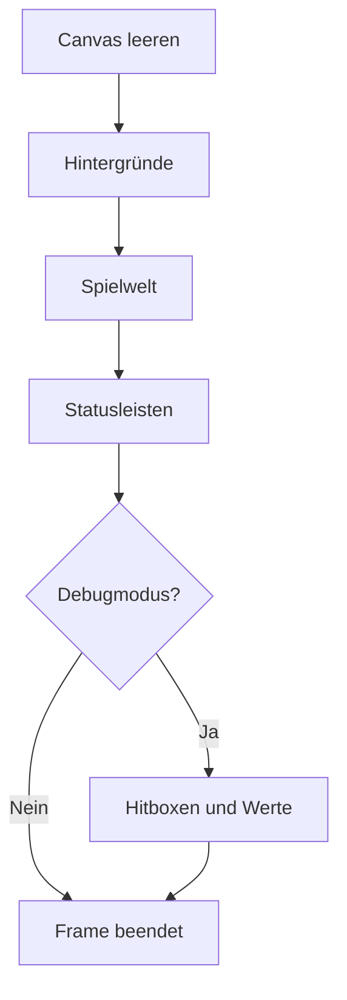

# Rendering und Assets

Dieses Dokument beschreibt die Canvas-Darstellung, Kamera, Zeichenreihenfolge,
Animationen, Statusanzeigen und zentrale Verwaltung der Bild- und Audiodateien
von **Sharky – Jump and Swim**.

Die wichtigsten beteiligten Klassen und Konfigurationen sind:

- `GameRenderer`
- `GameStatusRenderer`
- `CanvasStatusBar`
- `Camera`
- `DrawableObject`
- `AnimatedDrawableObject`
- `BackgroundObject`
- `BarrierObject`
- `ASSET_CONFIG`

## Canvas-Grundlage

Die Spielwelt wird in einem HTML5 Canvas mit einer internen Auflösung von
`960 × 540` Pixeln dargestellt.

```html
<canvas id="gameCanvas" width="960" height="540">
    Dein Browser unterstützt kein Canvas.
</canvas>
```

Diese Werte bilden die logische Renderauflösung. Die sichtbare Größe kann über
CSS an die verfügbare Bildschirmfläche angepasst werden, ohne dass die interne
Weltkoordinate verändert wird.

`GameRenderer` liest beim Erzeugen den zweidimensionalen Rendering-Kontext:

```js
this.context = canvas.getContext('2d');
```

Alle sichtbaren Spielobjekte werden über diesen gemeinsamen Kontext gezeichnet.

## Verantwortungsverteilung

| Bereich | Verantwortung |
| --- | --- |
| `GameRenderer` | vollständige Zeichenreihenfolge eines Frames |
| `GameStatusRenderer` | Spieler- und Bossstatusleisten |
| `CanvasStatusBar` | Auswahl eines Bildzustands anhand eines Prozentwerts |
| `Camera` | sichtbarer Weltausschnitt und Begrenzung auf das Level |
| `DrawableObject` | Bildladung, Cache, Position und grundlegendes Zeichnen |
| `AnimatedDrawableObject` | Animationsfolgen und zeitbasierter Bildwechsel |
| `BackgroundObject` | kamerabezogene Hintergründe und Parallax-Effekt |
| `BarrierObject` | sichtbare Barrieren und feste Kollisionsflächen |
| `ASSET_CONFIG` | zentrale Pfade aller Bilder, Animationen und Audiodateien |

## Renderzyklus

`Game` ruft nach jedem Update die Methode `GameRenderer.render()` auf.

Ein vollständiger Renderdurchlauf besteht aus:

1. Canvas leeren
2. Levelhintergründe zeichnen
3. kamerabhängige Weltobjekte zeichnen
4. Canvas-Statusleisten zeichnen
5. optionale Debugebene zeichnen



Das Canvas wird in jedem Frame vollständig neu aufgebaut. Bewegte Objekte
werden nicht einzeln gelöscht oder über ihre alte Darstellung gezeichnet.

## Canvas leeren

Vor der neuen Darstellung entfernt `clearCanvas()` den gesamten vorherigen
Frame:

```js
context.clearRect(
    0,
    0,
    canvas.width,
    canvas.height
);
```

Dadurch entstehen keine sichtbaren Spuren hinter bewegten Objekten.

## Zeichenreihenfolge

Die Reihenfolge bestimmt, welche Elemente andere Elemente überdecken.

### Gesamtreihenfolge

```text
1. Hintergrundebenen
2. Levelziel
3. Barrieren
4. aktive Sammelobjekte
5. normale Gegner
6. Endboss
7. aktive Angriffe
8. Spieler
9. Canvas-Statusleisten
10. Debugdarstellung
```

Der Spieler wird nach Angriffen und Gegnern gezeichnet und bleibt dadurch im
normalen Spielbetrieb sichtbar über diesen Elementen.

Statusleisten werden außerhalb der verschobenen Welt gezeichnet. Sie bleiben
deshalb unabhängig von der Kameraposition an derselben Stelle des Canvas.

## Welt- und Bildschirmkoordinaten

Sharky unterscheidet zwischen:

- Weltkoordinaten
- Canvas- beziehungsweise Bildschirmkoordinaten

Entities speichern ihre Position in der Spielwelt:

```text
object.x
object.y
```

Vor dem Zeichnen der normalen Weltobjekte verschiebt der Renderer den
Canvas-Kontext entgegen der Kamera:

```js
context.translate(-camera.x, -camera.y);
```

Ein Objekt an der Weltposition `x = 1500` erscheint dadurch abhängig von der
aktuellen Kameraposition im sichtbaren Canvas.

Nach der Weltzeichnung stellt `context.restore()` den ursprünglichen
Bildschirmkontext wieder her.

## Sicherung des Canvas-Kontexts

Temporäre Änderungen werden mit `save()` und `restore()` gekapselt:

```js
context.save();
context.translate(-camera.x, -camera.y);

// Weltobjekte zeichnen

context.restore();
```

Dasselbe Prinzip wird bei Hintergründen und ihrer Transparenz verwendet.

Dadurch beeinflussen folgende Einstellungen nicht unkontrolliert spätere
Zeichenoperationen:

- Übersetzung
- Transparenz
- Linienfarbe
- Linienbreite
- weitere Context-Eigenschaften

## Kamera

`Camera` speichert die linke obere Position des sichtbaren Weltausschnitts:

```text
camera.x
camera.y
```

Die Kamera folgt der Spielerposition horizontal und vertikal.

### Zielposition

Die Zielposition wird anhand des Spielers und eines konfigurierten
Fokusbereichs berechnet:

```text
targetX = player.x - canvas.width × horizontalFocus
targetY = player.y - canvas.height × verticalFocus
```

Die Fokuswerte stammen aus `GAME_CONFIG`.

Dadurch befindet sich der Spieler nicht zwingend exakt in der Mitte des
Canvas. Die Konfiguration kann festlegen, wie viel Welt in Bewegungsrichtung
sichtbar bleibt.

### Kameragrenzen

Die Kamera darf das Level nicht verlassen.

Horizontal gilt:

```text
0 ≤ camera.x ≤ level.width - canvas.width
```

Vertikal gilt:

```text
0 ≤ camera.y ≤ level.height - canvas.height
```

`Camera.limitValue()` beschränkt die berechnete Zielposition auf den gültigen
Bereich.

Bei Leveln, die kleiner als der Canvas sind, liefert das Level als maximale
Kameraposition `0`.

### Sichtbarer Bereich

`getVisibleBounds()` stellt den aktuellen Ausschnitt als Rechteck bereit:

```js
{
    left,
    top,
    right,
    bottom,
    width,
    height
}
```

Dieser Bereich wird nicht nur für die Darstellung verwendet. Der
`EnemySpawnPositionFinder` nutzt ihn auch, um neue Gegner außerhalb des
sichtbaren Ausschnitts zu positionieren.

## Hintergrunddarstellung

Hintergründe werden über `BackgroundObject` gezeichnet.

Ein Hintergrundobjekt enthält:

- Weltposition
- Breite und Höhe
- Bildpfad
- Fallbackfarbe
- Scrollfaktor
- Transparenz

### Parallax-Effekt

Jede Hintergrundebene kann einen eigenen `scrollFactor` verwenden.

Die Bildschirmposition wird folgendermaßen berechnet:

```text
screenX = object.x - camera.x × scrollFactor
screenY = object.y - camera.y × scrollFactor
```

Ein kleinerer Faktor bewegt eine Hintergrundebene langsamer als die eigentliche
Spielwelt. Dadurch entsteht räumliche Tiefe.

Die Levelkonfigurationen verwenden mehrere Ebenen, unter anderem:

- entfernte Wasserebene
- hintere Riffebene
- mittlere Riffebene
- Lichtebene
- Bodenschicht

### Bildzuschnitt

`BackgroundObject` verwendet eine Cover-Berechnung. Das Seitenverhältnis des
Bildes wird mit dem Zielbereich verglichen.

Je nach Verhältnis wird das Quellbild:

- horizontal beschnitten oder
- vertikal beschnitten

Das Bild füllt dadurch die konfigurierte Hintergrundfläche vollständig aus,
ohne sichtbar verzerrt zu werden.

### Transparenz

Die Eigenschaft `opacity` wird über `context.globalAlpha` angewendet.

Die Transparenz gilt nur innerhalb des gekapselten Hintergrund-Renderings und
wird anschließend über `restore()` zurückgesetzt.

## Barrieren

`BarrierObject` verbindet sichtbare Levelgrafiken mit festen
Kollisionsbereichen.

Die sichtbare Größe und die tatsächliche Kollisionsfläche können voneinander
abweichen. Dafür verwendet die Klasse ein `collisionInset`:

```js
{
    left,
    right,
    top,
    bottom
}
```

Die Kollisionsfläche wird aus der sichtbaren Position und diesen Abständen
berechnet.

Damit können transparente Ränder eines Bildes von der Kollision ausgeschlossen
werden.

## DrawableObject

`DrawableObject` ist die gemeinsame Grundlage für rechteckige Canvas-Objekte.

Die Klasse speichert:

- `x`
- `y`
- `width`
- `height`
- aktuelles Bild
- aktuellen Bildpfad
- Fallbackfarbe

### Bildladung

Ein Bild wird über `loadImage()` registriert:

```js
loadImage(imagePath);
```

Bei einem leeren Pfad wird das aktuelle Bild entfernt. Leere Assetpfade können
dadurch bewusst für optionale oder noch nicht grafisch belegte Objekte
verwendet werden.

### Bildprüfung

Vor dem Zeichnen prüft `isImageReady()`:

- ein Bildobjekt existiert
- der Ladevorgang ist abgeschlossen
- das Bild besitzt eine natürliche Breite größer als `0`

Nur vollständig geladene Bilder werden an `drawImage()` übergeben.

### Fallbackdarstellung

Wenn kein verwendbares Bild vorhanden ist, zeichnet `DrawableObject` ein
farbiges Rechteck innerhalb der Objektgrenzen.

Dadurch bleibt ein Objekt auch dann sichtbar, wenn:

- ein optionaler Bildpfad leer ist
- ein Bild noch geladen wird
- eine Datei nicht erfolgreich geladen werden konnte

Die projektspezifische Validierung soll fehlende konfigurierte Dateien bereits
vor der manuellen Browserprüfung erkennen.

## Gemeinsamer Bildcache

Alle `DrawableObject`-Instanzen teilen einen statischen Bildcache:

```js
DrawableObject.imageCache = {};
```

Der Cache verwendet den vollständigen Bildpfad als Schlüssel.

```text
Assetpfad
    ↓
Cache prüfen
    ├── vorhanden → vorhandenes Image verwenden
    └── nicht vorhanden → neues Image erzeugen und speichern
```

Dadurch wird dieselbe Bilddatei nicht für jedes Objekt und jeden
Animationszustand erneut als eigenes `Image`-Element angelegt.

Das betrifft beispielsweise:

- mehrere Gegner desselben Typs
- wiederkehrende Animationsframes
- Statusleisten
- Sammelobjekte
- Levelhintergründe

## Animationen

`AnimatedDrawableObject` erweitert bewegliche Objekte um wiederverwendbare
Bildfolgen.

Die Klasse speichert:

- registrierte Animationen
- Namen der aktuellen Animation
- aktuellen Frameindex
- Framedauer
- Zeitpunkt des letzten Bildwechsels
- Abschlussstatus einer einmaligen Animation

### Animation registrieren

Eine Animation wird über einen Namen und eine geordnete Pfadliste registriert:

```js
addAnimation('swim', imagePaths);
```

Alle Bilder werden über den gemeinsamen Bildcache geladen.

### Animation abspielen

```js
playAnimation(name, frameDuration, loop);
```

| Parameter | Bedeutung |
| --- | --- |
| `name` | registrierter Animationsname |
| `frameDuration` | Dauer eines Frames in Millisekunden |
| `loop` | Wiederholung oder einmaliger Ablauf |

### Animationswechsel

Beim Wechsel in einen anderen Animationszustand werden zurückgesetzt:

- Frameindex
- Framedauer
- letzter Framezeitpunkt
- Abschlussstatus

Ein erneuter Aufruf derselben Animation startet sie dagegen nicht in jedem
Spielupdate neu.

### Zeitsteuerung

Animationen verwenden:

```js
GAME_CLOCK.animationNow();
```

Dadurch bleibt der Frame während einer Spielpause stehen. Beim Fortsetzen
überspringt die Animation keine Bilder aufgrund der real vergangenen
Pausendauer.

### Verpasste Frames

Die Zahl der weiterzuschaltenden Animationsframes wird aus der vergangenen Zeit
berechnet:

```text
frameSteps = floor(elapsedTime / frameDuration)
```

Bei einem längeren Browserframe kann eine Animation dadurch mehrere Bilder
aufholen, statt dauerhaft langsamer zu laufen.

### Wiederholte Animation

Bei einer Schleifenanimation wird der Index mit dem Modulo der Bildanzahl
berechnet:

```text
nextIndex modulo frameCount
```

### Einmalige Animation

Bei einer nicht wiederholten Animation wird der letzte gültige Frame nicht
überschritten.

Sobald das Ende erreicht ist, meldet:

```js
isAnimationFinished();
```

den Abschluss. Dies wird beispielsweise für die Todesanimation des Spielers
verwendet.

## Zentrale Assetkonfiguration

Alle bekannten visuellen und akustischen Pfade werden in
`js/config/asset-config.js` unter `ASSET_CONFIG` registriert.

Die Hauptbereiche sind:

| Bereich | Inhalt |
| --- | --- |
| `character` | Sharky-Bilder und Spieleranimationen |
| `backgrounds` | Parallax-Ebenen für Level 1 und Level 2 |
| `enemies` | Pufferfische, Quallenvarianten und Endboss |
| `collectibles` | Münzen und Giftflaschen |
| `levelObjects` | Zielobjekt und Barrieren |
| `attacks` | Flossenschlag, Blasenfalle und Giftangriff |
| `ui` | Interfacebilder und Statusleisten |
| `audio.music` | Gameplay- und Bossmusik |
| `audio.sounds` | Ereignisbezogene Soundeffekte |

## Spieleranimationen

Für Sharky sind unter anderem folgende Zustände registriert:

- Ausgangsbild
- Idle
- Long Idle
- Schwimmen
- Flossenschlag
- Blasenfalle
- Hurt
- Dead

Jeder Zustand verwendet eine geordnete Liste einzelner Bilddateien. Das Projekt
verwendet keine zusammengefassten Sprite-Sheets für diese Animationen.

## Gegneranimationen

Die Assetkonfiguration unterscheidet mehrere Gegnergruppen.

### Pufferfisch

- Schwimmen
- Übergang
- aufgeblasenes Schwimmen
- Tod

### Quallen

- normale violette Qualle
- gelbe Qualle
- starke pinke Qualle
- Schwimm- und Todesanimationen

### Endboss

- Einführung
- Schweben
- Angriff
- Hurt
- Tod

Die tatsächliche Verwendung eines Assetzustands wird durch die jeweilige Entity
und ihren Movement Controller bestimmt.

## Sammelobjekte

Für Münzen und Giftflaschen existieren:

- ein statischer Ausgangspfad
- eine geordnete Animationsfolge

Gesammelte Objekte werden nicht mehr durch den Renderer ausgegeben.
`Level.getActiveCollectibles()` filtert sie vor der Zeichenphase.

## Statusleisten

`GameStatusRenderer` erzeugt vier bildbasierte Statusleisten:

| Statusleiste | Position |
| --- | --- |
| Spielerleben | links oben |
| Münzen | links unter Leben |
| Giftflaschen | links unter Münzen |
| Bossleben | rechts oben |

Jede Leiste verwendet sechs Bilder:

```text
0 %
20 %
40 %
60 %
80 %
100 %
```

`CanvasStatusBar` rechnet einen aktuellen Wert und ein Maximum in einen
Prozentwert um.

```text
percentage = currentValue / maximum × 100
```

Der Wert wird auf den Bereich zwischen `0` und `100` begrenzt. Ein ungültiges
Maximum wird intern mindestens als `1` behandelt, damit keine Division durch
null entsteht.

### Spielerleben

Die Lebensleiste verwendet:

```text
player.health / player.maxHealth
```

Dadurch berücksichtigt sie auch das im Shop kaufbare Lebensupgrade.

### Münzen

Das Maximum entspricht der Anzahl der Münzobjekte des aktiven Levels.

Falls ein Level keine Münzen enthält, wird ein sicherer Maximalwert von `1`
verwendet.

### Giftflaschen

Die Giftanzeige verwendet die aktuelle Inventarmenge und die von `GameState`
berechnete Kapazität.

Das Kapazitätsupgrade wird dadurch automatisch berücksichtigt.

### Bossleben

Die Bossleiste wird nur gezeichnet, wenn:

- ein Endboss vorhanden ist
- seine Einführung erfolgt ist
- er nicht besiegt wurde

Vor der Bossbegegnung und nach seinem Tod bleibt die Leiste unsichtbar.

## Canvas-HUD und DOM-HUD

Das Projekt besitzt zwei ergänzende Statusdarstellungen.

### Canvas-HUD

Das Canvas zeigt bildbasierte Leisten für:

- Leben
- Münzen
- Gift
- Bossleben

### DOM-HUD

Die HTML-Oberfläche zeigt zusätzlich Textwerte für:

- aktuelles Level
- exakte Lebenspunkte
- exakte Münzanzahl
- Giftmenge und Kapazität
- lesbaren Spielstatus

Das Canvas-HUD gehört zum Renderer. Das DOM-HUD wird vom
`UiStatusController` aktualisiert.

## Debugdarstellung

Der Debugmodus wird über einen URL-Parameter aktiviert:

```text
?debug=true
```

Wenn `GameState.debugMode` aktiv ist, zeichnet `GameRenderer` zusätzliche
Informationen.

### Debug-Weltebene

Folgende Bereiche werden markiert:

- Spieler-Hitbox
- Gegner-Hitboxen
- Endboss-Hitbox
- Angriffsbereiche
- Zielbereich
- Sammelobjekte
- feste Kollisionsbereiche

Objekt-Hitboxen werden weiß dargestellt. Andere rechteckige Prüfbereiche
werden gelb markiert.

### Debug-Text

Die Debuganzeige enthält unter anderem:

- FPS
- Spielstatus
- Spielerleben
- Giftflaschen
- Münzen
- aktive Angriffe
- Spielerposition
- Kameraposition
- Gegneranzahl und Spawnstatistik
- Bossleben

Der Debugmodus ist ein Entwicklungswerkzeug und kein Bestandteil der normalen
Spieloberfläche.

## Assetvalidierung

Das projektspezifische Validierungsskript kontrolliert unter anderem die in
`ASSET_CONFIG` registrierten lokalen Dateien.

Die vollständige Prüfung erfolgt mit:

```bash
npm run validate
```

Im zuletzt geprüften Projektstand wurden `202` konfigurierte Assets erkannt.

Die Validierung soll insbesondere verhindern:

- nicht vorhandene Bilddateien
- nicht vorhandene Audiodateien
- fehlerhafte relative Pfade
- abweichende Groß- und Kleinschreibung
- versehentlich umbenannte Assetdateien

## Regeln für neue Assets

Beim Hinzufügen eines Assets sind folgende Schritte erforderlich:

1. Datei im passenden Unterordner unter `assets` ablegen.
2. Pfad in `ASSET_CONFIG` registrieren.
3. Pfad in der zuständigen Klasse oder Konfiguration verwenden.
4. `npm run validate` ausführen.
5. Darstellung und Animation im Browser prüfen.
6. Groß- und Kleinschreibung des Pfades kontrollieren.
7. Geänderte Assets und Konfiguration gemeinsam committen.

Direkte Pfadstrings außerhalb der zentralen Konfiguration sollten vermieden
werden, wenn das Asset Teil der Spielwelt, Animationen oder Audioverwaltung ist.

## Regeln für neue Animationen

Eine neue Animation benötigt:

1. vollständig vorhandene Einzelbilder
2. eine geordnete Pfadliste in `ASSET_CONFIG`
3. Registrierung über `addAnimation()`
4. einen eindeutigen Animationsnamen
5. passende Framedauer
6. Entscheidung zwischen Schleife und einmaligem Ablauf
7. eine Zustandsentscheidung in der zuständigen Entity
8. Prüfung von Pause, Restart und Animationswechsel

## Bekannte Grenzen

- Es existiert kein eigener Preloader mit sichtbarer Ladefortschrittsanzeige.
- Bilder werden über `Image`-Elemente geladen und bis zur Verfügbarkeit durch
  eine Fallbackdarstellung ersetzt.
- Die JavaScript-Ausführung wartet nicht zentral auf das vollständige Laden
  aller Bilddateien.
- Die vorhandene Assetstruktur enthält historische Verzeichnis- und Dateinamen
  mit Leerzeichen, Sonderzeichen und gemischter Großschreibung.
- Assetpfade können auf Linux-basierten Servern an abweichender
  Groß-/Kleinschreibung scheitern.
- Ein Umbenennen vorhandener Dateien erfordert die gleichzeitige Anpassung aller
  betroffenen Pfade.
- Das Projekt verwendet Einzelbilder statt gebündelter Sprite-Sheets.
- Es existiert keine automatische Bildkomprimierung oder Formatkonvertierung.
- Canvas-Inhalte sind nicht direkt als semantische HTML-Elemente für
  Screenreader zugänglich.
- Automatisierte Tests prüfen Renderlogik und Zustände, ersetzen aber keinen
  visuellen Browservergleich.

## Renderingregeln

- Die Zeichenreihenfolge wird ausschließlich im Renderer festgelegt.
- Spielentities zeichnen keine DOM-Elemente.
- Statusleisten werden außerhalb der Kameratransformation gezeichnet.
- Kameraübersetzungen müssen mit `save()` und `restore()` gekapselt werden.
- Hintergründe verwalten ihre Parallax-Position selbst.
- Nur aktive Sammelobjekte werden gezeichnet.
- Der Bossstatus wird nur während einer aktiven Bossbegegnung angezeigt.
- Animationen verwenden die pausierbare Spielzeit.
- Wiederverwendete Bilder werden über den gemeinsamen Cache geladen.
- Fehlende Bilder dürfen die Animationsschleife nicht zum Absturz bringen.
- Neue Assetpfade müssen durch die Projektvalidierung geprüft werden.
- Debugdarstellung darf den normalen Spielzustand nicht verändern.

## Weiterführende Dokumentation

- [Anwendungsarchitektur](application.md)
- [Game Loop und Spielzustand](game-loop-state.md)
- [Spieler und Kampfsystem](../features/player-combat.md)
- [Gegner und Levelsystem](../features/enemies-levels.md)
- [Audio und Anzeigeeinstellungen](../features/audio-display-settings.md)
- [Styling und Barrierefreiheit](../engineering/styling-accessibility.md)
- [Tests und Projektvalidierung](../engineering/testing-validation.md)