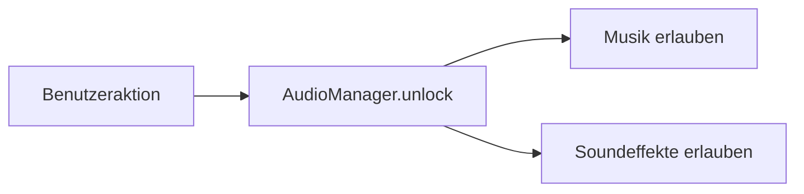
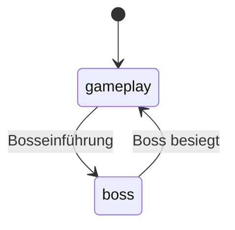

# Audio und Anzeigeeinstellungen

Dieses Dokument beschreibt Musik, Soundeffekte, Lautstärken, globales
Stummschalten, Browser-Audiofreigabe, Farbschema und Vollbildmodus von
**Sharky – Jump and Swim**.

Die wichtigsten beteiligten Klassen sind:

- `AudioManager`
- `UiAudioControls`
- `DisplaySettingsController`
- `UiController`
- `UiStatusController`

## Verantwortungsverteilung

| Klasse | Verantwortung |
| --- | --- |
| `AudioManager` | Audiodateien, Wiedergabe, Lautstärken und Speicherung |
| `UiAudioControls` | Audio-Buttons, Slider und UI-Synchronisierung |
| `DisplaySettingsController` | Farbschema, Vollbild und Anzeige-Buttons |
| `UiController` | Einbindung in Menü und Spielablauf |
| `UiStatusController` | Aktualisierung kompakter Ingame-Controls |

Audio- und Anzeigeeinstellungen sind voneinander getrennt und verwenden eigene
Local-Storage-Einträge.

## Audiobereiche

Das Audiosystem unterscheidet:

- Hintergrundmusik
- Soundeffekte
- globalen Mute-Zustand

Musik und Soundeffekte können unabhängig voneinander aktiviert, deaktiviert und
in der Lautstärke angepasst werden.

## Standardeinstellungen

Die Standardwerte stammen aus `GAME_CONFIG`.

| Einstellung | Standard |
| --- | ---: |
| Musik aktiviert | Ja |
| Soundeffekte aktiviert | Ja |
| Global stumm | Nein |
| Musiklautstärke | `40 %` |
| Soundlautstärke | `40 %` |

Die Prozentwerte werden intern als Zahlen zwischen `0` und `1` gespeichert.

```text
40 % → 0.4
```

## Browser-Audiofreigabe

Moderne Browser verhindern häufig automatische Audiowiedergabe vor einer
Benutzerinteraktion.

`AudioManager` startet deshalb mit:

```js
isUnlocked = false;
```

Musik und Sounds können erst abgespielt werden, nachdem `unlock()` durch eine
Benutzeraktion ausgeführt wurde.

Geeignete Aktionen sind unter anderem:

- Spielstart
- Levelwechsel
- Restart
- Audio-Button
- Interfaceklick



`unlock(false)` gibt Audio frei, startet aber nicht automatisch die aktuelle
Musik. Dies wird beispielsweise für reine Interfaceklicks und den kompakten
Audio-Button verwendet.

## Musik

Das Spiel registriert zwei wiederholte Musikstücke:

| Name | Verwendung |
| --- | --- |
| `gameplay` | normale Levelmusik |
| `boss` | aktive Bossbegegnung |

Beide Audioelemente verwenden:

```js
audio.loop = true;
audio.preload = 'auto';
```

## Musikwechsel

Beim Spielstart wird Gameplay-Musik ausgewählt.

Wenn der Endboss in den Zustand `introduce` wechselt:

1. Boss-Intro-Sound wird abgespielt
2. Gameplay-Musik wird gestoppt und zurückgespult
3. Bossmusik wird ausgewählt
4. Bossmusik beginnt

Beim Tod des Bosses:

1. Boss-Todessound wird abgespielt
2. Bossmusik wird gestoppt
3. Gameplay-Musik wird wieder ausgewählt



Ein Trackwechsel stoppt den bisherigen Track und setzt dessen Wiedergabeposition
auf `0`.

## Musik pausieren

Während einer Spielpause verwendet der Audio-Manager:

```js
pauseMusic();
```

Die Wiedergabeposition bleibt erhalten. Beim Fortsetzen läuft derselbe Track an
dieser Position weiter.

Davon zu unterscheiden ist `stopMusic()`. Diese Methode pausiert alle
Musiktracks und setzt ihre Wiedergabeposition auf `0`.

## Musikende bei Statuswechseln

Musik wird vollständig gestoppt bei:

- Game Over
- Levelabschluss
- Rückkehr zum Hauptmenü

Beim Restart oder nächsten Level wird anschließend die passende Musik neu
ausgewählt.

## Soundeffekte

Im aktuellen Assetstand sind `16` Soundeffekte registriert.

| Sound | Verwendung |
| --- | --- |
| `coin` | Münze eingesammelt |
| `poisonBottle` | Giftflasche eingesammelt |
| `finSlap` | Flossenschlag ausgelöst |
| `poisonShot` | Giftangriff ausgelöst |
| `bubbleTrap` | Blasenfalle ausgelöst |
| `bubblePop` | Projektil trifft Ziel oder Barriere |
| `playerHurt` | Sharky erhält nicht tödlichen Schaden |
| `playerDeath` | Sharky wird besiegt |
| `enemyBite` | Kontakt mit einem nicht elektrischen Gegner |
| `jellyfishShock` | Kontakt mit einer Qualle |
| `bossHurt` | Boss erhält Schaden |
| `bossDeath` | Boss wird besiegt |
| `bossIntro` | Bosseinführung beginnt |
| `gameOver` | Game-over-Screen erscheint |
| `win` | finaler Win-Screen erscheint |
| `buttonClick` | normale Interfaceaktion |

Der Long-Idle-Zustand besitzt bewusst keinen zusätzlichen Schlaf- oder
Schnarchsound.

## Soundpools

Für jeden Soundeffekt erzeugt `AudioManager` einen Pool aus vier unabhängigen
Audiokopien.

```text
Sound
├── Kopie 1
├── Kopie 2
├── Kopie 3
└── Kopie 4
```

Dadurch können identische Sounds kurz hintereinander oder überlappend
abgespielt werden.

Bei einer Soundanforderung wird bevorzugt eine Kopie verwendet, die:

- pausiert oder
- bereits beendet ist

Sind alle Kopien belegt, wird die erste Poolinstanz wiederverwendet.

Vor dem Abspielen wird die gewählte Kopie:

1. pausiert
2. auf Wiedergabeposition `0` gesetzt
3. auf die aktuelle Soundlautstärke gesetzt
4. in `activeSounds` aufgenommen
5. neu gestartet

Nach dem natürlichen Ende wird sie aus `activeSounds` entfernt.

## Aktive Soundeffekte stoppen

`stopSoundEffects()`:

- pausiert alle aktuell registrierten Soundkopien
- setzt ihre Position auf `0`
- leert die Sammlung aktiver Sounds

Diese Methode wird unter anderem verwendet bei:

- Spielpause
- Deaktivierung der Soundeffekte
- globalem Stummschalten
- Rückkehr zum Hauptmenü

## Gegnerkontaktsounds

Der Kontaktsound wird anhand des Gegnertyps gewählt.

Beginnt der Typname mit:

```text
jellyFish
```

wird `jellyfishShock` abgespielt.

Alle anderen normalen Kontaktgegner verwenden `enemyBite`.

Spieler- und Gegnersound werden nur abgespielt, wenn Sharkys Leben tatsächlich
reduziert wurde.

## Statussounds

`UiStatusController` speichert den vorherigen Spielstatus.

Dadurch werden folgende Sounds nur beim tatsächlichen Statuswechsel ausgelöst:

| Status | Sound |
| --- | --- |
| `gameOver` | `gameOver` |
| `levelComplete` | `win` |

Die wiederholte UI-Aktualisierung während mehrerer Frames spielt denselben
Statussound nicht erneut ab.

## Musik aktivieren und deaktivieren

`toggleMusic()` verändert ausschließlich den Musikkanal.

Beim Aktivieren:

- wird `musicEnabled` gesetzt
- ein globaler Mute-Zustand aufgehoben
- der aktuelle Track wird bei erlaubter Audiowiedergabe gestartet
- Einstellungen werden gespeichert

Beim Deaktivieren:

- wird der aktuelle Track pausiert
- seine Wiedergabeposition bleibt erhalten
- Soundeffekte bleiben unabhängig verfügbar

## Soundeffekte aktivieren und deaktivieren

`toggleSound()` verändert ausschließlich den Effektkanal.

Beim Deaktivieren:

- werden alle laufenden Soundeffekte gestoppt
- Musik bleibt unverändert

Beim Aktivieren wird ein globaler Mute-Zustand aufgehoben.

## Globales Audio-Toggle

Der kompakte Ingame-Audio-Button schaltet Musik und Soundeffekte gemeinsam.

### Wenn beide Kanäle aktiv sind

```text
Musik: Aus
Sound: Aus
```

### Wenn mindestens ein Kanal deaktiviert ist

```text
Musik: An
Sound: An
```

Die Oberfläche synchronisiert anschließend sämtliche Audioelemente.

## Globaler Mute-Zustand

`AudioManager` stellt zusätzlich einen gemeinsamen `muted`-Zustand bereit.

Beim vollständigen Deaktivieren:

- `musicEnabled` wird `false`
- `soundEnabled` wird `false`
- `muted` wird `true`
- Musik wird gestoppt und zurückgespult
- Soundeffekte werden gestoppt
- Einstellungen werden gespeichert

Beim vollständigen Aktivieren:

- beide Kanäle werden aktiviert
- `muted` wird `false`
- aktuelle Musik wird wieder gestartet, sofern Audio freigeschaltet ist

## Lautstärkeregler

Hauptmenü und Ingame-Einstellungen besitzen jeweils:

- Musiklautstärkeregler
- Soundlautstärkeregler

Alle Slider verwenden sichtbare Werte von `0` bis `100`.

`AudioManager` normalisiert sie:

```text
normalizedVolume = percent / 100
```

Vor der Umrechnung wird der Wert auf den gültigen Bereich begrenzt.

## Musiklautstärke

Eine Änderung der Musiklautstärke wird sofort auf alle vorhandenen
Musiktracks angewendet.

Dadurch besitzt auch der aktuell nicht aktive Track bereits den richtigen Wert,
wenn später zwischen Gameplay- und Bossmusik gewechselt wird.

## Soundlautstärke

Die Soundlautstärke wird gespeichert und beim nächsten Abspielen auf die
gewählte Poolinstanz angewendet.

Bereits laufende Soundeffekte werden durch eine Änderung des Sliders nicht
nachträglich in ihrer Lautstärke verändert.

## Lautstärke und Aktivierungszustand

Ein Lautstärkewert von `0 %` deaktiviert den Kanal nicht fachlich.

Beispiel:

```text
musicEnabled: true
musicVolume:  0
```

Die Oberfläche zeigt den Kanal weiterhin als aktiviert. Aktivierungsstatus und
Lautstärke sind getrennte Einstellungen.

## Audio-Bedienelemente

### Hauptmenü

- Musik an oder aus
- Musiklautstärke
- Soundeffekte an oder aus
- Soundlautstärke

### Ingame-Einstellungen

- Musik an oder aus
- Musiklautstärke
- Soundeffekte an oder aus
- Soundlautstärke

### Kompakter Ingame-Button

- Musik und Soundeffekte gemeinsam an oder aus

## Synchronisierung der Audiooberfläche

`UiAudioControls.updateAudioControls()` aktualisiert:

- kompakten Audio-Button
- Musikbutton im Hauptmenü
- Musikbutton im Spiel
- Soundbutton im Hauptmenü
- Soundbutton im Spiel
- beide Musikslider
- beide Soundslider

Eine Änderung an einer Stelle wird dadurch sofort an allen anderen
Bedienelementen sichtbar.

## Kompakter Audio-Button

Der kompakte Button reagiert auf:

- `pointerdown`
- tastaturgenerierten `click`

Bei Pointerbedienung wird die Aktion bereits über `pointerdown` ausgeführt.

Der zusätzliche Click-Handler reagiert nur, wenn:

```js
event.detail === 0
```

Dies kennzeichnet eine Tastaturaktivierung. Dadurch wird ein normaler
Pointerklick nicht durch `pointerdown` und `click` doppelt verarbeitet.

## Audio-ARIA-Zustand

Der kompakte Button erhält abhängig vom Zustand:

```text
aria-pressed="true" oder "false"
```

Sowie eine passende Beschreibung:

```text
Audio ausschalten
Audio einschalten
```

Der sichtbare beziehungsweise intern gesetzte Inhalt wechselt zwischen:

```text
🔊
🔇
```

Die grafische Darstellung erfolgt über das zugehörige CSS-Icon.

## Persistente Audioeinstellungen

Audioeinstellungen werden unter folgendem Local-Storage-Schlüssel gespeichert:

```text
sharkyAudioSettings
```

Gespeicherte Struktur:

```json
{
    "musicEnabled": true,
    "soundEnabled": true,
    "muted": false,
    "musicVolume": 0.4,
    "soundVolume": 0.4
}
```

Beim nächsten Erzeugen von `AudioManager` werden die Werte wiederhergestellt.

## Sichere Speicherung

Lesen und Schreiben sind durch `try/catch` geschützt.

Falls Local Storage:

- nicht verfügbar ist
- durch Browsereinstellungen blockiert wird
- ungültige JSON-Daten enthält
- einen Speicherfehler erzeugt

arbeitet das Spiel mit sicheren Standardwerten weiter.

Ungültige Lautstärken werden ignoriert. Gültige Werte werden zusätzlich auf
den Bereich `0` bis `1` begrenzt.

## Audiodateien

Die Musik- und Soundpfade befinden sich zentral unter:

```text
ASSET_CONFIG.audio.music
ASSET_CONFIG.audio.sounds
```

Ein leerer Pfad erzeugt kein Audioelement.

Alle vorhandenen Dateien werden mit:

```text
preload = auto
```

vorbereitet.

## Abgefangene Wiedergabefehler

`HTMLAudioElement.play()` liefert ein Promise, das beispielsweise bei
Browserrestriktionen abgelehnt werden kann.

Die Anwendung fängt diese Ablehnung ab:

```js
audio.play().catch(...);
```

Ein abgelehnter Audiostart unterbricht dadurch nicht den Spielablauf.

## Anzeigeeinstellungen

`DisplaySettingsController` verwaltet:

- dunkles Farbschema
- helles Farbschema
- Systempräferenz
- gespeicherte manuelle Auswahl
- Vollbildmodus
- Synchronisierung aller Anzeige-Buttons

Die Klasse wird unabhängig vom aktiven Spielstatus beim Laden der Anwendung
initialisiert.

## Farbschema

Das aktive Theme wird am Root-Element gespeichert:

```html
<html data-theme="dark">
```

Unterstützte Werte sind:

```text
dark
light
```

Andere Werte werden sicher auf `dark` zurückgeführt.

## Initiale Theme-Auswahl

Beim Start gilt folgende Priorität:

```text
1. gespeicherte manuelle Auswahl
2. Systempräferenz
3. Dark als sichere Standardauswahl
```

Die Systempräferenz wird über folgende Media Query gelesen:

```text
prefers-color-scheme: light
```

Ist sie aktiv, wird `light` verwendet. Andernfalls wird `dark` gesetzt.

## Manueller Themewechsel

Der Theme-Button wechselt zwischen:

```text
dark ↔ light
```

Eine manuelle Auswahl wird dauerhaft gespeichert.

Danach reagieren spätere Änderungen der Systempräferenz nicht mehr automatisch,
da die Entscheidung des Benutzers Vorrang besitzt.

## Änderung der Systempräferenz

Solange keine manuelle Auswahl gespeichert ist, hört der Controller auf
Änderungen von:

```text
prefers-color-scheme
```

Je nach Browser wird verwendet:

- `addEventListener('change', ...)`
- Legacy-Fallback über `addListener(...)`

## Theme-Speicherung

Das ausgewählte Farbschema wird unter folgendem Schlüssel gespeichert:

```text
sharky-display-theme
```

Erlaubte gespeicherte Werte:

```text
light
dark
```

Ungültige Einträge werden wie ein nicht vorhandener Wert behandelt.

Lesen und Schreiben sind gegen Local-Storage-Fehler abgesichert.

## Theme-Buttons

Alle Elemente mit:

```html
data-display-action="theme"
```

werden gemeinsam aktualisiert.

Die sichtbare Beschriftung lautet:

```text
Darstellung: Dunkel
Darstellung: Hell
```

`aria-pressed` zeigt an, ob das dunkle Theme aktiv ist.

## Vollbildmodus

Alle Elemente mit:

```html
data-display-action="fullscreen"
```

verwenden dieselbe Fullscreen-Logik.

Der Controller fordert Vollbild für das Root-Element der Anwendung an:

```js
document.documentElement.requestFullscreen();
```

Zum Beenden wird verwendet:

```js
document.exitFullscreen();
```

Dadurch wird die vollständige Seite und nicht nur das Canvas in den
Vollbildmodus versetzt.

## Fullscreen-Unterstützung

Vollbild ist nur verfügbar, wenn beide benötigten Methoden existieren:

- `requestFullscreen`
- `exitFullscreen`

Ist die API nicht verfügbar:

- wird der Vollbildbutton deaktiviert
- die Aktion gibt `false` zurück
- das Spiel bleibt normal nutzbar

Es existiert kein simulierter JavaScript-Fallback für Browser ohne
Fullscreen API.

## Fullscreen-Status

Der tatsächliche Status wird über:

```js
document.fullscreenElement
```

ermittelt.

Der Controller hört außerdem auf:

```text
fullscreenchange
```

Dadurch wird die Oberfläche auch korrekt aktualisiert, wenn Vollbild
beispielsweise über die Escape-Taste oder eine Browserfunktion beendet wird.

## Fullscreen-CSS-Zustand

Während Vollbild wird am Root-Element folgende Klasse gesetzt:

```text
is-fullscreen
```

Das CSS verwendet sie unter anderem für:

- deaktiviertes Body-Scrolling
- vollständige Viewporthöhe
- entfernte äußere Seitenabstände
- angepasste Game-Card
- maximierte verfügbare Spielfläche

## Fullscreen-Buttons

Normale Buttons zeigen:

```text
Vollbild: An
Vollbild: Aus
```

Der kompakte Ingame-Button behält das Symbol:

```text
⛶
```

Alle Varianten erhalten:

```text
aria-pressed="true" oder "false"
```

Sowie eine passende Bezeichnung:

```text
Vollbild aktivieren
Vollbild beenden
```

## Fehlerbehandlung im Vollbildmodus

Die Fullscreen API kann ein Promise ablehnen, beispielsweise wenn:

- keine erlaubte Benutzerinteraktion vorliegt
- der Browser Vollbild blockiert
- die Umgebung Vollbild nicht unterstützt
- eine andere Browserbeschränkung greift

`toggleFullscreen()` fängt diese Fehler ab und gibt `false` zurück. Ein Fehler
unterbricht die Anwendung nicht.

## Persistenz der Anzeigeeinstellungen

| Einstellung | Dauerhaft gespeichert |
| --- | --- |
| Theme | Ja |
| Vollbild | Nein |

Vollbild wird nicht automatisch nach einem Reload wieder aktiviert. Dies
entspricht den Sicherheitsvorgaben moderner Browser.

## Abgesicherte Fälle

Automatisierte Tests sichern insbesondere ab:

- beide Musiktracks sind registriert
- alle `16` Soundeffekte sind registriert
- jeder Sound besitzt einen Pool aus vier Kopien
- Standardlautstärken betragen jeweils `40 %`
- Bossmusik ersetzt nach Audiofreigabe die Gameplay-Musik
- globales Mute stoppt Wiedergabe
- Mute-Zustand bleibt über eine neue Managerinstanz erhalten
- globales Audio kann anschließend wieder aktiviert werden
- kompakter Audio-Button schaltet Musik und Effekte gemeinsam
- benötigte Audio- und Anzeigeelemente existieren im Interface

Theme und Fullscreen benötigen zusätzlich eine manuelle Browserprüfung.

## Bekannte Grenzen

- Audiowiedergabe hängt von Browserfreigabe und Benutzerinteraktion ab.
- Fehler beim Abspielen werden abgefangen, aber nicht sichtbar im Interface
  angezeigt.
- Es existiert keine Auswahl verschiedener Musikstücke.
- Es existiert kein Audio-Fade zwischen Gameplay- und Bossmusik.
- Ein Trackwechsel erfolgt direkt.
- Ein fünfter gleichzeitiger identischer Sound verwendet die erste Poolkopie
  erneut.
- Bereits laufende Soundeffekte übernehmen eine geänderte Lautstärke nicht
  nachträglich.
- Die Story-Sprachausgabe verwendet die Systemlautstärke und nicht die
  Soundeffektlautstärke des Spiels.
- Der Long-Idle-Zustand besitzt bewusst keinen eigenen Schlafsound.
- Vollbild kann auf einzelnen mobilen Browsern nicht verfügbar sein.
- Es existiert kein Pseudo-Fullscreen-Fallback.
- Themeauswahl wird gespeichert, Vollbildstatus dagegen nicht.
- Es existieren aktuell keine eigenen automatisierten Tests für
  `DisplaySettingsController`.

## Audio- und Anzeigeregeln

- Audio darf erst nach einer Benutzerinteraktion abgespielt werden.
- Musik und Soundeffekte bleiben getrennt schaltbar.
- Globales Audio-Toggle synchronisiert beide Kanäle.
- Pausieren darf die Musikposition nicht zurücksetzen.
- Statussounds dürfen pro Statuswechsel nur einmal abgespielt werden.
- Bossmusik ersetzt Gameplay-Musik nur während der Bossbegegnung.
- Alle Audio-Controls müssen nach einer Änderung synchronisiert werden.
- Lautstärken müssen auf gültige Bereiche begrenzt werden.
- Local-Storage-Fehler dürfen das Spiel nicht unterbrechen.
- Manuelle Themeauswahl hat Vorrang vor späteren Systemänderungen.
- Fullscreen-Buttons müssen den tatsächlichen Browserstatus abbilden.
- Nicht unterstützte Fullscreen-Aktionen werden deaktiviert.
- Display- und Audioeinstellungen bleiben voneinander unabhängig.

## Weiterführende Dokumentation

- [Anwendungsarchitektur](../architecture/application.md)
- [Game Loop und Spielzustand](../architecture/game-loop-state.md)
- [Rendering und Assets](../architecture/rendering-assets.md)
- [Interface und Steuerung](interface-controls.md)
- [Spieler und Kampfsystem](player-combat.md)
- [Styling und Barrierefreiheit](../engineering/styling-accessibility.md)
- [Tests und Projektvalidierung](../engineering/testing-validation.md)