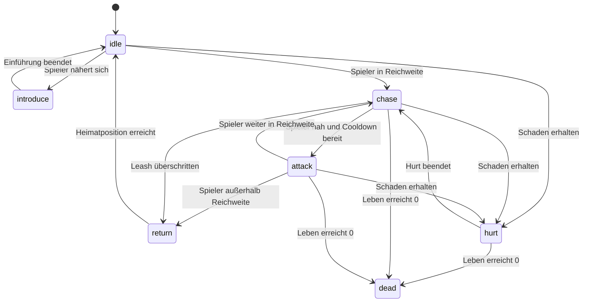

# Gegner und Levelsystem

Dieses Dokument beschreibt den Aufbau der Level, dynamische Gegnererzeugung,
Bewegungsprofile, Statuseffekte, Endboss-Zustände, Schwierigkeitssteigerung und
Abschlussbedingungen von **Sharky – Jump and Swim**.

Die wichtigsten beteiligten Bereiche sind:

- `LEVEL_CONFIG`
- `Level`
- `Enemy`
- `Endboss`
- `EnemyMovementController`
- `BossMovementController`
- `EnemyFactory`
- `EnemySpawner`
- `EnemySpawnPositionFinder`
- `RandomGenerator`
- `FinishObject`
- `js/levels/level-one.js`
- `js/levels/level-two.js`

## Levelübersicht

Das Spiel besitzt zwei spielbare Riffzonen.

| Eigenschaft | Level 1 | Level 2 |
| --- | ---: | ---: |
| Weltbreite | `2400` | `2800` |
| Welthöhe | `720` | `720` |
| Bodenhöhe | `120` | `130` |
| Startgegner | `4` | `4` |
| maximal aktive Gegner | `5` | `7` |
| Gegnerbudget | `12` | `18` |
| Münzen | `5` | `5` |
| Giftflaschen | `2` | `3` |
| Barrieren | `2` | `2` |
| Bossleben | `180` | `240` |
| Bossschaden | `35` | `45` |

Level 2 ist:

- breiter
- stärker bevölkert
- schneller im Nachspawnen
- stärker auf gefährliche Gegnertypen gewichtet
- mit einem schnelleren und aggressiveren Boss ausgestattet

## Zentrale Levelkonfiguration

Die skalierbaren Werte werden in `js/config/level-config.js` unter
`LEVEL_CONFIG` gepflegt.

Jeder Leveleintrag enthält:

```text
number
world
finish
spawner
enemyTypes
boss
```

Die konkrete Welt wird anschließend in `js/levels/level-one.js` oder
`js/levels/level-two.js` aus dieser Konfiguration aufgebaut.

Damit bleiben:

- Balancingwerte
- Levelobjekte
- Assetzuordnung
- Entity-Implementierung

voneinander getrennt.

## Levelregistrierung

Die spielbaren Level werden in einer gemeinsamen Sammlung registriert:

```js
const LEVELS = {};

LEVELS[1] = createLevelOne();
LEVELS[2] = createLevelTwo();
```

`GameState` liest das gewünschte Level über die Levelnummer aus dieser
Sammlung. Eine nicht vorhandene oder ungültige Nummer wird auf Level 1
zurückgeführt.

## Levelaufbau

Eine `Level`-Instanz enthält:

- Identität und Konfiguration
- Breite und Höhe
- Hintergrundebenen
- Barrieren
- feste Kollisionsbereiche
- normale Gegner
- Sammelobjekte
- Endboss
- Zielobjekt
- dynamischen Enemy-Spawner

Die Leveldateien erstellen zunächst keine statischen normalen Gegner. Die
Sammlung `enemies` startet leer und wird vollständig durch `EnemySpawner`
verwaltet.

## Hintergrundebenen

Beide Level verwenden fünf Parallax-Ebenen:

1. `far`
2. `back`
3. `middle`
4. `front`
5. `floor`

Die verwendeten Scrollfaktoren sind in beiden Leveln:

| Ebene | Scrollfaktor |
| --- | ---: |
| Far | `0.15` |
| Back | `0.3` |
| Middle | `0.55` |
| Front | `0.85` |
| Floor | `1` |

Level 2 verwendet eigene Hintergrunddateien und dunklere Fallbackfarben.

## Boden und feste Bereiche

Der Boden wird als durchgehender fester Bereich am unteren Levelrand erzeugt.

### Level 1

```text
y = 720 - 120
```

### Level 2

```text
y = 720 - 130
```

Zusätzlich enthalten beide Level:

- eine größere Bodenbarriere
- eine vertikale Felsbarriere

Die sichtbaren Barrieren liefern über `getSolidArea()` eigene technische
Kollisionsflächen. Transparente Bildränder werden über `collisionInset`
ausgeschlossen.

Spieler, normale Gegner und Endboss berücksichtigen diese Bereiche bei ihrer
Bewegung.

## Sammelobjekte

### Level 1

Münzen befinden sich bei:

```text
(310, 210)
(620, 300)
(1040, 230)
(1460, 310)
(1900, 230)
```

Giftflaschen befinden sich bei:

```text
(780, 210)
(1580, 260)
```

### Level 2

Münzen befinden sich bei:

```text
(420, 230)
(820, 320)
(1340, 260)
(1880, 210)
(2380, 340)
```

Giftflaschen befinden sich bei:

```text
(1040, 220)
(2040, 280)
(2520, 250)
```

Der Spawner berücksichtigt aktive Sammelobjekte bei der Positionssuche. Neue
Gegner dürfen deshalb nicht direkt auf einer noch verfügbaren Münze oder
Giftflasche erscheinen.

## Gegnerarten

Das Spiel verwendet vier normale Gegnertypen:

- Pufferfisch
- violette Qualle
- gelbe Qualle
- pinke Qualle

Alle normalen Varianten werden über `EnemyFactory` als `Enemy` erzeugt.

## Gegnerwerte in Level 1

| Typ | Gewicht | Größe | Leben | Schaden |
| --- | ---: | ---: | ---: | ---: |
| Pufferfisch | `0.55` | `58 × 58` | `45` | `20` |
| violette Qualle | `0.25` | `54 × 78` | `45` | `20` |
| gelbe Qualle | `0.10` | `54 × 78` | `45` | `20` |
| pinke Qualle | `0.10` | `56 × 80` | `60` | `26` |

## Gegnerwerte in Level 2

| Typ | Gewicht | Größe | Leben | Schaden |
| --- | ---: | ---: | ---: | ---: |
| Pufferfisch | `0.40` | `62 × 62` | `45` | `20` |
| violette Qualle | `0.20` | `58 × 84` | `45` | `20` |
| gelbe Qualle | `0.15` | `58 × 84` | `45` | `20` |
| pinke Qualle | `0.25` | `58 × 84` | `70` | `30` |

Die Summe der Gewichte muss pro Level exakt `1` ergeben.

Level 2 reduziert den Anteil der Pufferfische und erhöht insbesondere den
Anteil der stärkeren pinken Qualle.

## Gewichtete Typauswahl

`EnemySpawner.selectEnemyType()` wählt einen Typ anhand seiner konfigurierten
Gewichtung.

```text
Zufallswert
    ↓
gewichtete Gegnerliste
    ↓
bevorzugter Gegnertyp
```

Kann für den bevorzugten Typ keine gültige Position gefunden werden, werden
die übrigen Typen zufällig sortiert und als Fallback versucht.

Dadurch fällt ein kompletter Spawn nicht sofort aus, wenn lediglich die Größe
oder das Bewegungsprofil des zuerst ausgewählten Typs keine sichere Position
zulässt.

## EnemyFactory

`EnemyFactory` übersetzt die Levelkonfiguration in eine konkrete
Gegnerinstanz.

Übernommen werden:

- Typ
- Position
- Breite
- Höhe
- Lebenspunkte
- Kontaktschaden
- Bewegungsprofil

Zusätzlich ergänzt die Factory:

- obere Bewegungsgrenze
- Grenze oberhalb des Levelbodens
- zufällige Wellenphase
- zufällige anfängliche Vertikalrichtung

Ein unbekannter Gegnertyp führt zu einem lesbaren Fehler:

```text
[EnemyFactory] Unknown enemy type: ...
```

## Zufallsquelle

`RandomGenerator` wird von Factory, Spawner und Positionssuche gemeinsam
verwendet.

Dadurch können in Tests kontrollierte Zufallsquellen injiziert werden. Die
Produktivanwendung verwendet normale zufällige Werte.

Zufällig bestimmt werden unter anderem:

- Gegnertyp
- Spawnzeitpunkt
- Spawnposition
- Startphase einer Wellenbewegung
- vertikale Startrichtung
- Reihenfolge alternativer Gegnertypen

## Bewegungsprofile

Die Levelkonfiguration unterstützt zwei Bewegungsprofile:

| Profil | Verwendung |
| --- | --- |
| `waveLeft` | Pufferfische |
| `verticalDrift` | Quallen |

`EnemyMovementController` wertet das konfigurierte Profil aus.

## Pufferfischbewegung

Pufferfische bewegen sich dauerhaft nach links und folgen gleichzeitig einer
Sinuswelle.

```text
x = x - horizontalSpeed
y = originY + sin(phase) × amplitude
```

Nach jedem Frame wird die Phase um die konfigurierte Frequenz erhöht.

### Level 1

| Wert | Einstellung |
| --- | ---: |
| horizontale Geschwindigkeit | `1.4` |
| Wellenhöhe | `34` |
| Wellenfrequenz | `0.045` |

### Level 2

| Wert | Einstellung |
| --- | ---: |
| horizontale Geschwindigkeit | `1.7` |
| Wellenhöhe | `42` |
| Wellenfrequenz | `0.052` |

Pufferfische bewegen sich in Level 2 schneller und mit einer größeren
vertikalen Welle.

## Quallenbewegung

Quallen bewegen sich überwiegend vertikal und driften dabei leicht nach links.

```text
x = x - horizontalSpeed
y = y + verticalSpeed × verticalDirection
```

An den Grenzen ihres vertikalen Bewegungsbereichs wird die Richtung umgekehrt.

### Level 1

| Typ | horizontal | vertikal | Vertikalbereich |
| --- | ---: | ---: | ---: |
| violette Qualle | `0.16` | `1.15` | `150` |
| gelbe Qualle | `0.20` | `1.35` | `170` |
| pinke Qualle | `0.26` | `1.65` | `190` |

### Level 2

| Typ | horizontal | vertikal | Vertikalbereich |
| --- | ---: | ---: | ---: |
| violette Qualle | `0.22` | `1.45` | `185` |
| gelbe Qualle | `0.27` | `1.75` | `205` |
| pinke Qualle | `0.34` | `2.10` | `230` |

Die stärkeren Varianten bewegen sich vertikal schneller und decken einen
größeren Bereich ab.

## Hindernisverhalten

Vor jeder Gegnerbewegung wird die bisherige Position gespeichert.

Berührt ein Gegner anschließend einen festen Bereich:

1. wird die alte Position wiederhergestellt
2. der Movement Controller reagiert auf das Hindernis

Bei `waveLeft` wird die Wellenphase verändert. Bei `verticalDrift` wird die
vertikale Richtung umgekehrt.

## Spriteausrichtung

Pufferfischsprites sind als nach links blickend konfiguriert.

Quallensprites verwenden `neutral` und werden nicht horizontal gespiegelt.

`EnemyMovementController.shouldMirrorSprite()` vergleicht Bewegungsrichtung und
konfigurierte Spriteausrichtung. Dadurch wird ein Bild nur gespiegelt, wenn
Bewegung und Quelldatei unterschiedliche Richtungen besitzen.

## Pufferfischzustand

Ein Pufferfisch besitzt zusätzliche Zustände:

```text
normal
  ↓ Spieler im Radius
transition
  ↓ Animation beendet
inflated
```

Der Aktivierungsradius beträgt:

```text
210 Pixel
```

Nach der Übergangsanimation bleibt der Pufferfisch aufgeblasen.

Sein Kontaktschaden steigt dabei auf:

```text
30 Schaden
```

Der Zustand wird erst bei einem Level-Reset wieder vollständig
zurückgesetzt.

## Gegnerleben und Tod

Normale Gegner besitzen konfigurierbare Lebenspunkte.

`takeDamage()`:

1. ignoriert bereits besiegte Gegner
2. reduziert Leben mindestens auf `0`
3. speichert den Trefferzeitpunkt
4. prüft den Todeszustand

Bei `0` Leben:

- wird `isDefeated` gesetzt
- aktiver Giftschaden wird entfernt
- Todesanimation startet
- Kontaktschaden endet

Nach Abschluss der Todesanimation entfernt der Spawner den Gegner aus der
aktiven Sammlung.

## Hurt-Anzeige

Nach erhaltenem Schaden erscheint für kurze Zeit ein weißer Rahmen um den
Gegner.

Die Dauer wird über folgenden Wert gesteuert:

```text
enemyHurtDuration: 180 ms
```

Der Effekt verändert die Gegnerbewegung nicht.

## Blasenfalle

Normale Gegner können gefangen werden.

Während `isTrapped()` aktiv ist:

- wird keine Bewegung ausgeführt
- kann kein Kontaktschaden entstehen
- bleibt der Gegner weiterhin angreifbar
- erscheint ein hellblauer Rahmen

Die konfigurierte Fangdauer der Blasenfalle beträgt:

```text
3200 ms
```

Der Endboss überschreibt `canBeTrapped()` und kann nicht gefangen werden.

## Gifteffekt

Ein Giftangriff speichert im Gegner:

- Schaden pro Tick
- Endzeitpunkt
- Tickintervall
- Zeitpunkt des nächsten Ticks

Während des Effekts erscheint ein grüner Rahmen.

Ein Tick ruft die normale Schadensmethode des Gegners auf. Dadurch kann Gift
einen Gegner oder Endboss besiegen.

Nach Ablauf oder Tod wird der aktive Giftwert entfernt.

## Kontaktschaden

Ein Gegner darf Kontaktschaden verursachen, wenn er:

- nicht besiegt ist
- nicht gefangen ist
- sich mit Sharkys Hitbox überschneidet

Der Endboss darf zusätzlich während folgender Zustände keinen Kontaktschaden
verursachen:

- `introduce`
- `dead`

Die Schadensrate wird durch Sharkys Unverwundbarkeitsdauer begrenzt.

## Dynamischer Enemy-Spawner

`EnemySpawner` verwaltet die normalen Gegner vollständig zur Laufzeit.

Seine Aufgaben sind:

- Anfangspopulation erzeugen
- Gegnertyp gewichtet auswählen
- sichere Position suchen
- Gegner zeitgesteuert nacherzeugen
- Maximalanzahl einhalten
- Gesamtbudget einhalten
- besiegte Gegner entfernen
- entkommene Gegner entfernen
- Spawning in der Bosszone pausieren
- Debugstatistiken bereitstellen

## Spawnwerte

| Einstellung | Level 1 | Level 2 |
| --- | ---: | ---: |
| Anfangspopulation | `4` | `4` |
| maximal aktiv | `5` | `7` |
| Gesamtbudget | `12` | `18` |
| Mindestintervall | `3200 ms` | `2600 ms` |
| Maximalintervall | `5200 ms` | `4400 ms` |
| Mindestabstand Spieler | `320` | `300` |
| Mindestabstand Gegner | `120` | `110` |
| Abstand hinter Viewport | `160` | `150` |
| Despawn-Puffer | `180` | `200` |
| Bosszonen-Puffer | `520` | `600` |

Level 2 erlaubt mehr gleichzeitig aktive Gegner und verwendet kürzere
Spawnintervalle.

## Anfangspopulation

Die Anfangspopulation wird beim ersten gültigen Levelupdate erzeugt.

Der Spawner versucht so lange Gegner zu erstellen, bis:

- `initialCount` erreicht wurde
- das Gesamtbudget erschöpft ist
- keine sichere Position gefunden werden kann

Anschließend wird der nächste zeitgesteuerte Spawn geplant.

## Zeitgesteuerte Spawns

Ein neuer Gegner darf nur entstehen, wenn:

- Spawning nicht wegen der Bosszone pausiert
- weniger als `maxActiveEnemies` existieren
- das Gesamtbudget nicht erschöpft ist
- der geplante Spawnzeitpunkt erreicht wurde
- eine gültige Position gefunden wird

Nach einem erfolgreichen Spawn wird ein neues zufälliges Intervall zwischen
Minimum und Maximum geplant.

Die Zeit basiert auf `GAME_CLOCK.now()` und steht während einer Pause still.

## Gegnerbudget

`totalEnemyBudget` beschreibt die maximale Anzahl normaler Gegner, die während
eines Levelversuchs insgesamt erzeugt werden darf.

Das Budget wird beim Entfernen eines Gegners nicht zurückgegeben.

Beispiel für Level 1:

```text
maximal gleichzeitig aktiv: 5
maximal insgesamt erzeugt:  12
```

Dadurch kann das Level Gegner nacherzeugen, ohne endlos neue Gegner zu
produzieren.

## Entfernen von Gegnern

Ein Gegner wird aus der aktiven Sammlung entfernt, wenn:

- seine Todesanimation beendet ist oder
- er links hinter dem sichtbaren Kamerabereich verschwunden ist

Für entkommene Gegner gilt:

```text
enemy.right < visibleBounds.left - despawnBuffer
```

Das Entfernen reduziert die aktive Anzahl, aber nicht den bereits verwendeten
Gesamtzähler.

## Pause in der Bosszone

Bei aktivierter Einstellung `pauseDuringBoss` stoppt der Spawner, wenn:

- der Spieler die Bosszone erreicht
- die Bosseinführung läuft
- der Endboss als aktives Angriffsziel gilt

Dadurch entstehen während der Bossbegegnung keine zusätzlichen normalen
Gegner.

## Spawnpositionssuche

`EnemySpawnPositionFinder` sucht eine sichere Position für jeden neuen Gegner.

Die Suche erfolgt in zwei Stufen:

1. bis zu `120` zufällige Platzierungsversuche
2. deterministische Rastersuche als Fallback

Kann keine gültige Position gefunden werden, wird für diesen Typ kein Gegner
erzeugt.

## Horizontaler Spawnbereich

Neue Gegner erscheinen rechts außerhalb des sichtbaren Kamerabereichs.

```text
minimumX = visibleBounds.right + viewportOffset
maximumX = level.width - bossZoneBuffer - enemy.width
```

Dadurch entstehen Gegner:

- nicht sichtbar direkt im aktuellen Bild
- nicht innerhalb der reservierten Bosszone
- vollständig innerhalb des Levels

## Vertikaler Spawnbereich

Der gültige vertikale Bereich berücksichtigt:

- oberen Sicherheitsabstand
- sichtbaren Kameraausschnitt
- Gegnerhöhe
- Levelboden
- Wellenhöhe oder vertikalen Patrouillenbereich

Dadurch wird nicht nur die Startposition, sondern auch die spätere
Bewegungsfläche des Gegners berücksichtigt.

## Sicherheitsregeln für Spawnpositionen

Eine Position ist nur gültig, wenn der Gegner:

- vollständig innerhalb des spielbaren Bereichs liegt
- den Mindestabstand zum Spieler einhält
- keinen festen Bereich überschneidet
- genügend Abstand zu vorhandenen Gegnern besitzt
- kein aktives Sammelobjekt überschneidet
- nicht auf dem Zielobjekt erscheint
- nicht den Endboss überschneidet

## Endboss

Jedes Level besitzt einen eigenen `Endboss`.

Beide Bosse verwenden dieselbe Zustandsmaschine, aber unterschiedliche
Konfigurationswerte.

Die Bossgröße beträgt in beiden Leveln:

```text
210 × 168 Pixel
```

Gegenüber der ursprünglichen Basisgröße von `150 × 120` entspricht dies dem
Faktor `1.4`.

## Bosswerte

| Eigenschaft | Level 1 | Level 2 |
| --- | ---: | ---: |
| X-Position | `1980` | `2300` |
| Y-Position | `250` | `230` |
| Breite | `210` | `210` |
| Höhe | `168` | `168` |
| Leben | `180` | `240` |
| Kontaktschaden | `35` | `45` |
| Grundgeschwindigkeit | `1.1` | `1.45` |
| Patrouillenbereich | `170` | `240` |
| Einführungsdistanz | `650` | `720` |
| Aktivierungsdistanz | `650` | `740` |
| Verfolgungsdistanz | `580` | `680` |
| Angriffsdistanz | `180` | `210` |
| Leash-Distanz | `720` | `860` |
| Angriffscooldown | `2100 ms` | `1650 ms` |
| Angriffsframedauer | `90 ms` | `80 ms` |
| Aggressivität | `0.55` | `0.78` |

Level 2 erhöht Leben, Schaden, Geschwindigkeit, Reichweiten und Aggressivität
und reduziert den Angriffscooldown.

## Bosszustände



Die tatsächliche Auswahl nach einer Hurt-Animation richtet sich im folgenden
Update wieder nach Entfernung, Leash und Angriffscooldown.

## Idle und Patrouille

Vor und außerhalb einer aktiven Verfolgung patrouilliert der Boss um seine
Startposition.

Beide Level konfigurieren eine vertikale Patrouillenachse.

Der Boss bewegt sich abwechselnd zwischen:

```text
startY - patrolRange
startY + patrolRange
```

Levelgrenzen und feste Bereiche werden dabei berücksichtigt.

## Einführung

Die Einführung startet einmal pro Levelversuch, wenn der Spieler:

- horizontal nahe genug ist
- auch die vollständige Distanzprüfung besteht

Während `introduce`:

- läuft die Einführungsanimation
- bewegt sich der Boss nicht normal
- verursacht er keinen Kontaktschaden
- ist er noch kein gültiges Angriffsziel
- pausiert das normale Gegner-Spawning
- wechselt die Musik zur Bossmusik

Nach Abschluss beginnt der aktive Bosskampf.

## Verfolgung

Nach der Einführung verfolgt der Boss Sharky innerhalb der konfigurierten
`chaseDistance`.

Die Zielposition richtet die Mittelpunkte von Boss und Spieler aufeinander aus.

Die Verfolgungsgeschwindigkeit wird berechnet aus:

```text
speed × (1 + aggression × 0.6)
```

Level 2 reagiert dadurch deutlich schneller.

## Angriff

Ein Bossangriff darf starten, wenn:

- der Spieler innerhalb der `attackDistance` liegt
- die Einführung abgeschlossen ist
- der Angriffscooldown abgelaufen ist

Während der Angriffsanimation führt der Boss eine beschleunigte Bewegung in
Richtung des Spielers aus.

Die Angriffsgeschwindigkeit wird berechnet aus:

```text
speed × (1.4 + aggression × 0.8)
```

Der Schaden entsteht weiterhin über eine echte Hitboxüberschneidung und nicht
allein durch das Abspielen der Animation.

## Rückkehr und Leash

Der Boss darf sich bei einer Verfolgung nicht unbegrenzt von seiner
Startposition entfernen.

Überschreitet er `leashDistance`, wechselt er in `return`.

Die Rückkehrgeschwindigkeit lautet:

```text
speed × (1.1 + aggression × 0.4)
```

Nach Erreichen der Startposition:

- wird die Position exakt auf den Heimatpunkt gesetzt
- wechselt der Status zurück zu `idle`
- beginnt die normale Patrouille erneut

## Bosskollision mit Hindernissen

`BossMovementController` versucht zunächst die vollständige Bewegung auf beiden
Achsen.

Ist diese blockiert, werden getrennt versucht:

1. horizontale Bewegung
2. vertikale Bewegung

Dadurch kann der Boss an einem Hindernis entlanggleiten, statt sofort
vollständig stehenzubleiben.

Die Position wird stets innerhalb der Levelgrenzen gehalten.

## Hurt und Gift

Der Endboss erbt Schadens- und Giftlogik von `Enemy`.

Er kann:

- Direktschaden erhalten
- vergiftet werden
- durch einen Gifttick besiegt werden

Er kann nicht:

- von der Blasenfalle gefangen werden

Während Hurt wird eine eigene Bossanimation abgespielt.

## Tod des Endbosses

Bei `0` Lebenspunkten:

- wird `isDefeated` gesetzt
- Gift wird beendet
- Status wechselt zu `dead`
- Bossmusik wird durch Gameplay-Musik ersetzt
- Boss-Todessound wird abgespielt
- Todesanimation läuft vollständig
- Boss-Hitbox verursacht keinen Schaden mehr
- Zielobjekt wird freigeschaltet

Nach Abschluss der Todesanimation wird der Boss nicht mehr gezeichnet.

## Zielobjekt

Jedes Level besitzt ein `FinishObject`.

| Eigenschaft | Wert |
| --- | ---: |
| Breite | `86` |
| Höhe | `170` |

Positionen:

| Level | X | Y |
| --- | ---: | ---: |
| Level 1 | `2280` | `430` |
| Level 2 | `2680` | `420` |

Solange der Boss lebt, wird das Ziel:

- mit reduzierter Transparenz gezeichnet
- durch ein Schloss gekennzeichnet
- nicht als gültiger Levelabschluss akzeptiert

Nach dem Bosskampf wird es vollständig sichtbar und freigeschaltet.

## Levelabschluss

Ein Level endet nur, wenn:

1. der Endboss besiegt wurde
2. das Ziel freigeschaltet ist
3. Sharky das Zielobjekt tatsächlich berührt

Nach Level 1 folgt der Shop. Nach Level 2 folgt der finale Win-Screen.

## Reset eines Levelversuchs

Bei Restart setzt `Level.reset()` zurück:

- normale Gegner beziehungsweise den Enemy-Spawner
- Spawnzähler
- Spawnzeit
- Sammelobjekte
- Endboss
- Zielstatus

Der Spawner beginnt danach mit einer neuen Anfangspopulation.

Die ursprünglichen Levelobjekte werden wiederverwendet und über definierte
Resetmethoden in ihren Ausgangszustand versetzt.

## Konfigurationsvalidierung

Alle Levelkonfigurationen werden beim Laden über
`validateLevelConfigs()` geprüft.

Die Validierung kontrolliert unter anderem:

- erforderliche positive Zahlen
- ganzzahlige Spawnlimits
- gültige Bewegungsprofile
- gültige Spriteausrichtung
- vorhandene Gegnertypen
- Gewichtssumme von `1`
- Startpopulation nicht größer als Aktivlimit
- Aktivlimit nicht größer als Gesamtbudget
- gültige Spawnintervalle
- gültige Bossdistanzen
- Aggressivität nicht größer als `1`
- Angriffsdistanz kleiner als Verfolgungsdistanz
- Verfolgungsdistanz nicht größer als Aktivierungsdistanz
- Bosszonen-Puffer kleiner als Levelbreite

Fehler werden mit dem Präfix ausgegeben:

```text
[LEVEL_CONFIG]
```

Eine ungültige Konfiguration soll dadurch bereits beim Anwendungsstart
auffallen.

## Abgesicherte Fälle

Automatisierte Tests sichern insbesondere ab:

- alle Levelkonfigurationen sind gültig
- Gegnergewichte ergeben pro Level `1`
- Level 2 erhöht Gegner- und Boss-Schwierigkeit
- Bossgröße liegt 40 Prozent über der ursprünglichen Basisgröße
- Anfangspopulation und Respawns respektieren das Gesamtbudget
- Aktivlimit verhindert zusätzliche Spawns
- Spawning pausiert in der Bosszone
- besiegte und entkommene Gegner werden entfernt
- neue Gegner erscheinen außerhalb des sichtbaren Kamerabereichs
- Boss wird passend zur Blickrichtung gespiegelt
- Bossreset stellt seinen gemeinsamen Gegnerzustand wieder her
- vertikale Bosspatrouille bewegt sich um den Heimatpunkt
- Boss startet ohne Interfacefehler im Idle-Zustand

## Bekannte Grenzen

- Level werden über globale Konfigurationsobjekte und Funktionen aufgebaut.
- Es existiert kein grafischer Leveleditor.
- Gegnerbewegung ist framebasiert und nicht mit Delta-Time multipliziert.
- Das tatsächliche Spieltempo kann bei dauerhaft sehr niedriger Bildrate
  abweichen.
- Normale Gegner bewegen sich grundsätzlich nach links und kehren nicht nach
  rechts in die Spielwelt zurück.
- Ein entkommener Gegner verbraucht weiterhin einen Teil des Gesamtbudgets.
- Pufferfische wechseln nach dem Aufblasen nicht wieder in den normalen Zustand.
- Bossangriffe verwenden Kontaktschaden statt eigener Bossprojektile.
- Spawnpositionen basieren auf rechteckigen Flächen.
- Zufällige Spawns können zwischen Spielsitzungen unterschiedlich wirken.
- Automatisierte Tests ersetzen keine manuelle Prüfung von Gegnerdichte,
  Fairness und Schwierigkeitskurve.

## Levelregeln

- Jedes Level muss vor seiner Verwendung validiert werden.
- Gegnergewichte müssen zusammen `1` ergeben.
- Anfangspopulation darf das Aktivlimit nicht überschreiten.
- Aktivlimit darf das Gesamtbudget nicht überschreiten.
- Gegner dürfen nicht sichtbar direkt vor dem Spieler erscheinen.
- Gegner dürfen keine festen Bereiche, Sammelobjekte oder den Boss
  überschneiden.
- Der Bossbereich bleibt frei von normalen Respawns.
- Besiegte Gegner verursachen keinen Kontaktschaden.
- Gefangene Gegner verursachen keinen Kontaktschaden.
- Der Endboss kann nicht gefangen werden.
- Die Bosseinführung darf nur einmal pro Levelversuch starten.
- Der Boss bleibt innerhalb von Level- und Leash-Grenzen.
- Das Ziel bleibt bis zum Tod des Bosses gesperrt.
- Levelabschluss benötigt eine echte Berührung des freigeschalteten Ziels.
- Restart muss Gegner, Spawner, Boss, Sammelobjekte und Ziel zurücksetzen.

## Weiterführende Dokumentation

- [Anwendungsarchitektur](../architecture/application.md)
- [Game Loop und Spielzustand](../architecture/game-loop-state.md)
- [Rendering und Assets](../architecture/rendering-assets.md)
- [Spieler und Kampfsystem](player-combat.md)
- [Interface und Steuerung](interface-controls.md)
- [Audio und Anzeigeeinstellungen](audio-display-settings.md)
- [Tests und Projektvalidierung](../engineering/testing-validation.md)