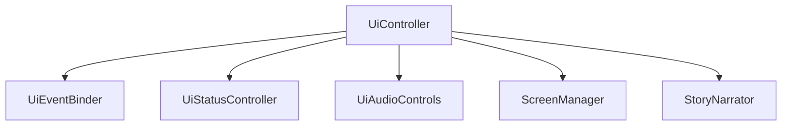
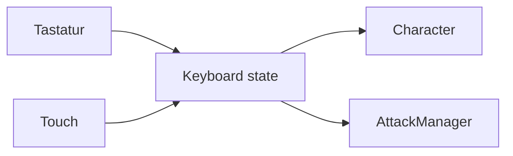

# Interface und Steuerung

Dieses Dokument beschreibt Hauptmenü, Dialoge, Spieloberfläche, Tastatur- und
Touch-Steuerung, Joystick, Statusscreens, Storyfunktion und mobile
Ausrichtungslogik von **Sharky – Jump and Swim**.

Die wichtigsten beteiligten Klassen sind:

- `Keyboard`
- `MobileControls`
- `UiController`
- `UiEventBinder`
- `UiStatusController`
- `ScreenManager`
- `MainMenuController`
- `StoryNarrator`

## Interfacebereiche

Die Anwendung besteht aus zwei übergeordneten Oberflächen:

```text
Hauptmenü
Spielansicht
```

`ScreenManager` steuert, welcher Bereich sichtbar ist.

Das Canvas ist nur ein Teil der Spielansicht. Menüs, HUD, Dialoge und mobile
Steuerelemente werden als normale HTML-Elemente über oder neben dem Canvas
dargestellt.

## Hauptmenü

Das Hauptmenü enthält:

- direkten Start von Level 1
- Levelauswahl
- Einstellungen
- Spielanleitung
- Geschichte
- Wechsel des Farbschemas
- Vollbildmodus
- Link zum Impressum

### Hauptaktionen

| Aktion | Ergebnis |
| --- | --- |
| Spiel starten | startet Level 1 |
| Level auswählen | öffnet Levelauswahl |
| Einstellungen | öffnet Audio- und Anzeigeeinstellungen |
| Anleitung | zeigt Bewegung und Angriffe |
| Geschichte | zeigt und optional liest den Storytext |
| Darstellung | wechselt zwischen Hell und Dunkel |
| Vollbild | aktiviert oder beendet Vollbild |
| Impressum | öffnet `imprint.html` |

## Hauptmenü-Panels

Folgende Inhalte werden als Panels über dem Menü geöffnet:

- Levelauswahl
- Einstellungen
- Anleitung
- Geschichte

Beim Öffnen eines Panels werden zuerst alle anderen Panels geschlossen.
Dadurch kann immer nur ein Hauptmenü-Panel sichtbar sein.

Ein Panel kann geschlossen werden über:

- den Schließen-Button
- den Zurück-Button
- einen Klick auf den tatsächlichen Panelhintergrund

Ein Klick innerhalb der Panelkarte schließt das Panel nicht.

Die Backdrop-Prüfung verwendet:

```js
event.target === event.currentTarget
```

Dadurch werden Klicks auf Inhalte, Buttons oder Formulare nicht versehentlich
als Backdrop-Klick behandelt.

## Levelauswahl

Die Levelauswahl bietet:

- Level 1 starten
- Level 2 als Testzugang starten

Die gewünschte Nummer wird aus `data-start-level` gelesen und an
`Game.start(levelNumber)` übergeben.

Vor dem Start wird die Browser-Audiowiedergabe durch die Benutzerinteraktion
freigeschaltet.

## Spielansicht

Die Spielansicht enthält:

- Spielkopf mit Navigation
- Text-HUD
- Canvas
- Canvas-Statusleisten
- Ingame-Schnellzugriff
- mobile Touch-Steuerung
- Pause-Overlay
- Ingame-Einstellungen
- Shop
- Game-over-Screen
- Win-Screen

## Text-HUD

Oberhalb beziehungsweise innerhalb der Spielfläche werden folgende Werte als
HTML-Text dargestellt:

| Element | Inhalt |
| --- | --- |
| `levelDisplay` | aktuelle Levelnummer |
| `healthDisplay` | aktuelle und maximale Lebenspunkte |
| `coinDisplay` | gesammelte Münzen |
| `poisonDisplay` | Giftflaschen und Kapazität |
| `statusDisplay` | lesbarer Spielstatus |

`UiStatusController` aktualisiert diese Werte nach jeder Statusmeldung von
`Game`.

Das Text-HUD ergänzt die bildbasierten Canvas-Statusleisten und stellt genaue
Zahlen bereit.

## Lesbare Statuswerte

Interne Statuswerte werden für das Interface übersetzt:

| Interner Status | Anzeige |
| --- | --- |
| `menu` | Menü |
| `playing` | Läuft |
| `paused` | Pause |
| `shop` | Shop |
| `gameOver` | Verloren |
| `levelComplete` | Geschafft |

Auf kleineren Bildschirmbreiten kann die zusätzliche Statusanzeige zugunsten
des verfügbaren Platzes ausgeblendet werden.

## Ingame-Schnellzugriff

Rechts über der Spielfläche befindet sich eine Gruppe runder
Schnellzugriffsschaltflächen.

| Schaltfläche | Funktion |
| --- | --- |
| Audio | Musik und Soundeffekte gemeinsam umschalten |
| Einstellungen | Ingame-Einstellungsdialog öffnen |
| Vollbild | Vollbildmodus wechseln |
| Pause/Play | Spiel pausieren oder fortsetzen |

Die Schaltflächen liegen als DOM-Elemente über dem Canvas und bleiben dadurch
unabhängig vom sichtbaren Kameraausschnitt erreichbar.

## Pause

Pause kann über die Ingame-Schaltfläche ausgelöst werden.

`UiController.togglePauseState()` unterscheidet:

- `playing` → pausieren
- `paused` → fortsetzen

Beim Pausieren:

1. wechselt `GameState` zu `paused`
2. Spielzeit und Fachupdates werden angehalten
3. Eingaben werden zurückgesetzt
4. Musik wird pausiert
5. laufende Soundeffekte werden gestoppt
6. Pause-Overlay wird eingeblendet

Das Pause-Overlay bietet:

- Weiter
- Neu starten
- Hauptmenü

## Ingame-Einstellungen

Beim Öffnen des Einstellungsdialogs speichert `UiController`, ob das Spiel zuvor
aktiv lief.

### Öffnen während `playing`

- das Spiel wird pausiert
- der Dialog wird geöffnet
- beim Schließen wird das Spiel fortgesetzt

### Öffnen während eines bereits pausierten Zustands

- der bestehende Pausenzustand bleibt erhalten
- beim Schließen erfolgt keine automatische Fortsetzung

Dafür verwendet der Controller:

```js
wasPlayingBeforeSettings
```

Dadurch verändert das Schließen der Einstellungen nicht versehentlich einen
zuvor bewusst gesetzten Pausenzustand.

## Statusscreens

`UiStatusController` verbindet den Spielstatus mit dem passenden Overlay.

| Status | Screen |
| --- | --- |
| `shop` | Shop-Screen |
| `gameOver` | Game-over-Screen |
| `levelComplete` | Win-Screen |

Vor dem Einblenden eines Statusscreens werden alle anderen Statusscreens
geschlossen.

Während Shop, Game Over oder Win werden die wichtigsten Ingame-Schaltflächen
deaktiviert.

## Shop

Der Shop zeigt:

- aktuelle Münzanzahl
- drei Upgrades
- Kaufstatus
- Kosten
- Fortsetzung zu Level 2
- Rückkehr zum Hauptmenü

Ein Upgrade-Button wird deaktiviert, wenn:

- das Upgrade bereits gekauft wurde
- nicht genügend Münzen vorhanden sind
- die Upgrade-Konfiguration ungültig ist

Der sichtbare Text wechselt nach dem Kauf zu:

```text
Gekauft
```

## Game-over-Screen

Der Game-over-Screen erscheint erst nach Abschluss der Todesanimation.

Er bietet:

- aktuelles Level neu starten
- zum Hauptmenü zurückkehren

Der Restart verwendet die vorhandene Spielinstanz und keinen Seiten-Reload.

## Win-Screen

Nach Abschluss von Level 2 zeigt das Interface den Win-Screen.

Er bietet:

- erneut spielen
- zum Hauptmenü zurückkehren

Beim ersten Wechsel in den Status `levelComplete` wird der Win-Sound
abgespielt.

## ScreenManager

`ScreenManager` kapselt Sichtbarkeit und deaktivierte Zustände der großen
Oberflächenbereiche.

Die Klasse arbeitet über die gemeinsame CSS-Klasse:

```css
.hidden {
    display: none;
}
```

Wichtige Methoden sind:

- `showMainMenuScreen()`
- `showGameScreen()`
- `openMainMenuPanel()`
- `closeMainMenuPanels()`
- `showPauseScreen()`
- `hidePauseScreen()`
- `showIngameSettingsDialog()`
- `hideIngameSettingsDialog()`
- `showShopScreen()`
- `showGameOverScreen()`
- `showWinScreen()`
- `hideStatusScreens()`
- `setIngameControlDisabled()`

Fachliche Statusentscheidungen verbleiben in `GameState` und `UiController`.
`ScreenManager` verändert nur die Oberfläche.

## UI-Controller-Aufteilung

Die Interfaceverantwortung ist auf mehrere Klassen verteilt.



### `UiController`

Der zentrale Controller koordiniert:

- Menüaktionen
- Spielstart
- Levelwechsel
- Restart
- Pause
- Ingame-Einstellungen
- Story
- Audio
- Rückkehr zum Hauptmenü

### `UiEventBinder`

Der Event Binder registriert DOM-Listener und delegiert die eigentliche Aktion
an `UiController`.

Er enthält keine Spielzustandslogik.

### `UiStatusController`

Der Statuscontroller synchronisiert:

- HUD
- Shop
- Statusscreens
- Pause-/Play-Button
- Statussounds

### `UiAudioControls`

Audioelemente und Lautstärkeregler werden in einer eigenen Klasse verwaltet und
im Audio-Fachdokument beschrieben.

## Interface-Klicksound

`UiEventBinder` registriert einen zentralen `pointerdown`-Listener für:

- aktive Buttons
- Links

Deaktivierte Buttons lösen keinen Klicksound aus.

Mobile Angriffsschaltflächen sind bewusst ausgeschlossen:

```css
button:not([data-mobile-action])
```

Dadurch wird beim Auslösen eines Spielangriffs nicht zusätzlich der normale
Interface-Klicksound abgespielt.

## Tastatursteuerung

`Keyboard` registriert `keydown` und `keyup` auf `window`.

### Bewegung

| Richtung | Pfeiltaste | Alternative |
| --- | --- | --- |
| links | `ArrowLeft` | `A` |
| rechts | `ArrowRight` | `D` |
| oben | `ArrowUp` | `W` |
| unten | `ArrowDown` | `S` |

### Angriffe

| Aktion | Taste |
| --- | --- |
| Flossenschlag | `E` |
| Blasenfalle | `Leertaste` |
| Giftangriff | `F` |

Intern werden `KeyboardEvent.code`-Werte verwendet:

```text
ArrowLeft
ArrowRight
ArrowUp
ArrowDown
KeyA
KeyD
KeyW
KeyS
KeyE
Space
KeyF
```

Dadurch richtet sich die Steuerung nach der physischen Taste und nicht nach dem
resultierenden Zeichen.

## Verhindern von Browseraktionen

Bei bekannten Spieltasten ruft `Keyboard` auf:

```js
event.preventDefault();
```

Dadurch lösen insbesondere Pfeiltasten und Leertaste während der Verwendung
keine normale Seitenbewegung aus.

Die registrierten Spieltasten werden global innerhalb der Seite behandelt.

## Gemeinsamer Eingabestatus

Tastatur und Touch-Steuerung verwenden dieselbe `Keyboard`-Instanz.



Die Spiellogik muss dadurch nicht unterscheiden, von welchem Gerät eine Aktion
stammt.

## Eingaben zurücksetzen

Alle Eingaben werden gemeinsam zurückgesetzt bei:

- Pause
- Restart
- Levelstart
- Levelwechsel
- Rückkehr zum Hauptmenü
- Verlust des Browserfokus
- verstecktem Browserdokument
- Deaktivierung des mobilen Steuerungslayouts

`resetAllInputs()` leert:

- gedrückte Tastaturtasten
- mobile Bewegungswerte
- mobile Angriffszustände

Dadurch bleiben keine Bewegungen aktiv, wenn ein `keyup` oder `pointerup` wegen
eines Fokuswechsels nicht mehr empfangen wurde.

## Fokusverlust

`Keyboard` reagiert auf:

```text
window.blur
document.visibilitychange
```

Sobald das Dokument verborgen ist, werden alle Eingaben gelöst.

Dies verhindert beispielsweise dauerhaftes Schwimmen nach:

- Wechsel in einen anderen Browser-Tab
- Minimieren des Browserfensters
- Öffnen einer anderen Anwendung
- Verlust des aktiven Fensters

## Touch-Erkennung

`MobileControls` aktiviert die mobile Steuerung nur, wenn:

1. mindestens ein Touchpunkt oder ein grober Pointer erkannt wird
2. die Fensterbreite höchstens `1180 px` beträgt

Die Prüfung lautet sinngemäß:

```text
(maxTouchPoints > 0 oder pointer: coarse)
und
window.innerWidth ≤ 1180
```

Geeignete Geräte erhalten am Root-Element:

```text
has-touch-controls
```

Desktopgeräte ohne Touch beziehungsweise Geräte oberhalb der unterstützten
Breite zeigen keine mobilen Steuerelemente.

## Reaktion auf Geräteänderungen

Die Verfügbarkeit wird erneut geprüft bei:

- Fenstergrößenänderung
- Änderung der Media Query `(pointer: coarse)`

Wenn Touch-Steuerung nicht mehr geeignet ist:

- aktive Pointer-ID wird entfernt
- Joystickbewegung wird neutral
- Angriffstasten werden gelöst
- Joystickknopf kehrt in die Mitte zurück

## Sichtbarkeit mobiler Controls

Die Touch-Steuerung ist standardmäßig ausgeblendet:

```css
.mobile-controls {
    display: none;
}
```

Sie wird nur unter folgenden Bedingungen sichtbar:

```css
@media (max-width: 1180px) {
    html.has-touch-controls .mobile-controls {
        display: flex;
    }
}
```

Die Sichtbarkeit hängt damit sowohl von JavaScript-Geräteerkennung als auch vom
CSS-Breakpoint ab.

## Mobiler Joystick

Der Joystick besteht aus:

- `mobileJoystick`
- `mobileJoystickKnob`

Er verwendet Pointer Events statt getrennten Touch- und Mausereignissen.

### Pointer-Lebenszyklus

```text
pointerdown
    ↓
pointermove
    ↓
pointerup oder pointercancel
```

Beim Start wird die aktive `pointerId` gespeichert. Bewegungen anderer Pointer
werden ignoriert.

Der Joystick verwendet Pointer Capture, damit die Steuerung auch dann aktiv
bleibt, wenn der Finger den ursprünglichen Elementbereich kurz verlässt.

## Joystick-Berechnung

Zunächst wird die Differenz zwischen Pointer und Joystickmittelpunkt berechnet:

```text
deltaX = pointerX - centerX
deltaY = pointerY - centerY
```

Die Entfernung wird über den Satz des Pythagoras bestimmt:

```text
distance = √(deltaX² + deltaY²)
```

Überschreitet die Position den erlaubten Radius, wird der Vektor auf die
Maximaldistanz normalisiert.

## Maximaldistanz

Die maximale Knopfbewegung ist der kleinere Wert aus:

- konfigurierten `42 px`
- tatsächlich verfügbarem Radius des Joystickelements

Dabei werden Knopfradius und ein Sicherheitsabstand berücksichtigt.

So bleibt der Knopf auch bei kleineren responsiven Joystickgrößen innerhalb
seiner sichtbaren Fläche.

## Normalisierte Bewegung

Die begrenzte Pixelposition wird auf Werte zwischen ungefähr `-1` und `1`
übertragen:

```text
movementX = deltaX / maximumDistance
movementY = deltaY / maximumDistance
```

`Keyboard` wertet eine Richtung erst ab dem konfigurierten Schwellenwert aus:

```text
0.22
```

Der Bereich um die Mitte bildet dadurch eine Deadzone und verhindert
unbeabsichtigte Bewegungen durch minimale Fingerabweichungen.

## Joystick-Ende

Bei `pointerup` oder `pointercancel` werden:

- aktive Pointer-ID entfernt
- mobile Bewegung auf `0, 0` gesetzt
- Knopfposition auf `translate(0, 0)` zurückgesetzt

## Mobile Angriffstasten

Die mobile Steuerung besitzt drei Buttons:

| `data-mobile-action` | Anzeige | Spielaktion |
| --- | --- | --- |
| `slap` | Flosse | Flossenschlag |
| `bubble` | Blase | Blasenfalle |
| `poison` | Gift | Giftangriff |

Bei `pointerdown` wird die Aktion aktiviert.

Sie wird gelöst bei:

- `pointerup`
- `pointercancel`
- `pointerleave`

Der `AttackManager` verwendet zusätzlich eine Eingabeflanke. Eine dauerhaft
aktive Taste erzeugt daher nicht in jedem Frame einen neuen Angriff.

## Schutz vor Touch-Nebenwirkungen

Joystick und mobile Angriffstasten verwenden:

```css
touch-action: none;
user-select: none;
-webkit-touch-callout: none;
```

Außerdem wird das `contextmenu`-Ereignis unterdrückt.

Dadurch werden reduziert:

- Scrollen während der Steuerung
- Textmarkierung
- Kontextmenü bei langem Drücken
- mobile Browser-Callouts

Die äußere `.mobile-controls`-Fläche besitzt `pointer-events: none`. Nur
Joystick und Angriffselemente aktivieren `pointer-events: auto`. Dadurch bleibt
der restliche Canvasbereich erreichbar.

## Responsive Touchgrößen

Die Controls werden abhängig von Breite und Höhe verkleinert.

### Standard

| Element | Größe |
| --- | ---: |
| Joystick | `116 × 116` |
| Joystickknopf | `46 × 46` |
| Angriffstaste mindestens | `62 × 54` |

### Bis `520 px` Breite

| Element | Größe |
| --- | ---: |
| Joystick | `88 × 88` |
| Joystickknopf | `34 × 34` |
| Angriffstaste mindestens | `52 × 46` |

### Landscape bis `620 px` Höhe

| Element | Größe |
| --- | ---: |
| Joystick | `82 × 82` |
| Joystickknopf | `32 × 32` |
| Angriffstaste mindestens | `48 × 42` |

### Landscape bis `430 px` Höhe

| Element | Größe |
| --- | ---: |
| Joystick | `72 × 72` |
| Joystickknopf | `28 × 28` |
| Angriffstaste mindestens | `44 × 38` |

## Hochformat-Hinweis

Geeignete Touchgeräte bis `1180 px` Breite zeigen im Hochformat einen
bildschirmfüllenden Hinweis:

```text
Gerät drehen
Sharky kann auf Mobilgeräten nur im Querformat gespielt werden.
```

Die Anzeige wird durch folgende Kombination aktiviert:

```css
@media (max-width: 1180px) and (orientation: portrait) {
    html.has-touch-controls .orientation-notice {
        display: grid;
    }
}
```

Der Hinweis liegt mit hohem `z-index` über der vollständigen Anwendung und
verhindert währenddessen Scrollen am Body.

## Semantik des Orientierungshinweises

Das Element verwendet:

```html
role="alert"
aria-live="polite"
```

Dadurch kann ein unterstützendes System den Hinweis als wichtige
Statusänderung erkennen.

Die animierte Gerätedarstellung ist dekorativ und wird mit
`aria-hidden="true"` ausgeblendet.

## Hauptmenü-Parallax

`MainMenuController` bewegt Menüszene und Lichtfokus anhand der
Pointerposition.

Die Pointerkoordinaten werden auf Werte zwischen `-1` und `1` normalisiert und
in CSS-Variablen übertragen:

```text
--menu-offset-x
--menu-offset-y
--menu-light-x
--menu-light-y
```

Die Aktualisierung wird auf höchstens eine Operation pro Animationsframe
begrenzt.

Für Touchpointer und bei aktivierter Einstellung `prefers-reduced-motion` wird
der Parallax-Effekt nicht verwendet.

## Storyfunktion

Das Story-Panel kann den sichtbaren Text über die Browser Speech API vorlesen.

`StoryNarrator` verwendet:

- `speechSynthesis`
- `SpeechSynthesisUtterance`

Konfiguration:

| Eigenschaft | Wert |
| --- | --- |
| Sprache | `de-DE` |
| Geschwindigkeit | `0.94` |
| Tonhöhe | `1` |
| Lautstärke | `1` |

Vor einem neuen Vorlesevorgang wird eine bestehende Ausgabe beendet.

Das Vorlesen wird außerdem gestoppt bei:

- Panelwechsel
- Schließen der Panels
- Spielstart
- Rückkehr zur Spielansicht

Unterstützt der Browser die benötigte API nicht, wird der Startbutton
deaktiviert und mit folgendem Text versehen:

```text
Vorlesen nicht verfügbar
```

## Reduced Motion

Bei aktivierter Systemeinstellung:

```text
prefers-reduced-motion: reduce
```

werden Animationen und Übergänge auf eine minimale Dauer reduziert.

Die animierte Hochformat-Gerätegrafik wird ohne Rotation direkt im
Querformat dargestellt.

Der Hauptmenü-Parallax wird vollständig deaktiviert.

## Accessibility-Grundlagen

Das Interface verwendet unter anderem:

- semantische `button`-Elemente
- Links für echte Navigation
- `nav` mit zugänglichen Bezeichnungen
- Gruppenbezeichnungen für Touch-Steuerung
- `aria-label` für Iconbuttons
- `aria-pressed` für umschaltbare Einstellungen
- deaktivierte Zustände für nicht verfügbare Aktionen
- DOM-Textwerte als Ergänzung zu Canvasanzeigen
- Fallbacktext im Canvas
- Reduced-Motion-Unterstützung

## Abgesicherte Fälle

Automatisierte Tests sichern insbesondere ab:

- benötigte Spiel- und Touchcontrols existieren
- responsive Styles enthalten Mobile-Landscape-Regeln
- Reduced Motion wird berücksichtigt
- Hauptmenü-Panels schließen nur über ihren tatsächlichen Backdrop
- Desktopbewegung unterstützt Pfeiltasten und WASD
- alle drei Angriffe sind den dokumentierten Tasten zugeordnet
- Fokusverlust löst sämtliche Eingaben
- Touchcontrols werden auf geeigneten Geräten aktiviert
- Touchcontrols bleiben auf Desktopgeräten verborgen
- Touchcontrols bleiben oberhalb der unterstützten Breite verborgen
- Kontextmenüs werden auf Touchcontrols unterdrückt

## Bekannte Grenzen

- Es existiert keine Gamepad-Unterstützung.
- Eine freie Neubelegung der Steuerung ist nicht implementiert.
- Die Spieltasten werden global auf der Seite behandelt.
- Dialoge besitzen kein vollständiges Fokus-Trapping.
- Beim Öffnen eines Panels wird der Tastaturfokus nicht automatisch auf dessen
  erstes Element gesetzt.
- Die Escape-Taste ist nicht als allgemeine Schließen- oder Pausefunktion
  registriert.
- Canvas-Spielobjekte sind nicht einzeln über Screenreader erreichbar.
- Die Touchsteuerung ist für Querformat und eine maximale Breite von `1180 px`
  vorgesehen.
- Geräteerkennung über Touchpunkte und Pointer-Media-Query kann bei einzelnen
  Hybridgeräten abweichend reagieren.
- Speech-Synthesis-Stimmen und Aussprache hängen vom verwendeten Browser und
  Betriebssystem ab.
- Automatisierte Tests ersetzen keine Prüfung auf echten Smartphones und
  Tablets.

## Interfaceregeln

- Fachliche Statuswechsel werden nicht im `ScreenManager` entschieden.
- Es darf immer nur ein Hauptmenü-Panel aktiv sein.
- Klicks innerhalb einer Panelkarte dürfen das Panel nicht schließen.
- Ingame-Einstellungen dürfen nur dann automatisch fortsetzen, wenn sie selbst
  die Pause ausgelöst haben.
- Verlorene Browser- oder Pointerereignisse dürfen keine Eingabe aktiv lassen.
- Desktopgeräte dürfen keine Touchcontrols erhalten.
- Touchcontrols oberhalb der unterstützten Breite werden zurückgesetzt.
- Der Hochformat-Hinweis erscheint nur auf geeigneten Touchlayouts.
- Mobile Controls dürfen kein Kontextmenü oder Seitenscrollen auslösen.
- Tastatur und Touch verwenden denselben normalisierten Eingabestatus.
- Statusscreens deaktivieren nicht mehr verfügbare Ingame-Aktionen.
- Storywiedergabe wird beim Verlassen des zugehörigen Kontexts beendet.
- Reduced-Motion-Einstellungen müssen respektiert werden.

## Weiterführende Dokumentation

- [Anwendungsarchitektur](../architecture/application.md)
- [Game Loop und Spielzustand](../architecture/game-loop-state.md)
- [Spieler und Kampfsystem](player-combat.md)
- [Gegner und Levelsystem](enemies-levels.md)
- [Audio und Anzeigeeinstellungen](audio-display-settings.md)
- [Styling und Barrierefreiheit](../engineering/styling-accessibility.md)
- [Tests und Projektvalidierung](../engineering/testing-validation.md)