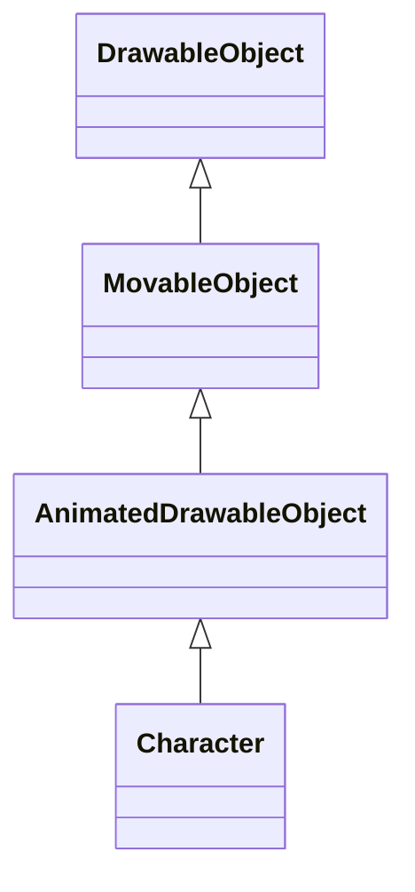
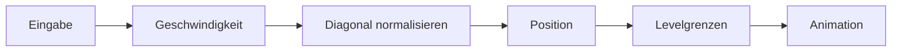
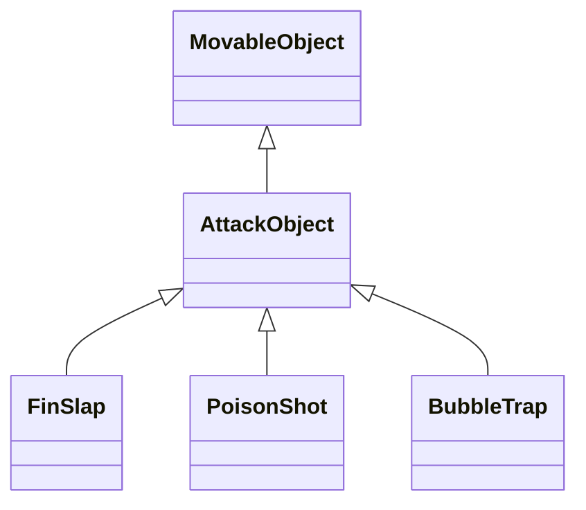

# Spieler und Kampfsystem

Dieses Dokument beschreibt Spielerbewegung, Animationen, Lebenssystem,
Angriffe, Treffererkennung, Sammelobjekte, Inventar und Shop-Upgrades von
**Sharky – Jump and Swim**.

Die wichtigsten beteiligten Klassen sind:

- `Character`
- `MovableObject`
- `AttackManager`
- `AttackObject`
- `FinSlap`
- `BubbleTrap`
- `PoisonShot`
- `CollisionManager`
- `CollectibleObject`
- `GameState`

## Spielergrundwerte

Die allgemeinen Spielerwerte befinden sich in `GAME_CONFIG`.

| Eigenschaft | Wert |
| --- | ---: |
| Startposition X | `120` |
| Startposition Y | `250` |
| Breite | `78` |
| Höhe | `48` |
| Bewegungsgeschwindigkeit | `4` |
| Lebenspunkte | `100` |
| Unverwundbarkeit nach Treffer | `900 ms` |
| Long-Idle-Verzögerung | `15000 ms` |
| Giftflaschen-Kapazität | `5` |

`Character` übernimmt diese Werte beim Erzeugen einer neuen Spielerinstanz.

## Vererbung

Der Spieler baut auf den gemeinsamen Zeichen-, Bewegungs- und
Animationsklassen auf:



Dadurch verwendet Sharky dieselben Grundlagen wie andere animierte Objekte:

- Position und Abmessungen
- Bildcache
- Bewegungsgeschwindigkeit
- Blickrichtung
- pausierbare Animationen
- Fallbackdarstellung

## Spielerzustand

`Character` verwaltet unter anderem:

| Eigenschaft | Bedeutung |
| --- | --- |
| `speed` | aktuelle Bewegungsgeschwindigkeit |
| `maxHealth` | maximale Lebenspunkte |
| `health` | aktuelle Lebenspunkte |
| `lastDamageTime` | Zeitpunkt des letzten erfolgreichen Treffers |
| `direction` | horizontale Blick- und Angriffsrichtung |
| `velocityX` | horizontale Bewegung |
| `velocityY` | vertikale Bewegung |
| `activeAttackAnimation` | aktuell laufende Angriffsanimation |
| `lastActivityTime` | Zeitpunkt der letzten Spieleraktivität |

Die eigentlichen Sitzungswerte wie Münzen, Giftflaschen und Upgrades liegen
nicht im Spieler, sondern in `GameState`.

## Bewegung

Der Spieler wird einmal pro aktiven Spielframe aktualisiert.

Der Bewegungsablauf ist:

1. bisherige Geschwindigkeit zurücksetzen
2. horizontale Eingaben auswerten
3. vertikale Eingaben auswerten
4. diagonale Geschwindigkeit normalisieren
5. Position aktualisieren
6. Levelgrenzen anwenden
7. passende Animation auswählen



## Bewegungsrichtungen

`MovableObject` stellt folgende Bewegungsmethoden bereit:

| Methode | Auswirkung |
| --- | --- |
| `moveLeft()` | negative X-Geschwindigkeit und Blickrichtung nach links |
| `moveRight()` | positive X-Geschwindigkeit und Blickrichtung nach rechts |
| `moveUp()` | negative Y-Geschwindigkeit |
| `moveDown()` | positive Y-Geschwindigkeit |

Die Blickrichtung wird nur durch horizontale Bewegung verändert. Sharky behält
seine zuletzt gewählte horizontale Richtung beim vertikalen Schwimmen und im
Stillstand bei.

## Diagonale Bewegung

Ohne Korrektur wäre eine gleichzeitige Bewegung auf zwei Achsen schneller als
eine gerade Bewegung.

Bei diagonaler Eingabe werden deshalb beide Geschwindigkeitskomponenten mit
folgendem Faktor multipliziert:

```text
0.7071
```

Der Wert entspricht näherungsweise:

```text
1 / √2
```

Dadurch bleibt die resultierende Gesamtgeschwindigkeit in allen Richtungen
nahezu gleich.

## Levelgrenzen

Nach der Positionsänderung wird der vollständige Spieler innerhalb der
Levelgrenzen gehalten.

```text
left ≤ player.x ≤ right - player.width
top  ≤ player.y ≤ bottom - player.height
```

Sharky kann dadurch weder seitlich noch vertikal vollständig aus der Spielwelt
schwimmen.

## Feste Kollisionsbereiche

Zusätzlich zu den äußeren Levelgrenzen können Barrieren und explizite
Solid-Areas die Bewegung blockieren.

Vor der Spielerbewegung speichert `Game` die bisherige Position. Nach der
Bewegung prüft der `CollisionManager`, von welcher Seite Sharky einen festen
Bereich betreten hat.

Je nach vorheriger Position wird Sharky:

- über den Bereich gesetzt
- unter den Bereich gesetzt
- links neben den Bereich gesetzt
- rechts neben den Bereich gesetzt

Die Geschwindigkeit auf der betroffenen Achse wird anschließend auf `0`
gesetzt.

## Spieleranimationen

Für den Spieler sind folgende Animationen registriert:

| Animation | Verwendung |
| --- | --- |
| `idle` | kurzer Stillstand |
| `longIdle` | längere Inaktivität |
| `swim` | aktive Bewegung |
| `finSlap` | Flossenschlag |
| `bubbleTrap` | Blasenfalle und Giftangriff |
| `hurt` | temporäre Unverwundbarkeit nach Schaden |
| `dead` | Tod des Spielers |

## Animationspriorität

Die Animation wird anhand einer festen Priorität ausgewählt:

```text
1. Dead
2. Hurt
3. aktive Angriffsanimation
4. Swim
5. Long Idle
6. Idle
```

Kritische Zustände überschreiben normale Bewegung und Angriffe.

Ein besiegter Spieler zeigt deshalb immer die Todesanimation. Während der
Unverwundbarkeit wird die Hurt-Animation vor einer laufenden Angriffsanimation
angezeigt.

## Idle und Long Idle

Wenn Sharky nicht bewegt wird, läuft zunächst die normale Idle-Animation.

Nach `15000 ms` ohne Aktivität wechselt der Spieler in `longIdle`.

Der Aktivitätszeitpunkt wird zurückgesetzt durch:

- Bewegung
- Flossenschlag
- Blasenfalle
- Giftangriff
- erhaltenen Schaden

Die Zeit basiert auf `GAME_CLOCK.now()`. Eine Pause zählt deshalb nicht als
Spielerinaktivität.

Für die Animationen gelten folgende Framedauern:

| Animation | Framedauer |
| --- | ---: |
| Idle | `180 ms` |
| Long Idle | `240 ms` |
| Swim | `100 ms` |
| Angriff | `60 ms` |
| Hurt | `110 ms` |
| Dead | `130 ms` |

## Sprite-Zuschnitt

Die Spielerbilder enthalten teilweise größere transparente oder nicht benötigte
Flächen. `Character` verwendet deshalb definierte Quellbereiche für:

- normale Animationen
- Flossenschlag
- Blasenfalle

Die visuelle Angriffsanimation kann größer als die technische Spieler-Hitbox
gezeichnet werden.

Dadurch bleiben:

- Bewegungskollision
- Gegnerkontakt
- Spielerposition

von der sichtbaren Größe der Angriffsanimation getrennt.

## Spiegelung

Die Spielerbilder werden abhängig von `direction` horizontal gespiegelt.

| Wert | Richtung |
| ---: | --- |
| `1` | rechts |
| `-1` | links |

Zum Spiegeln wird der Canvas-Kontext kurzzeitig mit `scale(-1, 1)` verändert und
anschließend wiederhergestellt.

Die Angriffsobjekte verwenden dieselbe Richtung. Dadurch starten Projektile und
Nahkampf-Hitboxen auf der Seite, in die Sharky blickt.

## Lebenssystem

Sharky startet regulär mit:

```text
100 / 100 Leben
```

`takeDamage()` verarbeitet Schaden nur, wenn der Spieler:

- noch lebt
- aktuell nicht unverwundbar ist

Der neue Lebenswert wird mindestens auf `0` begrenzt.

```text
health = max(0, health - damage)
```

## Unverwundbarkeit

Nach einem erfolgreichen Treffer ist Sharky für `900 ms` unverwundbar.

Während dieses Zeitraums:

- wird kein weiterer Schaden angenommen
- läuft die Hurt-Animation
- erscheint ein weißer Rahmen um die Spieler-Hitbox

Die Unverwundbarkeit verwendet die pausierbare Spielzeit. Während einer Pause
läuft sie nicht ab.

Dadurch kann ein Gegner Sharky bei dauerhafter Überschneidung nicht in jedem
Frame erneut verletzen.

## Kontaktschaden

Der `CollisionManager` prüft den Spieler gegen alle aktiven Gefahrobjekte des
Levels.

Schaden entsteht nur, wenn:

1. der Gegner aktuell Kontaktschaden verursachen darf
2. sich Spieler- und Gegnerrechteck überschneiden
3. der Spieler Schaden annehmen kann

Nach einem erfolgreichen Treffer wird abhängig vom Ergebnis abgespielt:

- `playerHurt`, wenn Sharky weiterlebt
- `playerDeath`, wenn die Lebenspunkte `0` erreichen
- zusätzlicher gegnerspezifischer Kontaktsound

Sounds werden nur ausgelöst, wenn sich die Lebenspunkte tatsächlich verringert
haben.

## Rechteckkollision

Treffer und Sammelvorgänge verwenden eine achsenparallele
Rechtecküberschneidung.

```text
A.right  > B.left
A.left   < B.right
A.bottom > B.top
A.top    < B.bottom
```

Nur das Berühren zweier Außenkanten gilt noch nicht als Überschneidung.

## Angriffssystem

`AttackManager` ist die zentrale Verwaltung aller Spielerangriffe.

Die Klasse übernimmt:

- Eingaben prüfen
- neue Angriffe erzeugen
- Abklingzeiten verwalten
- aktive Angriffe aktualisieren
- abgelaufene Angriffe entfernen
- vorherigen Eingabestatus speichern
- Angriffssounds auslösen
- Zurücksetzen bei Restart und Levelwechsel

## Steuerung

| Angriff | Tastatur | Touch |
| --- | --- | --- |
| Flossenschlag | `E` | `Flosse` |
| Blasenfalle | `Leertaste` | `Blase` |
| Giftangriff | `F` | `Gift` |

Alle Eingabearten schreiben in denselben `Keyboard`-Status.

## Eingabeflanke

Ein Angriff wird nur beim Übergang von „nicht gedrückt“ zu „gedrückt“
ausgelöst.

Dafür speichert `AttackManager` den vorherigen Zustand jeder Angriffstaste:

```js
previousInputs = {
    finSlap: false,
    poisonShot: false,
    bubbleTrap: false
};
```

Das Gedrückthalten einer Taste erzeugt deshalb nicht automatisch in jedem
Frame einen weiteren Angriff. Die Taste muss zunächst losgelassen und erneut
gedrückt werden.

## Abklingzeiten

Zusätzlich zur Eingabeflanke besitzt jeder Angriff eine eigene Abklingzeit.

| Angriff | Cooldown |
| --- | ---: |
| Flossenschlag | `420 ms` |
| Giftangriff | `650 ms` |
| Blasenfalle | `850 ms` |

Die Cooldowns verwenden `GAME_CLOCK.now()` und bleiben während einer Pause
stehen.

## Gemeinsame Angriffsbasis

Alle Angriffe erweitern `AttackObject`.



`AttackObject` stellt bereit:

- Position und Abmessungen
- Typ
- Direktschaden
- Geschwindigkeit
- Richtung
- Lebensdauer
- Ablaufstatus
- getroffene Ziele
- Bild oder Fallbackdarstellung

## Angriffswerte

| Wert | Flossenschlag | Giftangriff | Blasenfalle |
| --- | ---: | ---: | ---: |
| Breite | `82` | `44` | `58` |
| Höhe | `56` | `22` | `58` |
| Geschwindigkeit | `0` | `8` | `6` |
| Lebensdauer | `150 ms` | `1500 ms` | `1600 ms` |
| Cooldown | `420 ms` | `650 ms` | `850 ms` |
| Direktschaden | `28` | `10` | `0` |
| Ressource | keine | eine Giftflasche | keine |

## Flossenschlag

`FinSlap` erzeugt eine kurzlebige Nahkampf-Hitbox direkt neben dem Spieler.

Eigenschaften:

- bewegt sich nicht
- richtet sich nach Sharkys Blickrichtung
- verursacht `28` Schaden
- bleibt `150 ms` aktiv
- kann mehrere unterschiedliche Ziele treffen
- kann dasselbe Ziel nur einmal treffen

Die technische Hitbox besitzt aktuell kein eigenes sichtbares Angriffsbild.
Die sichtbare Darstellung erfolgt über Sharkys Flossenschlaganimation.

Wenn kein Angriffssprite konfiguriert ist, bleibt die technische Hitbox
bewusst unsichtbar.

## Giftangriff

`PoisonShot` ist ein horizontales Projektil.

Beim Erzeugen:

1. wird eine Giftflasche verbraucht
2. Sharkys Blasenanimation startet
3. das Projektil erscheint vor Sharky
4. der Angriffssound wird abgespielt

Beim Treffer:

1. entstehen `10` Punkte Direktschaden
2. das Ziel erhält einen Gifteffekt
3. das Ziel wird als getroffen registriert
4. der Bubble-Pop-Sound wird abgespielt
5. das Projektil läuft ab

Der Gifteffekt verwendet:

| Eigenschaft | Wert |
| --- | ---: |
| Schaden pro Tick | `8` |
| Gesamtdauer | `3600 ms` |
| Tickintervall | `700 ms` |

Das Zielobjekt ist für die zeitliche Verarbeitung des Gifteffekts
verantwortlich.

Der Angriff kann nur ausgelöst werden, wenn mindestens eine Giftflasche
vorhanden ist.

## Blasenfalle

`BubbleTrap` ist ein horizontales Projektil ohne Direktschaden.

Beim Treffer:

1. wird geprüft, ob das Ziel gefangen werden darf
2. ein erlaubtes Ziel wird für `3200 ms` gefangen
3. das Ziel wird als getroffen registriert
4. der Bubble-Pop-Sound wird abgespielt
5. das Projektil läuft ab

Nicht jedes Ziel muss fangbar sein. Die Entscheidung liegt beim Ziel über:

```js
target.canBeTrapped();
```

Dadurch kann beispielsweise ein Boss ein anderes Verhalten als ein normaler
Gegner besitzen.

## Projektilkollision mit Barrieren

Giftangriff und Blasenfalle gelten als Projektile.

Wenn ein Projektil einen festen Levelbereich trifft:

- wird der Bubble-Pop-Sound abgespielt
- das Projektil wird als abgelaufen markiert
- weitere Zielprüfungen für dieses Projektil werden übersprungen

Der Flossenschlag ist kein Projektil und wird nicht an festen Bereichen
beendet.

## Trefferregistrierung

Jedes `AttackObject` besitzt ein eigenes `Set` bereits getroffener Ziele:

```js
hitTargets = new Set();
```

Vor einem Treffer wird geprüft:

- Ziel wurde noch nicht getroffen
- Ziel ist nicht besiegt
- Hitboxen überschneiden sich

Nach erfolgreicher Verarbeitung wird das Ziel registriert.

Dadurch kann ein länger sichtbarer Angriff dasselbe Ziel nicht in jedem Frame
erneut beschädigen.

## Ablauf von Angriffen

Ein Angriff speichert seinen Erzeugungszeitpunkt:

```js
createdAt = GAME_CLOCK.now();
```

Bei jedem Update wird geprüft:

```text
aktuelle Spielzeit - Erzeugungszeitpunkt ≥ Lebensdauer
```

Abgelaufene Angriffe werden anschließend aus `activeAttacks` entfernt.

Bei Restart oder Levelwechsel leert `AttackManager.reset()`:

- alle aktiven Angriffe
- alle Cooldown-Zeitpunkte
- alle vorherigen Eingabestatus

## Sammelobjekte

Das Spiel unterstützt zwei Sammelobjekttypen:

| Typ | Wert | Verwendung |
| --- | ---: | --- |
| Münze | `1` | Shopkäufe |
| Giftflasche | `1` | Giftangriff |

`CollectibleObject` verwaltet:

- Typ
- Wert
- Position und Hitbox
- Animation
- Sammelstatus
- Reset bei Levelneustart

Gesammelte Objekte werden nicht mehr aktualisiert oder gezeichnet.

## Münzen sammeln

Eine Münze wird gesammelt, wenn:

- sie noch nicht eingesammelt wurde
- Spieler und Münze sich überschneiden

Im selben Kollisionsaufruf werden:

1. Münzen in `GameState` erhöht
2. Sammelsound abgespielt
3. Objekt als gesammelt markiert

Die HUD-Aktualisierung erhält dadurch direkt den neuen Wert.

## Giftflaschen sammeln

Eine Giftflasche wird nur gesammelt, wenn das Inventar noch Platz besitzt.

Standardkapazität:

```text
5 Giftflaschen
```

Ist das Inventar voll:

- bleibt die Flasche sichtbar
- wird sie nicht als gesammelt markiert
- wird kein Sammelsound abgespielt

Sie kann später eingesammelt werden, sobald eine Flasche verbraucht wurde oder
die Kapazität erhöht wurde.

## Inventar

`GameState` speichert:

```text
coins
poisonBottles
```

Die Giftmenge wird beim Sammeln sicher auf die aktuelle Maximalkapazität
begrenzt.

Der Giftangriff verwendet `usePoisonBottle()` und kann den Wert nicht unter
`0` reduzieren.

## Shop-Upgrades

Nach Abschluss von Level 1 können Münzen für drei Upgrades ausgegeben werden.

| Upgrade | Kosten | Auswirkung |
| --- | ---: | --- |
| Flossen-Turbo | `2` Münzen | Geschwindigkeit `+1` |
| Starke Schuppen | `3` Münzen | maximales Leben `+25` |
| Gift-Tasche | `2` Münzen | Giftkapazität `+2` |

Ein Kauf ist nur möglich, wenn:

- das Upgrade in `GAME_CONFIG.shopUpgrades` existiert
- es noch nicht gekauft wurde
- genügend Münzen vorhanden sind

## Geschwindigkeitsupgrade

`speedBoost` erhöht die Spielergeschwindigkeit von:

```text
4 auf 5
```

Die diagonale Normalisierung bleibt weiterhin aktiv.

## Lebensupgrade

`extraHealth` erhöht maximale und aktuelle Lebenspunkte von:

```text
100 auf 125
```

Das Upgrade wird beim Kauf auf die bestehende Spielerinstanz angewendet und
nach dem Erzeugen eines neuen Spielers erneut gesetzt.

## Giftkapazitätsupgrade

`poisonCapacity` erhöht die maximale Kapazität von:

```text
5 auf 7 Giftflaschen
```

Das Upgrade fügt keine Giftflaschen hinzu. Es erweitert nur den verfügbaren
Inventarplatz.

## Sitzungsdauer der Upgrades

Gekaufte Upgrades bleiben erhalten bei:

- Wechsel von Level 1 zu Level 2
- Restart des aktuellen Levels

Sie werden zurückgesetzt bei:

- vollständigem neuen Spielstart über `Game.start()`

Es existiert keine dauerhafte Speicherung der Upgrades im Browser oder auf
einem Server.

## Abgesicherte Fälle

Automatisierte Tests sichern insbesondere ab:

- Long Idle beginnt nach 15 Sekunden
- Bewegung beendet Long Idle sofort
- Angriffe setzen den Aktivitätstimer zurück
- Schaden entsteht nur bei echter Trefferüberschneidung
- ein Angriff trifft dasselbe Ziel nur einmal
- Münzzähler und Sammelsound werden direkt aktualisiert
- volle Giftinventare lassen Flaschen in der Spielwelt
- besiegte Spieler gelangen nicht mehr in normale Bewegungsupdates
- Todesanimation verändert die Spielerposition nicht

## Bekannte Grenzen

- Trefferflächen sind achsenparallele Rechtecke.
- Transparente Bildbereiche können von der technischen Hitbox abweichen.
- Es existieren keine pixelgenauen Maskenkollisionen.
- Sharky erhält keinen physischen Rückstoß nach einem Treffer.
- Angriffe besitzen keine frei konfigurierbare vertikale Zielrichtung.
- Projektile bewegen sich ausschließlich horizontal.
- Der Flossenschlag besitzt kein separates sichtbares Angriffssprite.
- Kampffortschritt und Upgrades werden nicht dauerhaft gespeichert.
- Es existiert kein Combo-, Erfahrungs- oder Level-up-System.
- Automatisierte Tests ersetzen keine manuelle Prüfung des Spielgefühls und der
  visuellen Trefferwirkung.

## Kampfregeln

- Nur lebende Spieler dürfen Angriffsanimationen starten.
- Gedrückthalten darf keinen Angriff pro Frame erzeugen.
- Cooldowns verwenden pausierbare Spielzeit.
- Giftangriffe benötigen und verbrauchen genau eine Giftflasche.
- Dasselbe Ziel darf pro Angriffsobjekt nur einmal getroffen werden.
- Projektile laufen bei einem Treffer oder einer Barriere ab.
- Besiegte Ziele dürfen keinen weiteren Schaden erhalten.
- Kontaktgeräusche werden nur bei tatsächlich entstandenem Schaden abgespielt.
- Volle Giftinventare dürfen Sammelobjekte nicht entfernen.
- Restart muss Angriffe, Cooldowns und Eingabestatus zurücksetzen.
- Visuelle Angriffsgröße und technische Spieler-Hitbox bleiben getrennt.

## Weiterführende Dokumentation

- [Anwendungsarchitektur](../architecture/application.md)
- [Game Loop und Spielzustand](../architecture/game-loop-state.md)
- [Rendering und Assets](../architecture/rendering-assets.md)
- [Gegner und Levelsystem](enemies-levels.md)
- [Interface und Steuerung](interface-controls.md)
- [Audio und Anzeigeeinstellungen](audio-display-settings.md)
- [Tests und Projektvalidierung](../engineering/testing-validation.md)