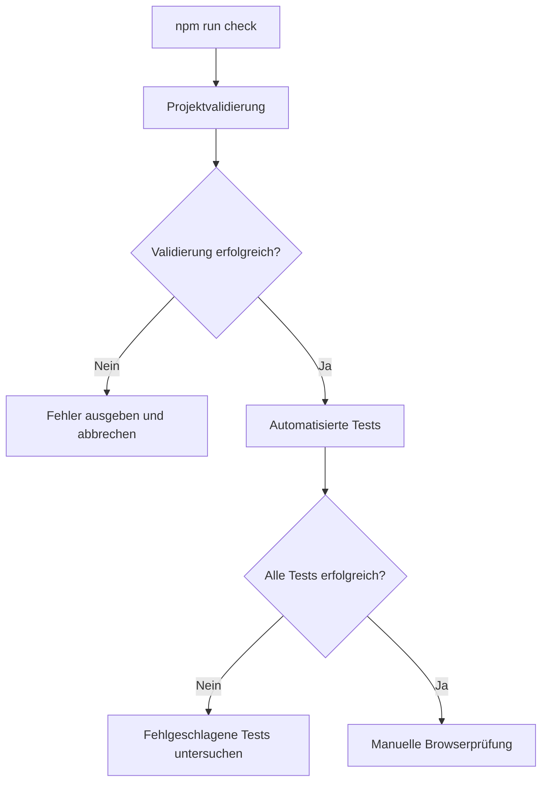

# Tests und Projektvalidierung

Dieses Dokument beschreibt die automatisierte und manuelle Qualitätssicherung
von Sharky – Jump and Swim.

Das Projekt verwendet den integrierten Node.js Test Runner und ein eigenes
Validierungsskript. Dadurch sind keine zusätzlichen Test-Frameworks oder
Abhängigkeiten erforderlich.

## Voraussetzungen

Für alle automatisierten Prüfungen wird mindestens Node.js 18 benötigt.

```bash
node --version
npm --version
```

Die erforderliche Node-Version ist in der `package.json` festgelegt:

```json
{
    "engines": {
        "node": ">=18"
    }
}
```

## Verfügbare Befehle

| Befehl | Aufgabe |
| --- | --- |
| `npm run validate` | Prüft Dateien, Referenzen, Syntax, Assets und Projektstruktur |
| `npm test` | Führt alle automatisierten JavaScript-Tests aus |
| `npm run check` | Führt zuerst die Validierung und anschließend alle Tests aus |
| `git diff --check` | Erkennt problematische Leerzeichen und Konfliktmarkierungen |
| `git status --short` | Zeigt geänderte, neue und vorgemerkte Dateien kompakt an |

Für die vollständige lokale Prüfung wird normalerweise dieser Befehl verwendet:

```bash
npm run check
```

Anschließend sollten zusätzlich die Git-Prüfungen ausgeführt werden:

```bash
git diff --check
git status --short
```

## Prüfablauf



Die Befehle sind in der `package.json` definiert:

```json
{
    "scripts": {
        "validate": "node scripts/validate-project.mjs",
        "test": "node --test \"tests/*.test.mjs\"",
        "check": "npm run validate && npm test"
    }
}
```

Durch den Operator `&&` werden die Tests nur gestartet, wenn die
Projektvalidierung erfolgreich abgeschlossen wurde.

## Projektvalidierung

Die Validierung wird durch folgende Datei ausgeführt:

```text
scripts/validate-project.mjs
```

Das Skript untersucht die Projektstruktur, lokale Referenzen, JavaScript-Syntax,
CSS-Dateien und konfigurierte Assets.

### Ausgeschlossene Verzeichnisse

Bei der rekursiven Dateisuche werden folgende Verzeichnisse ignoriert:

```text
.git/
.deploy/
node_modules/
```

Dadurch werden nur Dateien geprüft, die zum eigentlichen Projekt gehören.

### Erforderliche Dateien und Verzeichnisse

Die Validierung erwartet mindestens folgende Pfade:

```text
index.html
imprint.html
README.md
robots.txt
tests/
assets/audio/music/.gitkeep
assets/audio/sfx/.gitkeep
```

Fehlt einer dieser Pfade, schlägt die Validierung fehl.

Die `.gitkeep`-Dateien sorgen dafür, dass benötigte, möglicherweise leere
Audioverzeichnisse von Git gespeichert werden können.

## HTML-Prüfung

Die Dateien `index.html` und `imprint.html` werden auf lokale Referenzen
untersucht.

Geprüft werden unter anderem:

- lokale `src`-Attribute
- lokale `href`-Attribute
- referenzierte JavaScript-Dateien
- doppelt eingebundene Skripte
- die Position von `js/main.js`
- nicht vorhandene lokale Dateien

`js/main.js` muss das letzte Skript in `index.html` sein. Dadurch ist
sichergestellt, dass alle benötigten Klassen und Konfigurationen geladen wurden,
bevor die Anwendung initialisiert wird.

Externe URLs, Sprungmarken und andere nicht lokale Referenzen werden nicht wie
lokale Projektdateien behandelt.

## CSS-Prüfung

Alle Dateien mit der Endung `.css` werden automatisch erfasst.

Die Validierung prüft:

- ob öffnende und schließende geschweifte Klammern ausgeglichen sind
- ob lokale Dateien aus `url(...)` existieren
- ob Stylesheets grundsätzlich verarbeitet werden können

Kommentare und Zeichenketten werden bei der einfachen Klammerprüfung
berücksichtigt, damit darin enthaltene Zeichen keine falschen Fehler auslösen.

Die CSS-Prüfung ersetzt keinen vollständigen CSS-Parser und keine visuelle
Browserprüfung.

## JavaScript-Syntaxprüfung

Alle Dateien mit den Endungen `.js` und `.mjs` werden mit Node.js geprüft:

```bash
node --check <datei>
```

Damit werden unter anderem folgende Fehler erkannt:

- ungültige JavaScript-Syntax
- fehlende Klammern
- unvollständige Ausdrücke
- fehlerhafte Klassendeklarationen
- ungültige Modulsyntax

Die Syntaxprüfung führt die Produktionsdateien nicht als vollständige
Browseranwendung aus. Laufzeitfehler müssen deshalb zusätzlich durch Tests und
manuelle Browserprüfungen erkannt werden.

## Asset-Prüfung

Die Datei `js/config/asset-config.js` enthält die zentralen Assetpfade des
Spiels.

Das Validierungsskript:

1. liest Assetpfade aus der Konfiguration,
2. entfernt doppelte Pfade,
3. prüft jede referenzierte Datei,
4. meldet fehlende Assets,
5. gibt die Anzahl der geprüften Assets aus.

Dadurch können Tippfehler, verschobene Dateien und ungültige Assetreferenzen
bereits vor dem Start im Browser erkannt werden.

Die Prüfung stellt nur fest, ob eine Datei unter dem angegebenen Pfad existiert.
Sie prüft nicht, ob eine Bild- oder Audiodatei beschädigt ist oder im Browser
korrekt wiedergegeben wird.

## README-Prüfung

Die Validierung untersucht lokale Markdown-Links und lokale Bildreferenzen in
der `README.md` im Projektstamm.

Geprüft werden:

- Markdown-Links auf lokale Dateien
- lokale Bilder über Markdown
- lokale Bilder über HTML-`img`-Elemente

Externe Weblinks werden dabei nicht auf ihre Erreichbarkeit geprüft.

> Die aktuelle Validierung untersucht nur die zentrale `README.md`. Links
> innerhalb des Verzeichnisses `docs/` müssen zusätzlich manuell oder über eine
> spätere Erweiterung des Validierungsskripts geprüft werden.

## Unerwünschte Dateien

Die Validierung sucht nach Entwicklungsartefakten, die nicht in die finale
Projektversion gehören.

Dazu zählen unter anderem:

- Dateien oder Verzeichnisse mit `Legacy` im Pfad
- Preview- oder Proposal-GIFs
- Adobe-Illustrator-Dateien
- ZIP-Archive

Werden solche Dateien gefunden, schlägt die Validierung fehl.

## Fehlerausgabe

Das Validierungsskript sammelt alle gefundenen Probleme und gibt sie gemeinsam
aus. Dadurch müssen Fehler nicht einzeln durch wiederholte Aufrufe gesucht
werden.

Ein erfolgreicher Durchlauf sieht beispielsweise so aus:

```text
Sharky project validation passed.
- 46 HTML script references
- 8 stylesheets
- 202 configured assets
```

Die ausgegebenen Zahlen dienen zusätzlich als Plausibilitätskontrolle. Eine
unerwartete Änderung kann auf eine fehlende oder doppelte Referenz hinweisen.

## Automatisierte Tests

Die Tests verwenden ausschließlich in Node.js enthaltene Module:

```js
import assert from 'node:assert/strict';
import test from 'node:test';
```

Die Tests werden mit folgendem Befehl ausgeführt:

```bash
npm test
```

Node.js führt dabei alle Dateien aus, deren Name diesem Muster entspricht:

```text
tests/*.test.mjs
```

## Teststruktur

```text
tests/
├── audio-manager.test.mjs
├── boss-movement-controller.test.mjs
├── character.test.mjs
├── collision-manager.test.mjs
├── enemy-spawner.test.mjs
├── game-clock.test.mjs
├── game-lifecycle.test.mjs
├── game-status-renderer.test.mjs
├── interface.test.mjs
├── keyboard.test.mjs
├── level-config.test.mjs
├── mobile-controls.test.mjs
└── test-helpers.mjs
```

`test-helpers.mjs` ist keine eigene Testsammlung. Die Datei stellt gemeinsame
Hilfsfunktionen für andere Tests bereit.

## Testumgebung

Viele Produktionsdateien wurden ursprünglich für den Browser entwickelt und
verwenden globale Klassen statt ES-Module.

Die Test-Hilfsfunktionen laden diese Skripte deshalb in einen kontrollierten
`node:vm`-Kontext:

```js
import {
    createScriptContext,
    loadProjectScripts
} from './test-helpers.mjs';
```

Die Testumgebung kann Browserfunktionen gezielt nachbilden, beispielsweise:

- `window`
- `document`
- `localStorage`
- `Audio`
- `Date`
- `performance`
- DOM-Elemente
- Event Listener
- Media Queries

Dadurch können einzelne Klassen ohne vollständigen Browser getestet werden.

## Testprinzipien

Die Tests folgen mehreren Grundsätzen:

### Isolierte Einheiten

Eine Klasse wird möglichst unabhängig vom gesamten Spiel geprüft. Benötigte
Abhängigkeiten werden durch kleine Testobjekte ersetzt.

### Beobachtbare Aufrufe

Testobjekte speichern beispielsweise:

- abgespielte Sounds
- erhaltenen Schaden
- Zustandsänderungen
- gestartete Animationen
- registrierte Ereignisse
- Aufrufe von Restart-Methoden

Dadurch wird nicht nur ein Endwert, sondern auch die Zusammenarbeit zwischen
Klassen überprüft.

### Kontrollierte Zeit

Zeitabhängige Funktionen wie Pause und Long Idle verwenden kontrollierbare
Zeitwerte. Die Tests müssen daher nicht tatsächlich mehrere Sekunden warten.

### Keine echten Assets erforderlich

Die Tests laden keine vollständigen Bild- oder Audiodateien. Stattdessen prüfen
sie Konfigurationen, Pfade, Methodenaufrufe und Zustandsänderungen.

### Reproduzierbare Ergebnisse

Zufällige oder browserabhängige Einflüsse werden in den Tests kontrolliert.
Dadurch sollen identische Quellstände zu identischen Testergebnissen führen.

## Übersicht der Tests

| Testdatei | Anzahl | Schwerpunkt |
| --- | ---: | --- |
| `audio-manager.test.mjs` | 3 | Audioregistrierung, Bossmusik und gespeicherter Mute-Zustand |
| `boss-movement-controller.test.mjs` | 4 | Spiegelung, Reset, Bewegung und Bosszustand |
| `character.test.mjs` | 3 | Long-Idle-Animation und Aktivitätsrücksetzung |
| `collision-manager.test.mjs` | 4 | Trefferflächen, Schaden und Sammelobjekte |
| `enemy-spawner.test.mjs` | 5 | Gegnerbudgets, Spawnlimits und Spawnpositionen |
| `game-clock.test.mjs` | 2 | Pause und korrekte Spiellaufzeit |
| `game-lifecycle.test.mjs` | 3 | Tod, Todesanimation und Restart |
| `game-status-renderer.test.mjs` | 2 | Statusanzeige und Bosslebensanzeige |
| `interface.test.mjs` | 5 | HTML, Responsive-Regeln, Konsolenausgaben und UI-Verhalten |
| `keyboard.test.mjs` | 3 | Desktop-Steuerung und Fokusverlust |
| `level-config.test.mjs` | 4 | Levelvalidierung und Schwierigkeitswerte |
| `mobile-controls.test.mjs` | 4 | Sichtbarkeit und Verhalten der Touch-Steuerung |
| **Gesamt** | **42** | Automatisierte Unit- und Regressionstests |

## Audio-Manager

`tests/audio-manager.test.mjs` prüft:

1. Alle Musikstücke und Soundeffekte sind registriert.
2. Bossmusik ersetzt nach der Audiofreigabe die normale Spielmusik.
3. Mute stoppt die Wiedergabe und bleibt über neue Managerinstanzen hinweg
   gespeichert.

Der Test verwendet keine echte Audioausgabe. Eine Fake-Audio-Implementierung
zeichnet Methodenaufrufe und Zustände auf.

## Bossbewegung

`tests/boss-movement-controller.test.mjs` prüft:

1. Das Bosssprite wird nur bei Bewegung nach rechts gespiegelt.
2. Ein Reset stellt den gemeinsamen Gegnerzustand wieder her.
3. Die vertikale Patrouille bewegt sich um den konfigurierten Ausgangspunkt.
4. Der Endboss kann zurückgesetzt werden und fehlerfrei in den Idle-Zustand
   wechseln.

Damit werden gemeinsame Schnittstellen zwischen Endboss, Bewegungscontroller und
Rendering abgesichert.

## Charakter und Long Idle

`tests/character.test.mjs` prüft:

1. Nach 15 Sekunden ohne Aktivität beginnt die Long-Idle-Animation.
2. Bewegung beendet Long Idle sofort und setzt den Timer zurück.
3. Ein Angriff setzt den Long-Idle-Timer ebenfalls zurück.

Ein zusätzlicher Schlaf- oder Schnarchsound ist bewusst nicht Bestandteil
dieser Funktion.

## Kollisionen und Sammelobjekte

`tests/collision-manager.test.mjs` prüft:

1. Angriffe verursachen nur bei echter Überschneidung der Trefferflächen
   Schaden.
2. Derselbe Angriff kann ein Ziel nicht mehrfach treffen.
3. Das Sammeln einer Münze aktualisiert Inventar und Sound unmittelbar.
4. Bei vollem Giftinventar bleibt eine Giftflasche in der Spielwelt erhalten.

Diese Tests schützen besonders wichtige Spielregeln vor unbemerkten
Regressionen.

## Gegnererzeugung

`tests/enemy-spawner.test.mjs` prüft:

1. Initiale Gegner und Respawns respektieren das Gesamtbudget eines Levels.
2. Das Limit gleichzeitig aktiver Gegner verhindert zusätzliche Spawns.
3. In der Bosszone wird die normale Gegnererzeugung angehalten.
4. Entkommene oder abgeschlossene Gegner werden entfernt.
5. Neue Gegner erscheinen außerhalb des aktuell sichtbaren Kamerabereichs.

Die Auswahl der konkreten Position wird durch den ausgelagerten
`EnemySpawnPositionFinder` unterstützt.

## Spielzeit und Pause

`tests/game-clock.test.mjs` prüft:

1. Während einer Pause bleibt die Spiellaufzeit stehen.
2. Nach dem Fortsetzen wird die vergangene Pausendauer nicht zur Spielzeit
   addiert.

Damit bleiben Animationen und zeitgesteuerte Abläufe nach einer Pause
synchronisiert.

## Spiellebenszyklus

`tests/game-lifecycle.test.mjs` prüft:

1. Ein besiegter Spieler gelangt nicht mehr in den aktiven Bewegungsablauf.
2. Die Todesanimation verändert die Spielerposition nicht.
3. Ein Restart bereitet das aktuelle Level ohne Neuladen der Seite vor.

Der Restart verwendet die bestehende Spielinstanz und ersetzt keinen
Browser-Reload.

## Statusdarstellung

`tests/game-status-renderer.test.mjs` prüft:

1. Die Statusdarstellung übernimmt die aktuellen Werte des Spielers.
2. Die Bosslebensanzeige erscheint erst nach der Einführung des Bosses.

Dadurch werden normale HUD-Werte und bossabhängige Anzeigezustände getrennt
abgesichert.

## Interface

`tests/interface.test.mjs` prüft:

1. Alle erforderlichen Spiel- und Touch-Steuerelemente sind im HTML vorhanden.
2. Die Styles enthalten Regeln für mobile Querformate und reduzierte
   Animationen.
3. Browser-Skripte enthalten keine `console`-Ausgaben.
4. Hauptmenü-Panels schließen nur über den vorgesehenen Hintergrundbereich.
5. Der kompakte Audio-Button schaltet Musik und Soundeffekte gemeinsam.

Diese Tests analysieren HTML-, CSS- und JavaScript-Strukturen. Sie ersetzen
keine visuelle Browserprüfung.

## Tastatursteuerung

`tests/keyboard.test.mjs` prüft:

1. Die Bewegung funktioniert mit Pfeiltasten und WASD.
2. Alle drei Angriffe sind den dokumentierten Tasten zugeordnet.
3. Beim Verlust des Browserfokus werden alle aktiven Eingaben zurückgesetzt.

Das Zurücksetzen bei Fokusverlust verhindert, dass Bewegungen oder Angriffe nach
einem Fensterwechsel aktiv bleiben.

## Levelkonfiguration

`tests/level-config.test.mjs` prüft:

1. Alle Levelkonfigurationen erfüllen die erwartete Struktur.
2. Die Gewichtungen der Gegnertypen ergeben in jedem Level den Wert `1`.
3. Level 2 erhöht Gegner- und Bossschwierigkeit.
4. Der Boss ist 40 Prozent größer als seine ursprüngliche Basisgröße.

Die Tests verhindern inkonsistente oder unvollständige
Konfigurationsänderungen.

## Mobile Steuerung

`tests/mobile-controls.test.mjs` prüft:

1. Touch-Steuerelemente werden auf einem geeigneten mobilen Viewport aktiviert.
2. Auf Desktopgeräten bleiben sie ausgeblendet.
3. Oberhalb der unterstützten Bildschirmbreite bleiben sie ausgeblendet.
4. Kontextmenüs werden auf den Touch-Steuerelementen unterdrückt.

Die tatsächliche Bedienbarkeit muss zusätzlich auf einem echten Smartphone oder
Tablet geprüft werden.

## Aktueller Prüfstand

Der zuletzt bestätigte Stand umfasst:

| Prüfung | Ergebnis |
| --- | ---: |
| Testdateien | 12 |
| Automatisierte Tests | 42 |
| Erfolgreich | 42 |
| Fehlgeschlagen | 0 |
| HTML-Skriptreferenzen | 46 |
| Stylesheets | 8 |
| Konfigurierte Assets | 202 |

Die Zahlen beschreiben einen konkreten geprüften Projektstand. Nach späteren
Erweiterungen dürfen sich diese Werte ändern.

Entscheidend ist, dass alle erwarteten Dateien erfasst werden und keine Prüfung
fehlschlägt.

## Git-Prüfungen

Die automatisierten npm-Skripte prüfen keine Git-Historie und keine
Commitaufteilung.

Vor einem Commit sollte deshalb zusätzlich ausgeführt werden:

```bash
git diff --check
git status --short
```

`git diff --check` erkennt unter anderem:

- nachgestellte Leerzeichen
- problematische Leerzeilen
- versehentlich verbliebene Konfliktmarkierungen

`git status --short` unterscheidet zwischen:

```text
 M datei    Geändert, aber nicht gestaged
M  datei    Geändert und gestaged
A  datei    Neue Datei und gestaged
?? datei    Neue, noch nicht erfasste Datei
```

Der Inhalt eines vorbereiteten Commits kann geprüft werden mit:

```bash
git diff --cached
git diff --cached --stat
```

## LF- und CRLF-Warnungen

Unter Windows kann Git folgende Meldung ausgeben:

```text
warning: LF will be replaced by CRLF the next time Git touches it
```

Diese Meldung bedeutet nicht automatisch, dass ein Test oder Commit
fehlgeschlagen ist. Sie weist auf unterschiedliche Zeilenende-Einstellungen
zwischen Arbeitskopie und Repository hin.

Vor einer Änderung sollte geprüft werden:

```bash
git status
git diff --check
```

Eine einheitliche Regelung kann später über `.gitattributes` erfolgen. Eine
bestehende Konfiguration sollte nicht unmittelbar vor einem Abschluss ohne
Prüfung geändert werden.

## Manuelle Browserprüfung

Automatisierte Tests können nicht alle Eigenschaften eines Canvas-Spiels
vollständig abdecken.

Nach einem erfolgreichen `npm run check` ist deshalb eine manuelle Prüfung
erforderlich.

### Allgemeiner Start

- Das Hauptmenü wird vollständig dargestellt.
- Es entstehen keine Fehler in der Browserkonsole.
- Alle Bilder und Schriften werden geladen.
- Alle Buttons reagieren auf die erwartete Aktion.
- Interne Links funktionieren.
- Das Impressum ist erreichbar.
- Das Spiel kann aus dem Menü gestartet werden.

### Spielablauf

- Level 1 startet mit einer sicheren Spielerposition.
- Bewegung funktioniert in alle Richtungen.
- Kamera und Hintergrund folgen korrekt.
- Gegner erscheinen außerhalb des sichtbaren Bereichs.
- Gegner verursachen nur bei Berührung Schaden.
- Besiegte Gegner verschwinden korrekt.
- Münzen und Giftflaschen können gesammelt werden.
- HUD-Werte werden unmittelbar aktualisiert.
- Der Endboss erscheint im vorgesehenen Bereich.
- Die Bosslebensanzeige wird zum richtigen Zeitpunkt eingeblendet.

### Angriffe

- Flossenschlag funktioniert mit `E`.
- Blasenfalle funktioniert mit der Leertaste.
- Giftangriff funktioniert mit `F`.
- Angriffe treffen nur im sichtbaren Wirkungsbereich.
- Die Blasenfalle verhält sich bei kleinen Gegnern korrekt.
- Gift wird nur bei verfügbarem Inventar verwendet.
- Angriffssounds werden abgespielt.

### Spielzustände

- Pause stoppt Bewegung und Spielzeit.
- Fortsetzen setzt das Spiel korrekt fort.
- Game Over erscheint nach der Todesanimation.
- Der Charakter bewegt sich nach dem Tod nicht weiter.
- Restart lädt das aktuelle Level ohne Seiten-Reload neu.
- Der Shop erscheint nach Abschluss von Level 1.
- Level 2 kann aus dem Shop gestartet werden.
- Der Gewinnbildschirm erscheint nach Abschluss des letzten Levels.
- Die Rückkehr zum Hauptmenü funktioniert aus allen vorgesehenen Zuständen.

### Audio

- Musik startet erst nach einer erlaubten Benutzerinteraktion.
- Musik kann ein- und ausgeschaltet werden.
- Soundeffekte können ein- und ausgeschaltet werden.
- Musik- und Effektlautstärke lassen sich getrennt verändern.
- Der kompakte Audio-Button schaltet beide Audiobereiche.
- Bossmusik ersetzt die normale Levelmusik.
- Gespeicherte Einstellungen bleiben nach einem Neuladen erhalten.
- Es laufen nicht mehrere Musikstücke gleichzeitig.

### Anzeige

- Dunkel- und Hellmodus funktionieren.
- Vollbild kann aktiviert und beendet werden.
- Die Vollbildanzeige bleibt mit den Buttons synchron.
- Canvas und UI bleiben innerhalb des Viewports.
- Es entstehen keine unerwarteten Scrollbalken.
- Hintergründe besitzen keine sichtbaren Lücken.
- Overlays verdecken das Spiel vollständig.

### Mobile Geräte

- Im Hochformat erscheint der Orientierungshinweis.
- Im Querformat verschwindet der Orientierungshinweis.
- Der virtuelle Joystick reagiert korrekt.
- Alle drei Angriffstasten funktionieren.
- Touch-Steuerelemente erscheinen nicht auf Desktopgeräten.
- Langes Drücken öffnet kein Kontextmenü.
- Browsergesten blockieren die Spielsteuerung nicht ungewollt.
- Pause und Vollbild funktionieren auf unterstützten Geräten.
- Buttons überlagern weder HUD noch Spielfigur.
- Die Seite kann nicht unbeabsichtigt während des Spiels gescrollt werden.

### Barrierefreiheit

- Alle interaktiven Elemente sind mit der Tastatur erreichbar.
- Der sichtbare Fokus ist erkennbar.
- Icon-Buttons besitzen verständliche Alternativbeschriftungen.
- Dialoge und Panels haben nachvollziehbare Überschriften.
- Texte besitzen ausreichenden Kontrast.
- Inhalte bleiben bei reduziertem Bewegungswunsch verständlich.
- Dekorative Bilder werden von Screenreadern ignoriert.
- Bedeutungsvolle Bilder besitzen geeignete Alternativtexte.

## Deployment-Prüfung

Nach der Veröffentlichung muss die bereitgestellte Version erneut getestet
werden.

Besonders wichtig sind:

- Groß- und Kleinschreibung von Dateipfaden
- Leerzeichen in Assetnamen
- vollständige Übertragung aller Assets
- korrekte relative Pfade
- funktionierende Audio- und Bilddateien
- direkte Erreichbarkeit von `index.html`
- Erreichbarkeit von `imprint.html`
- fehlerfreie Browserkonsole

Ein lokales Windows-Dateisystem kann Unterschiede bei der Groß- und
Kleinschreibung tolerieren, die auf einem Linux-basierten Webserver zu fehlenden
Dateien führen.

## Was automatisiert geprüft wird

Die aktuelle Qualitätssicherung erkennt zuverlässig:

- fehlende Pflichtdateien
- ungültige lokale HTML-Referenzen
- ungültige lokale CSS-Referenzen
- doppelte Skripteinbindungen
- eine falsche Position von `js/main.js`
- einfache CSS-Klammerfehler
- JavaScript-Syntaxfehler
- fehlende konfigurierte Assets
- ungültige lokale Links in der Stamm-README
- unerwünschte Entwicklungsartefakte
- Regressionen in 42 definierten Spielfällen

## Was nicht vollständig automatisiert geprüft wird

Die aktuelle Qualitätssicherung garantiert nicht:

- korrekte visuelle Darstellung
- vollständige Browserkompatibilität
- tatsächliche Audioqualität
- fehlerfreie Bildanimationen
- vollständige Barrierefreiheit
- korrekte Bedienung auf jedem Mobilgerät
- reale Performance unter Last
- vollständige End-to-End-Spielabläufe
- Erreichbarkeit externer Links
- fehlerfreie Veröffentlichung
- Vollständigkeit aller JSDoc-Kommentare
- maximale Datei- oder Funktionslängen
- korrekte Links innerhalb sämtlicher Dateien unter `docs/`

Diese Bereiche werden durch Code-Reviews, manuelle Tests und spätere
Erweiterungen der Prüfsysteme abgedeckt.

## Einen neuen Test ergänzen

Ein neuer Test sollte in einer fachlich passenden Datei oder in einer neuen
Datei mit der Endung `.test.mjs` angelegt werden.

Beispiel:

```js
import assert from 'node:assert/strict';
import test from 'node:test';
import {
    createScriptContext,
    loadProjectScripts
} from './test-helpers.mjs';

const context = createScriptContext();

loadProjectScripts(
    context,
    ['js/example/example.class.js'],
    'this.ExampleExport = Example;'
);

test('example changes its state after activation', () => {
    const example = new context.ExampleExport();

    example.activate();

    assert.equal(example.isActive, true);
});
```

Der Testname sollte das erwartete Verhalten beschreiben und nicht nur einen
Methodennamen wiederholen.

Gut:

```js
test('restart prepares the current level without reloading the page', () => {
    // ...
});
```

Weniger aussagekräftig:

```js
test('restart test', () => {
    // ...
});
```

## Regeln für neue Tests

Neue Tests sollten:

- genau ein klar erkennbares Verhalten prüfen,
- ohne echte Wartezeiten auskommen,
- keine Netzwerkverbindung benötigen,
- keine echten Audio- oder Bilddateien laden,
- kontrollierte Testdaten verwenden,
- unabhängig von der Ausführungsreihenfolge sein,
- nach Möglichkeit keine Produktionsimplementierung duplizieren,
- verständliche Fehlermeldungen erzeugen,
- gemeinsam mit der zugehörigen Änderung committed werden.

## Vorgehen bei einem fehlgeschlagenen Test

1. Vollständige Ausgabe lesen.
2. Namen und Datei des fehlgeschlagenen Tests bestimmen.
3. Den Test einzeln ausführen.
4. Erwarteten und tatsächlichen Wert vergleichen.
5. Prüfen, ob Produktionscode oder Testerwartung falsch ist.
6. Korrektur vornehmen.
7. Gesamte Testsammlung erneut ausführen.
8. Abschließend die Projektvalidierung wiederholen.

Eine einzelne Testdatei kann so ausgeführt werden:

```bash
node --test tests/collision-manager.test.mjs
```

Nach der Korrektur:

```bash
npm run check
git diff --check
```

Ein Test darf nicht nur entfernt oder abgeschwächt werden, damit die
Testsammlung wieder grün erscheint. Zuerst muss geklärt werden, ob sich eine
Anforderung bewusst geändert hat oder eine Regression vorliegt.

## Empfohlener Ablauf vor einem Commit

```bash
npm run check
git diff --check
git status --short
git diff
```

Danach werden nur die fachlich zusammengehörenden Dateien vorbereitet:

```bash
git add <dateien>
git diff --cached --stat
git diff --cached
git commit -m "type(scope): kurze beschreibung"
```

## Empfohlener Ablauf vor einem Push

```bash
npm run check
git diff --check
git status
git log --oneline -5
git push
```

Nach dem Push sollte der Stand im Repository und anschließend die
bereitgestellte Anwendung geprüft werden.

## Weiterführende Dokumentation

- [Dokumentationsübersicht](../README.md)
- [Anwendungsarchitektur](../architecture/application.md)
- [Game Loop und Zustände](../architecture/game-loop-state.md)
- [Spieler und Kampfsystem](../features/player-combat.md)
- [Gegner und Level](../features/enemies-levels.md)
- [Entwicklungskonventionen](conventions.md)
- [Styling und Barrierefreiheit](styling-accessibility.md)
- [Entwicklungsworkflow](../operations/development-workflow.md)
- [Deployment](../operations/deployment.md)