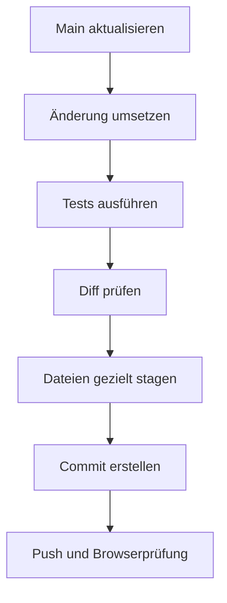

# Entwicklungsworkflow

Dieses Dokument beschreibt den aktuellen Entwicklungs- und Git-Workflow von
Sharky – Jump and Swim.

Das Repository wird derzeit als Einzelprojekt geführt. Der aktuelle Stand
verwendet ausschließlich den Branch `main`. Pull Requests und verpflichtende
Code-Reviews sind daher momentan kein Bestandteil des Prozesses.

## Technische Voraussetzungen

| Werkzeug | Voraussetzung |
| --- | --- |
| Git | Aktuelle stabile Version |
| Node.js | Version 18 oder höher |
| npm | Wird zusammen mit Node.js installiert |
| Browser | Aktuelle Version von Chrome, Firefox oder Edge |
| Entwicklungsserver | Beispielsweise VS Code Live Server |

Versionen prüfen:

```bash
git --version
node --version
npm --version
```

## Repository klonen

```bash
git clone https://github.com/CZX93-BW/SharkyProject.git
cd SharkyProject
```

Remote-Verbindung prüfen:

```bash
git remote -v
```

Erwarteter Remote:

```text
origin  https://github.com/CZX93-BW/SharkyProject.git
```

## Projekt installieren

Das Projekt besitzt keine externen Laufzeitabhängigkeiten und benötigt keinen
Build-Schritt.

Die npm-Metadaten können trotzdem initialisiert werden:

```bash
npm install
```

Das Spiel sollte anschließend über einen lokalen Webserver geöffnet werden.
Das direkte Öffnen von `index.html` über `file://` kann bei lokalen Assets und
Browserfunktionen zu abweichendem Verhalten führen.

Mit VS Code kann beispielsweise die Erweiterung Live Server verwendet werden.

## Aktueller Branch-Workflow

Der aktuelle Repository-Stand besitzt nur diesen Branch:

```text
main
```

Da das Projekt allein entwickelt wird, können geprüfte Änderungen direkt auf
`main` committed werden.

Vor jeder neuen Arbeitseinheit:

```bash
git switch main
git status
git pull --ff-only origin main
```

`--ff-only` verhindert, dass Git unbemerkt einen zusätzlichen Merge-Commit
erstellt.

Falls lokale Änderungen vorhanden sind, müssen diese zuerst geprüft werden.
Ein Pull sollte nicht blind über einen ungeklärten Arbeitsstand ausgeführt
werden.

## Standardablauf



## 1. Arbeitsstand prüfen

Vor einer Änderung:

```bash
git status --short
```

Typische Statuskennzeichen:

| Status | Bedeutung |
| --- | --- |
| ` M datei` | Geändert, aber nicht gestaged |
| `M  datei` | Geändert und gestaged |
| `MM datei` | Gestaged und danach erneut verändert |
| `A  datei` | Neue Datei und gestaged |
| `?? datei` | Neue, noch nicht erfasste Datei |
| `D  datei` | Datei zum Löschen vorgemerkt |

## 2. Änderung umsetzen

Eine Arbeitseinheit sollte nur ein fachlich zusammengehörendes Ziel verfolgen.

Beispiele:

- Long-Idle-Animation ergänzen
- mobilen Hochformat-Hinweis hinzufügen
- Status-Renderer auslagern
- Gegnererzeugung absichern
- Tests für einen Lebenszyklus ergänzen
- Dokumentation eines Fachbereichs erstellen

Unabhängige Änderungen sollten nicht in einem einzigen Sammelcommit vermischt
werden.

## 3. Änderungen während der Arbeit prüfen

Alle nicht gestagten Änderungen anzeigen:

```bash
git diff
```

Übersicht nach Dateien:

```bash
git diff --stat
```

Nur eine bestimmte Datei prüfen:

```bash
git diff -- js/game/game.class.js
```

Neue Dateien erscheinen nicht in `git diff`, solange sie noch nicht von Git
erfasst wurden. Sie werden über `git status --short` angezeigt.

## 4. Tests ausführen

Die vollständige Projektprüfung:

```bash
npm run check
```

Sie führt nacheinander aus:

```bash
npm run validate
npm test
```

Zusätzliche Git-Prüfung:

```bash
git diff --check
```

Während der Entwicklung kann eine einzelne Testdatei ausgeführt werden:

```bash
node --test tests/collision-manager.test.mjs
```

Vor einem Commit muss anschließend trotzdem die vollständige Prüfung
durchlaufen.

## 5. Änderungen gezielt stagen

Einzelne Dateien hinzufügen:

```bash
git add js/game/game.class.js
git add tests/game-lifecycle.test.mjs
```

Mehrere fachlich zusammengehörende Dateien:

```bash
git add \
    js/game/game.class.js \
    tests/game-lifecycle.test.mjs
```

Unter PowerShell kann derselbe Befehl in einer Zeile ausgeführt werden:

```powershell
git add js/game/game.class.js tests/game-lifecycle.test.mjs
```

Es sollte nicht automatisch `git add .` verwendet werden, wenn verschiedene
Änderungspakete im Arbeitsverzeichnis liegen.

## Teilweise geänderte Dateien

Enthält eine Datei Änderungen für mehrere Commits, kann sie interaktiv gestaged
werden:

```bash
git add -p index.html
```

Wichtige Auswahlmöglichkeiten:

| Eingabe | Aktion |
| --- | --- |
| `y` | Aktuellen Block stagen |
| `n` | Aktuellen Block nicht stagen |
| `s` | Block weiter aufteilen |
| `e` | Block manuell bearbeiten |
| `q` | Interaktives Staging beenden |
| `?` | Hilfe anzeigen |

Nach dem interaktiven Staging muss der vorbereitete Stand geprüft werden:

```bash
git diff --cached
```

## Vorgemerkte Dateien zurücknehmen

Eine versehentlich gestagte Datei kann aus dem Commit entfernt werden, ohne die
lokale Änderung zu löschen:

```bash
git restore --staged <datei>
```

Beispiel:

```bash
git restore --staged index.html
```

Dagegen verwirft folgender Befehl lokale Änderungen:

```bash
git restore <datei>
```

Er sollte nur verwendet werden, wenn die Änderungen dieser Datei wirklich
gelöscht werden sollen.

## 6. Vorbereiteten Commit prüfen

Dateiübersicht:

```bash
git diff --cached --stat
```

Vollständiger Inhalt:

```bash
git diff --cached
```

Zusätzlicher Status:

```bash
git status --short
```

Vor dem Commit muss klar sein:

- Welche Dateien werden committed?
- Gehören alle Dateien zum gleichen Thema?
- Fehlt eine neue Datei?
- Wurde versehentlich eine fremde Änderung gestaged?
- Sind Tests und Dokumentation enthalten?
- Enthält der Diff temporäre Ausgaben oder Debug-Code?

## Commit-Konvention

Das Repository verwendet überwiegend dieses Format:

```text
type(scope): short description
```

Die Commitnachricht wird auf Englisch geschrieben.

Beispiele aus dem Projekt:

```text
feat(player): add long idle animation
feat(mobile): add portrait notice and protect touch controls
refactor(renderer): extract canvas status rendering
refactor(spawner): extract enemy position finder
test(game): add lifecycle and collision regression coverage
docs(js): complete project-wide JSDoc documentation
fix(boss): restore reset and patrol lifecycle
chore(deploy): add release validation and documentation
```

## Commit-Typen

| Typ | Verwendung |
| --- | --- |
| `feat` | Neue Funktion |
| `fix` | Fehlerkorrektur |
| `refactor` | Strukturänderung ohne neue Funktion |
| `test` | Neue oder geänderte Tests |
| `docs` | Dokumentation |
| `style` | Reine Formatierung ohne Logikänderung |
| `chore` | Wartung, Konfiguration oder Deployment-Vorbereitung |

Für das Löschen von Dateien wird normalerweise der fachlich passende Typ
verwendet. Ein eigener Typ wie `delete` ist nicht notwendig.

Beispiel:

```text
chore(project): remove obsolete todo file
```

## Commit-Scopes

Bestehende und sinnvolle Scopes sind:

| Scope | Bereich |
| --- | --- |
| `player` | Charakter und Spielerzustände |
| `game` | Allgemeiner Spielablauf |
| `ui` | Benutzeroberfläche |
| `mobile` | Touch- und Mobile-Verhalten |
| `audio` | Musik und Soundeffekte |
| `renderer` | Canvas-Rendering |
| `spawner` | Gegnererzeugung |
| `boss` | Endboss |
| `assets` | Bilder, Audio, Fonts und Icons |
| `styles` | CSS und visuelle Darstellung |
| `clean-code` | Strukturelle Codebereinigung |
| `architecture` | Architekturänderungen oder -dokumentation |
| `deploy` | Veröffentlichung |
| `docs` | Allgemeine Projektdokumentation |

Der Scope sollte den kleinsten sinnvollen Fachbereich benennen.

## Gute Commitnachrichten

```text
feat(audio): add persistent volume settings
fix(mobile): prevent context menu on attack controls
refactor(ui): extract audio controls from ui controller
test(spawner): cover enemy budget limits
docs(architecture): document game state lifecycle
```

Weniger geeignete Nachrichten:

```text
changes
update files
fix stuff
final version
new commit
```

Die Commitnachricht soll erklären, was sich fachlich geändert hat.

## 7. Commit erstellen

```bash
git commit -m "type(scope): short description"
```

Beispiel:

```bash
git commit -m "docs(engineering): document testing workflow"
```

Nach dem Commit:

```bash
git status
git log --oneline -5
```

## 8. Push ausführen

```bash
git push origin main
```

Anschließend prüfen:

```bash
git status
```

Erwarteter Zustand:

```text
On branch main
Your branch is up to date with 'origin/main'.

nothing to commit, working tree clean
```

Danach sollte der neue Commit im GitHub-Repository kontrolliert werden.

## Commitaufteilung für die Projektdokumentation

Die Dokumentation kann als ein gemeinsames Paket committed werden:

```bash
git add docs README.md
git diff --cached --stat
git commit -m "docs(project): add technical project documentation"
```

Für eine feinere Historie kann sie auch getrennt werden:

```text
docs(architecture): document game architecture
docs(features): document gameplay and interface systems
docs(engineering): document conventions and quality assurance
docs(operations): document development and deployment workflow
docs(readme): add project and documentation navigation
```

Die Aufteilung ist nur sinnvoll, wenn die jeweiligen Dateien tatsächlich als
eigenständige Pakete vorbereitet werden.

## Dokumentationsworkflow

Bei Änderungen am Produktionscode muss geprüft werden, ob eine vorhandene
Dokumentation betroffen ist.

Typische Zuordnung:

| Änderung | Möglicherweise betroffene Doku |
| --- | --- |
| Neue Spielzustände | `architecture/game-loop-state.md` |
| Neue Assets | `architecture/rendering-assets.md` |
| Neue Angriffe | `features/player-combat.md` |
| Neue Gegner | `features/enemies-levels.md` |
| Neue Buttons | `features/interface-controls.md` |
| Audioänderungen | `features/audio-display-settings.md` |
| Neue Tests | `engineering/testing-validation.md` |
| Neue Konventionen | `engineering/conventions.md` |
| Neue Breakpoints | `engineering/styling-accessibility.md` |
| Geänderter Releaseprozess | `operations/deployment.md` |

Die Dokumentation sollte den tatsächlichen Stand beschreiben und keine geplanten
Funktionen als bereits umgesetzt darstellen.

## Umgang mit Assets

Neue Assets müssen:

1. im fachlich passenden Ordner liegen,
2. in `asset-config.js` eingetragen werden,
3. über die korrekte Groß- und Kleinschreibung referenziert werden,
4. von `npm run validate` gefunden werden,
5. im Browser geladen werden können.

Nach einer Assetänderung:

```bash
npm run validate
```

Besondere Vorsicht gilt bei bestehenden Dateinamen mit:

- Leerzeichen
- gemischter Groß- und Kleinschreibung
- Sonderzeichen
- älteren Schreibfehlern

Ein funktionierender Pfad sollte nicht nur aus optischen Gründen umbenannt
werden. Eine Umbenennung muss alle Referenzen im selben Commit aktualisieren.

## Umgang mit Scriptreferenzen

Neue Browserklassen werden über `index.html` geladen.

Dabei gilt:

- Abhängigkeiten müssen vor ihren Verbrauchern geladen werden.
- Eine Datei darf nicht doppelt eingebunden werden.
- `js/main.js` bleibt das letzte Skript.
- Neue Dateien müssen im selben Commit wie ihre Referenz enthalten sein.

Nach einer Änderung an den Skriptreferenzen:

```bash
npm run validate
npm test
```

## Umgang mit Zeilenenden

Unter Windows kann Git folgende Warnung anzeigen:

```text
LF will be replaced by CRLF the next time Git touches it
```

Die Warnung bedeutet nicht automatisch, dass ein Commit fehlgeschlagen ist.

Prüfen:

```bash
git diff --check
git status --short
```

Zeilenenden sollten nicht während einer fachlichen Änderung ohne Not
projektweit umgeschrieben werden. Sonst wird der Diff unnötig groß und schwer
prüfbar.

## Ignorierte Dateien

Die `.gitignore` schließt aktuell folgende Bereiche aus:

```gitignore
# Operating system files
.DS_Store
Thumbs.db
desktop.ini

# Editor settings
.idea/
.vscode/
*.code-workspace

# Local tooling
node_modules/
*.log

# Generated deployment packages
.deploy/
```

Nicht committed werden:

- lokale Betriebssystemdateien
- persönliche Editor-Konfigurationen
- installierte npm-Pakete
- Logdateien
- generierte Deploymentpakete

## Debugging-Regeln

Temporärer Debug-Code muss vor dem Commit entfernt werden.

Nicht im finalen Produktionscode verbleiben dürfen:

- `console.log`
- `console.warn`
- `console.error`
- temporäre Testbuttons
- fest eingebaute Debugzustände
- auskommentierte alte Implementierungen
- lokale absolute Dateipfade

Die automatisierten Interface-Tests prüfen Browser-Skripte auf
Konsolenausgaben.

## Fehler nach einem Pull

Wenn ein Pull nicht möglich ist:

```bash
git status
git log --oneline --decorate -5
```

Zuerst muss geklärt werden:

- Sind lokale Änderungen vorhanden?
- Existieren lokale Commits, die noch nicht gepusht wurden?
- Wurde der Remote-Branch verändert?
- Betrifft der Konflikt dieselben Dateien?

Lokale Änderungen dürfen nicht mit destruktiven Git-Befehlen gelöscht werden,
solange ihr Inhalt nicht eindeutig geprüft oder gesichert wurde.

## Optionale Feature-Branches

Der aktuelle Einzelentwickler-Workflow benötigt keine zusätzlichen Branches.

Für größere oder riskante Erweiterungen kann später ein Feature-Branch sinnvoll
sein:

```bash
git switch main
git pull --ff-only origin main
git switch -c feat/ranking-system
```

Nach Abschluss:

```bash
npm run check
git diff --check
git push -u origin feat/ranking-system
```

Mögliche Branchnamen:

```text
feat/ranking-system
fix/mobile-fullscreen
refactor/game-state
docs/project-documentation
```

Ein Feature-Branch sollte nur verwendet werden, wenn er einen tatsächlichen
Vorteil bietet, beispielsweise:

- größere mehrtägige Erweiterung
- experimentelle Änderung
- Zusammenarbeit mit weiteren Personen
- gewünschter Pull-Request-Review
- Schutz des stabilen `main`-Stands

## Pull Requests bei späterer Zusammenarbeit

Falls weitere Entwickler hinzukommen, sollte nicht gemeinsam direkt auf `main`
gearbeitet werden.

Empfohlener Ablauf:

1. aktuellen `main` pullen,
2. eigenen Branch erstellen,
3. kleine fachliche Commits erstellen,
4. Tests lokal ausführen,
5. Branch pushen,
6. Pull Request öffnen,
7. Review durchführen,
8. erst danach in `main` mergen.

Ein Pull Request sollte enthalten:

- kurze Beschreibung
- betroffene Fachbereiche
- ausgeführte Tests
- manuelle Prüfschritte
- Screenshots bei UI-Änderungen
- bekannte Einschränkungen

Das ist eine mögliche spätere Erweiterung und kein aktuell verpflichtender
Prozess.

## Derzeit nicht vorhanden

Im aktuellen Repository sind nicht eingerichtet:

- verpflichtende Pull Requests
- Branch-Protection-Regeln als dokumentierter Workflow
- automatische GitHub-Actions-Prüfungen
- automatische Deployments
- Release-Tags als verbindlicher Prozess
- Mehrpersonen-Reviewregeln

Die Qualitätssicherung erfolgt derzeit lokal vor Commit, Push und Deployment.

## Checkliste vor einem Commit

- [ ] Arbeitsstand mit `git status --short` geprüft
- [ ] Nur ein fachliches Thema bearbeitet
- [ ] Keine Debugausgaben vorhanden
- [ ] Neue Dateien vollständig hinzugefügt
- [ ] Dokumentation bei Bedarf aktualisiert
- [ ] `npm run check` erfolgreich
- [ ] `git diff --check` ohne Fehler
- [ ] Gestagten Diff vollständig geprüft
- [ ] Commitnachricht entspricht der Konvention

## Checkliste vor einem Push

- [ ] Richtiger Branch aktiv
- [ ] Arbeitsverzeichnis geprüft
- [ ] Alle lokalen Commits kontrolliert
- [ ] Vollständige Tests erfolgreich
- [ ] Keine fremden oder sensiblen Dateien enthalten
- [ ] Git-Historie verständlich
- [ ] Pushziel ist `origin/main`

## Checkliste nach einem Push

- [ ] Commit auf GitHub sichtbar
- [ ] Repository zeigt erwartete Dateien
- [ ] `main` enthält den neuen Stand
- [ ] lokale und entfernte Historie stimmen überein
- [ ] bereitgestellte Version bei Release erneut geprüft

## Schnellablauf

```bash
git switch main
git pull --ff-only origin main
git status --short

# Änderung umsetzen

npm run check
git diff --check
git diff
git status --short

git add <fachlich-zusammengehörende-dateien>
git diff --cached --stat
git diff --cached

git commit -m "type(scope): short description"
git push origin main
git status
```

## Weiterführende Dokumentation

- [Dokumentationsübersicht](../README.md)
- [Anwendungsarchitektur](../architecture/application.md)
- [Entwicklungskonventionen](../engineering/conventions.md)
- [Tests und Validierung](../engineering/testing-validation.md)
- [Styling und Barrierefreiheit](../engineering/styling-accessibility.md)
- [Deployment](deployment.md)